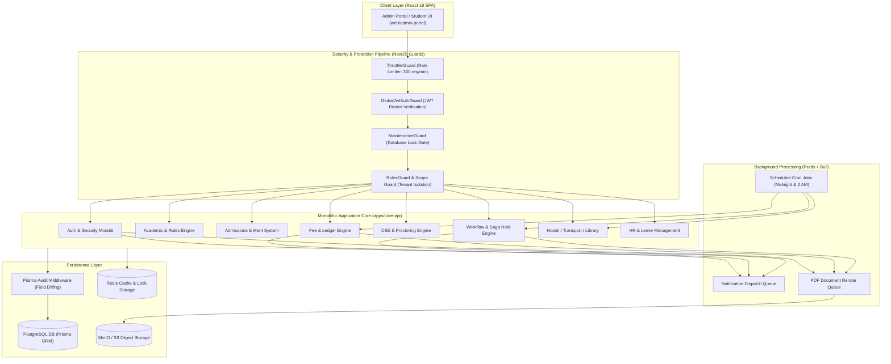

# Master End-to-End Workflow Architecture & System Design Catalog

## Overview
This document serves as the master technical architecture catalog for **UniversityERP**. It details the end-to-end system design, component interaction models, state machine transitions, database mutation flows, and asynchronous queue processing pipelines across every business domain in the application.

---

## 🏛️ High-Level System Architecture & Flow Topology

---

## 📂 Separated End-to-End Workflow Architecture Documents

The technical workflow architecture, state machine diagrams, sequence diagrams, and data transformation pipelines are cataloged into **8 separated architecture design documents** in [`APPLICATION_KNOWLEDGE_DOCUMENTATION/WORKFLOW_ARCHITECTURE_DESIGNS/`](file:///home/admin/UniversityERP/APPLICATION_KNOWLEDGE_DOCUMENTATION/WORKFLOW_ARCHITECTURE_DESIGNS/):

1. **[`WORKFLOW_ARCHITECTURE_DESIGNS/01_AUTH_AND_SECURITY_WORKFLOW_ARCHITECTURE.md`](file:///home/admin/UniversityERP/APPLICATION_KNOWLEDGE_DOCUMENTATION/WORKFLOW_ARCHITECTURE_DESIGNS/01_AUTH_AND_SECURITY_WORKFLOW_ARCHITECTURE.md)**
   - Authentication flow, JWT token refresh lifecycle, 6-digit OTP verification, password history tracking, rate limiting, and NestJS guard pipeline topology.
2. **[`WORKFLOW_ARCHITECTURE_DESIGNS/02_ADMISSIONS_AND_ONBOARDING_WORKFLOW_ARCHITECTURE.md`](file:///home/admin/UniversityERP/APPLICATION_KNOWLEDGE_DOCUMENTATION/WORKFLOW_ARCHITECTURE_DESIGNS/02_ADMISSIONS_AND_ONBOARDING_WORKFLOW_ARCHITECTURE.md)**
   - End-to-end admission pipeline: Applicant registration -> Dynamic form submission -> Document upload (MinIO) -> Application fee payment -> Merit list algorithm -> Seat allocation -> Onboarding wizard.
3. **[`WORKFLOW_ARCHITECTURE_DESIGNS/03_ACADEMIC_AND_VERSIONED_RULES_WORKFLOW_ARCHITECTURE.md`](file:///home/admin/UniversityERP/APPLICATION_KNOWLEDGE_DOCUMENTATION/WORKFLOW_ARCHITECTURE_DESIGNS/03_ACADEMIC_AND_VERSIONED_RULES_WORKFLOW_ARCHITECTURE.md)**
   - Academic catalog setup -> Immutable `StreamLabel` & `SubjectLabel` versioning rules -> Elective pooling choices -> Timetable constraint-solving scheduler.
4. **[`WORKFLOW_ARCHITECTURE_DESIGNS/04_FEE_BILLING_AND_PAYMENT_WORKFLOW_ARCHITECTURE.md`](file:///home/admin/UniversityERP/APPLICATION_KNOWLEDGE_DOCUMENTATION/WORKFLOW_ARCHITECTURE_DESIGNS/04_FEE_BILLING_AND_PAYMENT_WORKFLOW_ARCHITECTURE.md)**
   - Head-wise fee structure definition -> Daily 2 AM recurring billing cron (`RecurringBillingService`) -> Razorpay payment callback handling -> Double-entry ledger mutations -> Receipt generation -> Deposit refunds.
5. **[`WORKFLOW_ARCHITECTURE_DESIGNS/05_EXAMINATIONS_AND_CBE_PROCTORING_WORKFLOW_ARCHITECTURE.md`](file:///home/admin/UniversityERP/APPLICATION_KNOWLEDGE_DOCUMENTATION/WORKFLOW_ARCHITECTURE_DESIGNS/05_EXAMINATIONS_AND_CBE_PROCTORING_WORKFLOW_ARCHITECTURE.md)**
   - Question bank creation -> Question paper shuffle algorithm -> Proctored exam attempt session -> AI webcam telemetry & tab-switch tracking -> Invigilator live dashboard intervention -> Auto-grading & SGPA/CGPA calculation -> Question challenge workflow.
6. **[`WORKFLOW_ARCHITECTURE_DESIGNS/06_VISUAL_WORKFLOW_ENGINE_AND_SAGA_HOLDS_WORKFLOW_ARCHITECTURE.md`](file:///home/admin/UniversityERP/APPLICATION_KNOWLEDGE_DOCUMENTATION/WORKFLOW_ARCHITECTURE_DESIGNS/06_VISUAL_WORKFLOW_ENGINE_AND_SAGA_HOLDS_WORKFLOW_ARCHITECTURE.md)**
   - Generic visual workflow graph engine -> Multi-step actor resolution -> Razorpay payment gates -> Resource reservation holds (Saga pattern) -> Midnight hold expiration cron (`WorkflowSchedulerService`).
7. **[`WORKFLOW_ARCHITECTURE_DESIGNS/07_INFRASTRUCTURE_FACILITIES_WORKFLOW_ARCHITECTURE.md`](file:///home/admin/UniversityERP/APPLICATION_KNOWLEDGE_DOCUMENTATION/WORKFLOW_ARCHITECTURE_DESIGNS/07_INFRASTRUCTURE_FACILITIES_WORKFLOW_ARCHITECTURE.md)**
   - Hostel block/room bed allocation -> Warden gate pass approvals -> Transport route/stop mapping & bus pass generation -> Library circulation & fine calculation -> Midnight reservation cleanup cron.
8. **[`WORKFLOW_ARCHITECTURE_DESIGNS/08_HR_LEAVE_COUNSELLING_AUDIT_WORKFLOW_ARCHITECTURE.md`](file:///home/admin/UniversityERP/APPLICATION_KNOWLEDGE_DOCUMENTATION/WORKFLOW_ARCHITECTURE_DESIGNS/08_HR_LEAVE_COUNSELLING_AUDIT_WORKFLOW_ARCHITECTURE.md)**
   - Staff onboarding -> Multi-level leave approval hierarchy -> Leave balance tracking -> Counselling appointment booking -> Field-level Prisma audit logging middleware (`AuditLog`) -> Database backup & restore maintenance mode.
