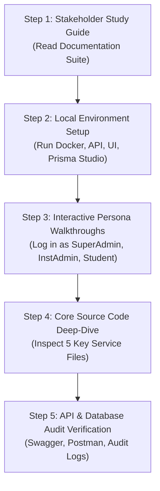

# Complete Application Mastery Roadmap & Developer Onboarding Guide

## Purpose
This document provides the definitive 5-step roadmap, practical runbooks, database inspection queries, API testing guides, and source code navigation maps required for anyone to gain **100% complete operational and technical mastery** over UniversityERP.

---

## 🗺️ The 5-Step Complete Mastery Roadmap



---

## 📚 Step 1: Recommended Reading Order by Goal

Depending on your objective, follow this specific reading sequence through the documentation repository:

| Goal / Objective | Recommended Document Sequence | Focus Highlights |
| :--- | :--- | :--- |
| **Product Overview & Business Rules** | 1. [`00_APPLICATION_OVERVIEW.md`](file:///home/admin/UniversityERP/APPLICATION_KNOWLEDGE_DOCUMENTATION/00_APPLICATION_OVERVIEW.md)<br/>2. [`01_BUSINESS_PROCESSES.md`](file:///home/admin/UniversityERP/APPLICATION_KNOWLEDGE_DOCUMENTATION/01_BUSINESS_PROCESSES.md)<br/>3. [`02_USER_JOURNEYS.md`](file:///home/admin/UniversityERP/APPLICATION_KNOWLEDGE_DOCUMENTATION/02_USER_JOURNEYS.md) | Business domains, multi-tenant hierarchy, 12 core workflows, and role experiences. |
| **System Architecture & Infrastructure** | 1. [`04_SYSTEM_ARCHITECTURE_AND_INFRASTRUCTURE.md`](file:///home/admin/UniversityERP/APPLICATION_KNOWLEDGE_DOCUMENTATION/04_SYSTEM_ARCHITECTURE_AND_INFRASTRUCTURE.md)<br/>2. [`05_MODULE_BY_MODULE_DIRECTORY.md`](file:///home/admin/UniversityERP/APPLICATION_KNOWLEDGE_DOCUMENTATION/05_MODULE_BY_MODULE_DIRECTORY.md)<br/>3. [`07_INCOMPLETE_MISSING_AND_LIMITATION_AUDIT.md`](file:///home/admin/UniversityERP/APPLICATION_KNOWLEDGE_DOCUMENTATION/07_INCOMPLETE_MISSING_AND_LIMITATION_AUDIT.md) | NestJS guard pipelines (`ThrottlerGuard` -> `GlobalJwtAuthGuard` -> `MaintenanceGuard`), 38 NestJS modules, Redis/Bull queues, MinIO storage. |
| **Technical Workflows & State Diagrams** | 1. [`09_END_TO_END_WORKFLOW_ARCHITECTURE_CATALOG.md`](file:///home/admin/UniversityERP/APPLICATION_KNOWLEDGE_DOCUMENTATION/09_END_TO_END_WORKFLOW_ARCHITECTURE_CATALOG.md)<br/>2. [`WORKFLOW_ARCHITECTURE_DESIGNS/`](file:///home/admin/UniversityERP/APPLICATION_KNOWLEDGE_DOCUMENTATION/WORKFLOW_ARCHITECTURE_DESIGNS/) | 9 Mermaid sequence diagrams, state machine transitions, Saga pattern holds, and multi-role cross-tenant flows. |
| **Step-by-Step Action Execution** | 1. [`10_COMPLETE_END_TO_END_ACTION_PROCESS_MANUAL.md`](file:///home/admin/UniversityERP/APPLICATION_KNOWLEDGE_DOCUMENTATION/10_COMPLETE_END_TO_END_ACTION_PROCESS_MANUAL.md)<br/>2. [`END_TO_END_ACTION_PROCESSES/`](file:///home/admin/UniversityERP/APPLICATION_KNOWLEDGE_DOCUMENTATION/END_TO_END_ACTION_PROCESSES/) | 6-stage lifecycle for every button click: UI -> Payload -> API Guard -> Service -> Database -> Side Effects. |
| **UI/UX Screen Designs & Wireframes** | 1. [`08_UI_UX_DESIGN_SYSTEM_AND_SCREEN_CATALOG.md`](file:///home/admin/UniversityERP/APPLICATION_KNOWLEDGE_DOCUMENTATION/08_UI_UX_DESIGN_SYSTEM_AND_SCREEN_CATALOG.md)<br/>2. [`DESIGNS/`](file:///home/admin/UniversityERP/APPLICATION_KNOWLEDGE_DOCUMENTATION/DESIGNS/) | Design tokens, HSL color palette, dark mode glassmorphism specs, and 45 page layout wireframes. |

---

## 🚀 Step 2: Practical Local Environment Runbook

To run and observe the application live on your local machine:

### 1. Boot Local Infrastructure Containers
```bash
# Start PostgreSQL, Redis, and MinIO S3 containers
docker-compose up -d
```

### 2. Initialize Database & Run Prisma Seeds
```bash
cd /home/admin/UniversityERP/apps/core-api

# Run database migrations
npx prisma migrate dev

# Seed default university, institutes, superadmin account, and fee heads
npx prisma db seed
```

### 3. Launch Development Servers
```bash
# From workspace root (/home/admin/UniversityERP)
npm run dev
```

- **Backend API**: `http://localhost:3000/api/v1`
- **Frontend Portal**: `http://localhost:5173`
- **Swagger Documentation**: `http://localhost:3000/api/docs`

---

## 🔍 Step 3: Interactive Database & Tooling Inspection

To inspect live data transformations, database tables, and system logs:

### 1. Launch Prisma Studio (Visual DB GUI)
```bash
cd /home/admin/UniversityERP/apps/core-api
npx prisma studio
```
- Open `http://localhost:5555` to browse all 100+ PostgreSQL tables live.

### 2. Default Access Credentials

| Role | Email Address | Default Password | Access Portal |
| :--- | :--- | :--- | :--- |
| **SuperAdmin** | `erpsupport@slashcurate.com` | `Admin@1234` | Full System Access |
| **UnivAdmin** | `univadmin@slashcurate.edu` | `Admin@1234` | University Master Data & Fee Heads |
| **InstAdmin** | `eng_admin@slashcurate.edu` | `Admin@1234` | Institute Admissions & Timetable |
| **Lecturer / Faculty** | `prof.smith@slashcurate.edu` | `Faculty@1234` | Class Attendance & CBE Exams |
| **Student** | `alex.kim@student.slashcurate.edu` | `Student@1234` | Fee Payment & Exam Taking |

---

## 💻 Step 4: The 5 Core Source Files Every Engineer Must Read

To master the actual codebase implementation, study these 5 critical source files in order:

1. **[`apps/core-api/src/app.module.ts`](file:///home/admin/UniversityERP/apps/core-api/src/app.module.ts)**
   - Understanding global exception filters, rate limiters, fail-closed JWT auth guards, and maintenance mode gates.
2. **[`apps/core-api/prisma/schema.prisma`](file:///home/admin/UniversityERP/apps/core-api/prisma/schema.prisma)**
   - Master data models, multi-tenant relationships (`University`, `Institute`, `Department`), and versioned rules (`StreamLabel`, `SubjectLabel`).
3. **[`apps/core-api/src/modules/workflow/workflow-engine.service.ts`](file:///home/admin/UniversityERP/apps/core-api/src/modules/workflow/workflow-engine.service.ts)**
   - The heart of the visual workflow engine, dynamic actor resolution, state transitions, and Saga pattern resource holds.
4. **[`apps/core-api/src/modules/examination/examination.service.ts`](file:///home/admin/UniversityERP/apps/core-api/src/modules/examination/examination.service.ts)**
   - Computer-Based Examination (CBE) paper shuffle algorithms, AI webcam proctoring telemetry, tab-switch counters, and SGPA/CGPA formulas.
5. **[`apps/core-api/src/modules/fee/fee.service.ts`](file:///home/admin/UniversityERP/apps/core-api/src/modules/fee/fee.service.ts)** & **[`recurring-billing.service.ts`](file:///home/admin/UniversityERP/apps/core-api/src/modules/fee/recurring-billing.service.ts)**
   - Daily 2 AM automated billing cron execution, head-wise fee demand creation, double-entry financial ledger mutations, and Razorpay payment gate settlement.

---

## 🎯 Step 5: Master Self-Verification Checklist

Before taking full ownership of production, verify you can answer and demonstrate:

- [ ] **Data Isolation**: Can you explain how `universityId`, `instituteId`, and `departmentId` prevent cross-tenant data leaks?
- [ ] **Rule Versioning**: Why does updating a program's curriculum create a new `StreamLabel` version without breaking existing student cohorts?
- [ ] **Saga Pattern Holds**: What happens at midnight when a student fails to complete a fee payment for a reserved auditorium or hostel bed?
- [ ] **Audit Trail**: How does `PrismaService` capture field-level `oldValues` vs `newValues` JSON diffs on every database write?
- [ ] **Microservices Reality**: Where are CBE exams and PDF certificates actually processed (`core-api` monolith vs `cbe-engine` / `cert-generator` stubs)?
