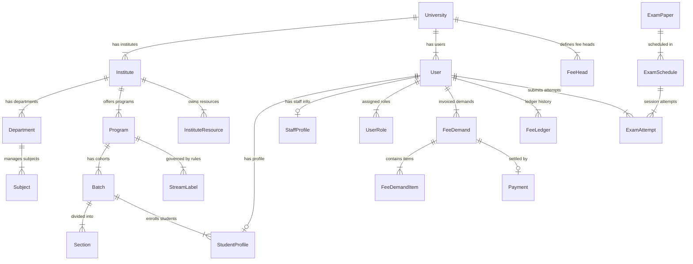

# Database Schema Dictionary & Entity Relations

## Overview
This document provides a comprehensive schema dictionary for the **100+ database models** defined in `apps/core-api/prisma/schema.prisma`. It documents table relationships, foreign key constraints, composite indexes, and field-level data dictionary rules.

---

## 📐 Primary Entity Relationship Map

---

## 📑 Core Data Dictionary Reference

### 1. Multi-Tenant Organization Cluster
- **`universities`**: `id` (UUID PK), `name`, `domain` (Unique), `logo_path`, `config` (JSON), `branding` (JSON), `is_active` (Boolean).
- **`institutes`**: `id` (UUID PK), `university_id` (FK), `name`, `schema_name` (Unique), `head_user_id` (Nullable FK to Director), `is_active`.
- **`departments`**: `id` (UUID PK), `institute_id` (FK), `name`, `code`.

### 2. User & Access Control Cluster
- **`users`**: `id` (UUID PK), `email` (Unique), `password_hash`, `first_name`, `last_name`, `phone`, `role` (ApplicationRole Enum), `is_active`, `must_change_password`, `locked_until`, `failed_login_attempts`, `university_id` (FK), `institute_id` (Nullable FK), `department_id` (Nullable FK).
- **`roles`**: `id`, `code`, `name`, `scope_level` (`UNIVERSITY` / `INSTITUTE` / `DEPARTMENT`).
- **`user_roles`**: `id`, `user_id` (FK), `role_id` (FK), `scope_id`.
- **`audit_logs`**: `id`, `user_id` (FK), `action`, `entity_name`, `entity_id`, `old_values` (JSON), `new_values` (JSON), `ip_address`, `created_at`.

### 3. Academic & Rule Versioning Cluster
- **`programs`**: `id`, `institute_id` (FK), `name`, `code`, `duration_years`.
- **`batches`**: `id`, `program_id` (FK), `stream_label_id` (FK to immutable rules snapshot), `start_year`, `end_year`.
- **`stream_labels`**: `id`, `program_id` (FK), `version` (Int), `label_name`, `total_credits` (Int), `rules_json` (JSON), `is_frozen` (Boolean).
- **`subject_labels`**: `id`, `stream_label_id` (FK), `subject_id` (FK), `credit_weight`, `requirement_type` (`CORE` / `ELECTIVE`).

### 4. Fee & Financial Ledger Cluster
- **`fee_heads`**: `id`, `university_id` (FK), `name`, `code`, `is_refundable` (Boolean).
- **`fee_structures`**: `id`, `institute_id` (FK), `program_id` (FK), `batch_id` (FK).
- **`fee_demands`**: `id`, `user_id` (FK), `term_id` (FK), `amount` (Decimal), `status` (`PENDING` / `PARTIALLY_PAID` / `PAID` / `OVERDUE` / `CANCELLED`), `due_date`.
- **`fee_ledger`**: `id`, `user_id` (FK), `demand_id` (Nullable FK), `payment_id` (Nullable FK), `transaction_type` (`DEBIT` / `CREDIT`), `amount` (Decimal), `balance_after` (Decimal), `created_at`.
- **`payments`**: `id`, `demand_id` (FK), `razorpay_payment_id` (Unique), `razorpay_order_id`, `amount`, `status` (`SUCCESS` / `FAILED`).

### 5. Examination & Proctoring Cluster
- **`questions`**: `id`, `subject_id` (FK), `type` (`MCQ` / `DESCRIPTIVE`), `difficulty`, `content` (Text), `marks`.
- **`exam_papers`**: `id`, `subject_id` (FK), `total_marks`, `passing_marks`, `duration_minutes`.
- **`exam_attempts`**: `id`, `exam_schedule_id` (FK), `user_id` (FK), `status` (`IN_PROGRESS` / `SUBMITTED` / `TERMINATED_PROCTOR`), `score` (Decimal).
- **`exam_proctor_logs`**: `id`, `attempt_id` (FK), `tab_switches` (Int), `webcam_snapshots_count` (Int), `device_fingerprint`.
