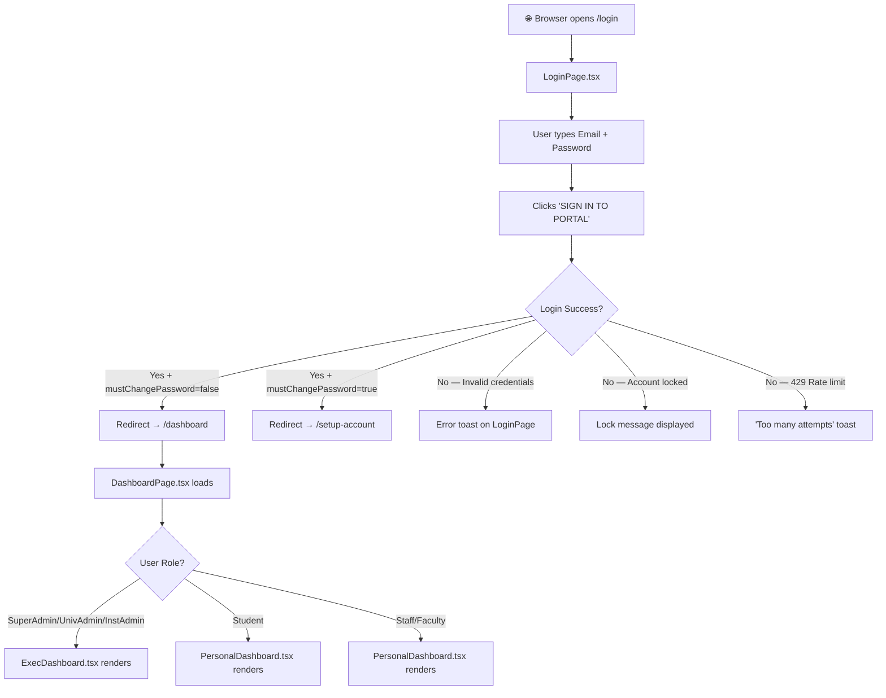
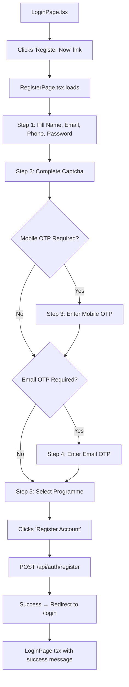
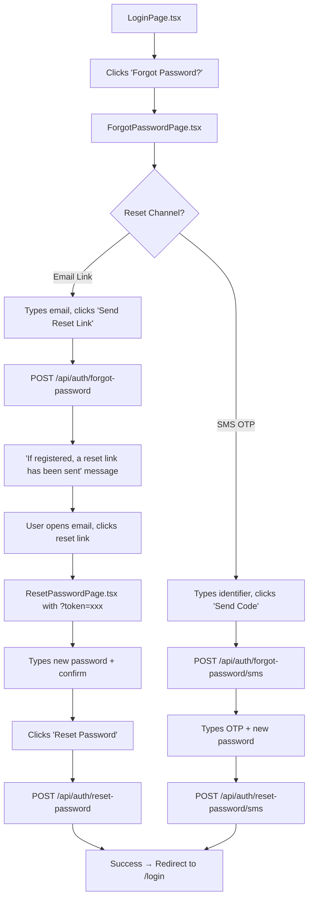

# UI Click Flow: Login & Account Setup

> Every step documents: **Step Number** → **Screen** → **What User Sees** → **What User Clicks** → **Where It Goes Next**

---

## Flow 1: Standard Login → Dashboard

### Step-by-Step

| Step | Screen | What User Sees | What User Clicks/Enters | What Happens | Next Screen |
|:---|:---|:---|:---|:---|:---|
| 1 | Browser | URL bar | Navigates to `https://portal.university.edu` | App loads, checks auth token | LoginPage (if no token) or Dashboard (if valid token) |
| 2 | `LoginPage.tsx` | University logo, branding cover image, email/password inputs, "Forgot Password?" link, "Register Now" link | Types email in Email field | Field validates email format | Same screen |
| 3 | `LoginPage.tsx` | Password field with eye toggle | Types password, clicks Eye icon to toggle visibility | Password shown/hidden | Same screen |
| 4 | `LoginPage.tsx` | "Remember Me" checkbox, "SIGN IN TO PORTAL" button | Clicks **"SIGN IN TO PORTAL"** | `POST /api/auth/login` fires. Spinner shows on button. | — |
| 5a | `LoginPage.tsx` → `DashboardPage.tsx` | Loading spinner | — | Login success → tokens stored in memory, Zustand state hydrated | `/dashboard` |
| 5b | `LoginPage.tsx` → `SetupAccountPage.tsx` | Loading spinner | — | Login success BUT `mustChangePassword=true` | `/setup-account` |
| 5c | `LoginPage.tsx` | Error toast: "Invalid email or password" | — | Wrong credentials → `401` response | Same screen (retry) |
| 5d | `LoginPage.tsx` | Error: "Account locked. Try again in X minutes" | — | Account locked → `403` response | Same screen |

---

## Flow 2: Self-Registration → OTP Verification → Login

### Step-by-Step

| Step | Screen | What User Sees | What User Clicks/Enters | What Happens | Next Screen |
|:---|:---|:---|:---|:---|:---|
| 1 | `LoginPage.tsx` | "Don't have an account? Register Now" | Clicks **"Register Now"** | Navigation | `RegisterPage.tsx` |
| 2 | `RegisterPage.tsx` (Step 1) | Name fields, email, phone, password with strength meter, role selector cards | Fills all fields, selects role | Password policy validated in real-time via rules from `GET /api/auth/public/password-policy` | Same (Step 2 enabled) |
| 3 | `RegisterPage.tsx` (Step 2) | Distorted text captcha image, input box | Types captcha answer, clicks **"Verify"** | Captcha token validated | Step 3 (or skip) |
| 4 | `RegisterPage.tsx` (Step 3) | "Send OTP" button for mobile | Clicks **"Send OTP"** | `POST /api/auth/register/send-otp` fires. 60s countdown starts | OTP entry shown |
| 5 | `RegisterPage.tsx` (Step 3) | 6-digit OTP input boxes, countdown timer | Types 6 digits | `POST /api/auth/register/verify-otp` → gets `phoneVerifyToken` | Step 4 (or skip) |
| 6 | `RegisterPage.tsx` (Step 4) | "Send Email Code" button | Clicks **"Send Code"** | `POST /api/auth/register/send-email-otp` fires | Email OTP entry |
| 7 | `RegisterPage.tsx` (Step 4) | 6-digit code input | Types 6 digits | `POST /api/auth/register/verify-email-otp` → gets `emailVerifyToken` | Step 5 |
| 8 | `RegisterPage.tsx` (Step 5) | Cascading dropdowns: Institute → Dept → Programme → Course → Batch → Stream | Selects each dropdown in sequence | Each selection calls respective public API endpoint | Fee preview appears |
| 9 | `RegisterPage.tsx` (Step 5) | Fee preview card, scholarship list | Clicks **"Register Account"** | `POST /api/auth/register` with all tokens | `/login` with success |
| 10 | `LoginPage.tsx` | Green success banner: "Registration successful! You can now sign in." | Types credentials, clicks **"SIGN IN"** | Normal login flow | `/dashboard` |

---

## Flow 3: Forgot Password → Reset → Login

### Step-by-Step

| Step | Screen | What User Clicks | What Happens | Next Screen |
|:---|:---|:---|:---|:---|
| 1 | `LoginPage.tsx` | Clicks **"Forgot Password?"** | Navigation | `ForgotPasswordPage.tsx` |
| 2 | `ForgotPasswordPage.tsx` | Types email, clicks **"Send Reset Link"** | `POST /api/auth/forgot-password` | Same (generic success message) |
| 3 | Email inbox | Clicks **reset link** in email | Opens `/reset-password?token=xxx` | `ResetPasswordPage.tsx` |
| 4 | `ResetPasswordPage.tsx` | Types new password (with policy checklist), confirms, clicks **"Reset Password"** | `POST /api/auth/reset-password` → validates token, policy, history | `/login` with success |
| 5 | `LoginPage.tsx` | Signs in with new password | Normal login | `/dashboard` |

---

## Flow 4: Setup Account (Forced Password Change)

| Step | Screen | What User Clicks | What Happens | Next Screen |
|:---|:---|:---|:---|:---|
| 1 | `LoginPage.tsx` | Signs in normally | `mustChangePassword=true` → redirect | `SetupAccountPage.tsx` |
| 2 | `SetupAccountPage.tsx` | Types current password | Validated against stored hash | Same |
| 3 | `SetupAccountPage.tsx` | Types new password with policy validation visible | Real-time strength meter + policy checklist | Same |
| 4 | `SetupAccountPage.tsx` | Clicks **"Set New Password"** | `POST /api/auth/change-password` → clears `mustChangePassword` flag | `/dashboard` |

---

## Flow 5: Impersonation (SuperAdmin Only)

| Step | Screen | What User Clicks | What Happens | Next Screen |
|:---|:---|:---|:---|:---|
| 1 | `UserManagementPage.tsx` | Clicks **"Impersonate"** on a user row | `POST /api/auth/impersonate/:userId` → receives scoped access token | Dashboard refreshes as target user |
| 2 | Any page | Sees **yellow "Impersonating: user@email"** banner at top | Clicks **"Exit Impersonation"** | `POST /api/auth/impersonate-exit` → returns to SuperAdmin view |

---

## Flow 6: Idle Timeout Auto-Logout

| Step | Screen | What Happens | Next Screen |
|:---|:---|:---|:---|
| 1 | Any page | User is idle beyond configured timeout | Token refresh attempted |
| 2 | Any page | Refresh token expired → `401` response | `LoginPage.tsx` |
| 3 | `LoginPage.tsx` | Logout event recorded as `LOGOUT_TIMEOUT` in audit log | — |
