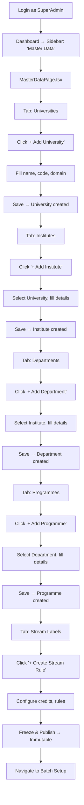

# UI Click Flow: Admin Master Data Setup

> Complete click-by-click journey for an administrator setting up the entire academic structure from scratch.

---

## Master Flow: Initial System Setup

---

## Step-by-Step: Building University → Institute → Department → Programme

| Step | Screen / Tab | What User Sees | What User Clicks | What Happens | Next Action |
|:---|:---|:---|:---|:---|:---|
| 1 | `DashboardPage.tsx` | Left sidebar navigation | Clicks **"Master Data"** | Navigation | `MasterDataPage.tsx` loads |
| 2 | `MasterDataPage.tsx` | Tab bar: Universities, Institutes, Depts... | Tab **"Universities"** is default | University list loads | — |
| 3 | Universities tab | Empty table (first setup) or list | Clicks **"+ Add New"** | Modal/form opens | — |
| 4 | Create University modal | Name, Code, Admin Email fields | Fills details, clicks **"Save"** | `POST /api/master-data/universities` | University appears in table |
| 5 | `MasterDataPage.tsx` | Tab bar | Clicks **"Institutes"** tab | Institute list loads | — |
| 6 | Institutes tab | Table with university filter | Clicks **"+ Add New"** | Create form opens | — |
| 7 | Create Institute form | University dropdown, Institute Name, Code, Head | Selects university, fills details, clicks **"Save"** | `POST /api/master-data/institutes` | Institute appears in table |
| 8 | `MasterDataPage.tsx` | Tab bar | Clicks **"Departments"** tab | Department list loads | — |
| 9 | Departments tab | Table with institute filter | Clicks **"+ Add New"** | Create form opens | — |
| 10 | Create Department form | Institute dropdown, Dept Name, Code, HOD | Selects institute, fills details, clicks **"Save"** | `POST /api/master-data/departments` | Department appears |
| 11 | `MasterDataPage.tsx` | Tab bar | Clicks **"Programmes"** tab | Programme list loads | — |
| 12 | Programmes tab | Table with department filter | Clicks **"+ Add New"** | Create form opens | — |
| 13 | Create Programme form | Department, Programme Name, Duration, Degree Type | Fills all, clicks **"Save"** | `POST /api/master-data/programmes` | Programme appears |

---

## Step-by-Step: Creating Courses & Subjects

| Step | Screen / Tab | What User Clicks | What Happens | Next Action |
|:---|:---|:---|:---|:---|
| 14 | `MasterDataPage.tsx` | Clicks **"University Courses"** tab | Course catalog loads | — |
| 15 | Courses tab | Clicks **"+ Add Course"** | `POST /api/master-data/university-courses` | Course created |
| 16 | `MasterDataPage.tsx` | Clicks **"University Subjects"** tab | Subject catalog loads | — |
| 17 | Subjects tab | Clicks **"+ Add Subject"** | `POST /api/master-data/university-subjects` | Subject created |

---

## Step-by-Step: Configuring Stream Labels (Graduation Rules)

| Step | Screen / Tab | What User Clicks | What Happens | Next Action |
|:---|:---|:---|:---|:---|
| 18 | `MasterDataPage.tsx` | Clicks **"Stream Labels"** tab | Stream labels list loads | — |
| 19 | Stream Labels tab | Clicks **"+ Create Stream Rule"** | `StreamLabelDetailModal.tsx` opens | — |
| 20 | Stream Label Modal | Selects Programme, enters Version Name (e.g., `CS_V1`), Total Credits (160), Core (120), Elective (40), Min GPA (2.0) | Fills all fields | — |
| 21 | Stream Label Modal | Adds subject rules: selects subjects, marks required/elective, sets credits | Uses subject picker | — |
| 22 | Stream Label Modal | Clicks **"Freeze & Publish"** | `POST /api/master-data/stream-labels` — creates immutable rule snapshot | Modal closes, rule appears in list |

---

## Step-by-Step: Batch Setup Wizard

```mermaid
flowchart LR
    A["Sidebar: Batch Setup"] --> B["BatchSetupList.tsx"]
    B --> C["Click '+ New Batch'"]
    C --> D["BatchSetupWizard Step 1: Select Programme + Year"]
    D --> E["Step 2: Define Terms"]
    E --> F["Step 3: Create Sections"]
    F --> G["Step 4: Assign Subjects"]
    G --> H["Step 5: Bind Stream Label"]
    H --> I["Step 6: Review & Confirm"]
    I --> J["POST /api/batch-setup → Batch created"]
```

| Step | Screen | What User Clicks | What Happens |
|:---|:---|:---|:---|
| 23 | Sidebar | Clicks **"Batch Setup"** (or navigates from Master Data) | `BatchSetupList.tsx` loads |
| 24 | `BatchSetupList.tsx` | Clicks **"+ New Batch"** | `BatchSetupWizard.tsx` opens |
| 25 | Wizard Step 1 | Selects Programme (B.Tech CS), Academic Year (2024-2025) | Clicked **"Next"** |
| 26 | Wizard Step 2 | Defines terms — Term 1 (Aug-Dec), Term 2 (Jan-May) | Adds terms, clicks **"Next"** |
| 27 | Wizard Step 3 | Creates sections per term — Section A (60 seats), Section B (60 seats) | Adds sections, clicks **"Next"** |
| 28 | Wizard Step 4 | Assigns subjects to terms from university subject catalog | Drags/selects subjects, clicks **"Next"** |
| 29 | Wizard Step 5 | Binds Stream Label Rule (`CS_V1`) to this batch | Selects label, clicks **"Next"** |
| 30 | Wizard Step 6 | Reviews full batch structure summary | Clicks **"Create Batch"** |
| 31 | `BatchSetupList.tsx` | New batch appears in list | Setup complete |

---

## Step-by-Step: Bulk Import

| Step | Screen | What User Clicks | What Happens |
|:---|:---|:---|:---|
| 32 | `MasterDataPage.tsx` | Clicks **"Bulk Import"** tab | Import panel loads |
| 33 | Bulk Import | Clicks **"Download CSV Template"** | Template CSV downloaded |
| 34 | Bulk Import | Fills CSV with data, clicks **"Upload CSV"** | File uploaded via `POST /api/master-data/bulk-import/upload` |
| 35 | Bulk Import | Sees validation results (success/error rows) | Reviews and confirms |

---

## Step-by-Step: Staff-Subject Assignment

| Step | Screen | What User Clicks | What Happens |
|:---|:---|:---|:---|
| 36 | Sidebar | Navigates to subject management | Staff-Subject panel loads |
| 37 | Staff-Subject | Clicks **"Assign Faculty"** | `POST /api/staff-subject` — links faculty to subject/section |
| 38 | Staff-Subject | Faculty sees subject in `MySubjectsPage.tsx` | Assignment active |

---

## Step-by-Step: Campus Resource Setup

| Step | Screen | What User Clicks | What Happens |
|:---|:---|:---|:---|
| 39 | `MasterDataPage.tsx` | Clicks **"Campus Resources"** tab | Resource list loads |
| 40 | Campus Resources | Clicks **"+ Add Resource"** | Form: name, type (Classroom/Lab/Auditorium), capacity, institute |
| 41 | Campus Resources | Fills details, clicks **"Save"** | `POST /api/master-data/campus-resources` |
