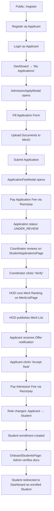

# UI Click Flow: Admission Application Journey

> Complete journey from applicant registration through application submission, fee payment, verification, merit ranking, seat offer, and student onboarding.

---

## Master Flow: Applicant → Student Conversion

---

## Phase 1: Applicant Registers & Logs In

| Step | Screen | What User Sees | What User Clicks | What Happens | Next Screen |
|:---|:---|:---|:---|:---|:---|
| 1 | `RegisterPage.tsx` | Registration form | Fills name, email, phone, password, selects role "Student" | — | Same |
| 2 | `RegisterPage.tsx` | Captcha + OTP steps | Completes verification | OTP tokens obtained | Programme selection |
| 3 | `RegisterPage.tsx` | Cascading dropdowns: Institute → Dept → Programme → Course → Batch → Stream | Selects programme | Fee preview shows | Same |
| 4 | `RegisterPage.tsx` | "Register Account" button | Clicks **"Register Account"** | `POST /api/auth/register` → account created | `/login` |
| 5 | `LoginPage.tsx` | Success message | Signs in with credentials | Login success | `/dashboard` |

---

## Phase 2: Applicant Fills & Submits Application

| Step | Screen | What User Sees | What User Clicks | What Happens | Next Screen |
|:---|:---|:---|:---|:---|:---|
| 6 | `DashboardPage.tsx` | PersonalDashboard with "Complete Your Application" CTA | Clicks **"My Applications"** in sidebar | Navigation | `StudentApplicationsPage.tsx` |
| 7 | `StudentApplicationsPage.tsx` | Empty applications list, "Apply Now" button | Clicks **"Apply Now"** | `AdmissionApplyModal.tsx` opens | Modal overlay |
| 8 | `AdmissionApplyModal.tsx` | Dynamic admission form loaded from `GET /api/forms/admission-form` | Fills personal details: address, emergency contact, previous academics | — | Same modal |
| 9 | `AdmissionApplyModal.tsx` | File upload fields for marksheets, certificates | Clicks **"Upload"** for each document | Files uploaded to MinIO via `POST /api/upload/file` → returns object keys | Same modal |
| 10 | `AdmissionApplyModal.tsx` | Programme confirmation, all fields filled | Clicks **"Submit Application"** | `POST /api/forms/:id/submit` → creates `FormSubmission` (status: SUBMITTED) | Fee payment modal |
| 11 | `ApplicationFeeModal.tsx` | Application fee breakdown (e.g., ₹500 Application Processing Fee) | Reviews fee summary | — | Same modal |
| 12 | `ApplicationFeeModal.tsx` | "Pay via Razorpay" button | Clicks **"Pay ₹500 via Razorpay"** | Razorpay checkout overlay opens | Razorpay modal |
| 13 | Razorpay Checkout | Card/UPI payment form | Enters payment details, clicks **"Pay"** | Payment processed, webhook verifies signature | Back to app |
| 14 | `StudentApplicationsPage.tsx` | Application status: "UNDER REVIEW" with green "Fee Paid" badge | — | Fee demand updated to PAID, application transitions to UNDER_REVIEW | — |

---

## Phase 3: Admission Officer Reviews Application

| Step | Screen | What User Sees | What User Clicks | What Happens | Next Screen |
|:---|:---|:---|:---|:---|:---|
| 15 | `LoginPage.tsx` | — | Coordinator logs in (role: InstAdmin/Staff) | — | `/dashboard` |
| 16 | Sidebar | "Admissions" menu item | Clicks **"Admissions"** | Navigation | `StudentApplicationsPage.tsx` (admin view) |
| 17 | `StudentApplicationsPage.tsx` | Filter bar: Status = "Under Review" | Selects status filter | List of pending applications loads | — |
| 18 | `StudentApplicationsPage.tsx` | Application list (left panel) | Clicks **application row "APP-2024-001"** | Right panel: detailed view with document previews | Split view |
| 19 | Right panel | PDF preview of uploaded marksheet | Clicks **document thumbnail** | Full-screen PDF viewer opens | Modal |
| 20 | Right panel | Verification notes text area | Types **"Marksheet authentic, eligibility confirmed"** | — | Same |
| 21 | Right panel | Action buttons: Verify, Request Correction, Reject | Clicks **"Verify & Approve for Merit List"** | `PATCH /api/auth/registrations/:id/review { action: 'APPROVED' }` | Status → VERIFIED |

---

## Phase 4: HOD Generates Merit List & Offers Seats

| Step | Screen | What User Sees | What User Clicks | What Happens | Next Screen |
|:---|:---|:---|:---|:---|:---|
| 22 | `LoginPage.tsx` | — | HOD logs in | — | `/dashboard` |
| 23 | Sidebar | "Admissions" → "Merit List" | Clicks **"Merit List"** | Navigation | `MeritListPage.tsx` |
| 24 | `MeritListPage.tsx` | Batch selector, empty merit table | Selects batch **"B.Tech CS 2024-2028"** | — | — |
| 25 | `MeritListPage.tsx` | "Run Merit Ranking" button | Clicks **"Run Merit Ranking"** | `POST /api/admissions/merit-list/:batchId/compute` | Merit table populates with ranks |
| 26 | `MeritListPage.tsx` | Ranked list with candidates | Reviews ranks, clicks **"Publish Merit List"** | `POST /api/admissions/merit-list/:batchId/publish` | Status → OFFERED for top candidates |
| 27 | — | — | — | Email notifications sent to offered candidates | — |

---

## Phase 5: Applicant Accepts Offer & Becomes Student

| Step | Screen | What User Sees | What User Clicks | What Happens | Next Screen |
|:---|:---|:---|:---|:---|:---|
| 28 | Email inbox | "Congratulations! You've been offered admission" | Clicks **login link** | Opens portal | `LoginPage.tsx` |
| 29 | `DashboardPage.tsx` | "Admission Offered" status card | Clicks **"Accept Seat & Pay Admission Fee"** | — | Fee payment flow |
| 30 | Fee Payment | Admission fee breakdown | Clicks **"Pay via Razorpay"** | Payment processed | — |
| 31 | — | — | — | `POST /api/auth/registrations/:id/offer` completes → user role changed to Student, student profile created | `/dashboard` as Student |

---

## Phase 6: Admin Completes Onboarding

| Step | Screen | What User Sees | What User Clicks | What Happens | Next Screen |
|:---|:---|:---|:---|:---|:---|
| 32 | Admin login | — | Admin navigates to **"Onboard Students"** | — | `OnboardStudentsPage.tsx` |
| 33 | `OnboardStudentsPage.tsx` | Onboarding checklist table | Clicks student name | Document verification panel opens | — |
| 34 | `OnboardStudentsPage.tsx` | Document checklist, ID generation | Clicks **"Generate Student ID"** | `POST /api/onboarding/commit` → enrollment number generated | Student fully enrolled |

---

## Alternative Flow: Application Rejection

| Step | Screen | What Admin Clicks | What Happens |
|:---|:---|:---|:---|
| A1 | `StudentApplicationsPage.tsx` | Clicks **"Reject Application"** | `PATCH /api/auth/registrations/:id/review { action: 'REJECTED' }` |
| A2 | — | — | Rejection notification email sent to applicant |
| A3 | Applicant `StudentApplicationsPage.tsx` | Sees "REJECTED" status badge | Can re-apply for next cycle |

## Alternative Flow: Cancel Enrollment

| Step | Screen | What User Clicks | What Happens |
|:---|:---|:---|:---|
| B1 | Admin navigates to Cancel Enrollment | Clicks **"Initiate Cancellation"** for student | `POST /api/cancel-enrollment` → creates cancellation request |
| B2 | HOD `MyTasksPage.tsx` | Reviews cancellation, clicks **"Approve"** | `POST /api/cancel-enrollment/:id/review` |
| B3 | Final approver | Clicks **"Final Approve"** | `POST /api/cancel-enrollment/:id/approve` → enrollment cancelled, refund initiated |
