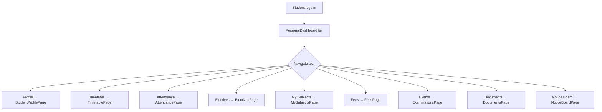

# UI Click Flow: Student Enrollment & Profile

> Click-by-click journey for an enrolled student navigating their academic life.

---

## Master Flow

---

## Flow 1: Student Views Profile

| Step | Screen | What User Clicks | What Happens | Next Screen |
|:---|:---|:---|:---|:---|
| 1 | `DashboardPage.tsx` | Clicks **"Profile"** in sidebar | Navigation | `StudentProfilePage.tsx` |
| 2 | `StudentProfilePage.tsx` | Sees profile header: name, photo, enrollment number, batch, programme | — | — |
| 3 | `StudentProfilePage.tsx` | Clicks **"Academic"** tab | `GET /api/student-profile/dashboard` loads academic data | Term-wise SGPA/CGPA chart |
| 4 | `StudentProfilePage.tsx` | Clicks **"Fees"** tab | `GET /api/student-profile/fees` | Fee demands, payment history |
| 5 | `StudentProfilePage.tsx` | Clicks **"Attendance"** tab | `GET /api/student-profile/attendance` | Attendance % per subject |
| 6 | `StudentProfilePage.tsx` | Clicks **"Results"** tab | `GET /api/student-profile/term-results` | Term results list |
| 7 | `StudentProfilePage.tsx` | Clicks a specific **term row** | `GET /api/student-profile/term-results/:batchTermId` | Detailed subject-wise grades |
| 8 | `StudentProfilePage.tsx` | Clicks **"Documents"** tab | `GET /api/student-profile/documents` | Issued certificates/marksheets |
| 9 | `StudentProfilePage.tsx` | Clicks **"Hostel"** tab | `GET /api/student-profile/hostel` | Room allocation details |
| 10 | `StudentProfilePage.tsx` | Clicks **"Transport"** tab | `GET /api/student-profile/transport` | Bus route and pass |

---

## Flow 2: Student Edits Profile

| Step | Screen | What User Clicks | What Happens |
|:---|:---|:---|:---|
| 1 | `StudentProfilePage.tsx` | Clicks **"Edit Profile"** | Profile edit form opens |
| 2 | Edit form | Updates phone, address, photo | — |
| 3 | Edit form | Clicks **"Save"** | `PATCH /api/auth/me` — non-governed fields saved immediately |
| 4 | Edit form | Tries to edit governed field (e.g., name, DOB) | Redirected to Profile Governance pipeline |
| 5 | GovernedProfileSection | Clicks **"Submit Change Request"** | `POST /api/profile-governance/submit` — awaits admin approval |

---

## Flow 3: Student Views Timetable

| Step | Screen | What User Clicks | What Happens |
|:---|:---|:---|:---|
| 1 | Sidebar | Clicks **"Timetable"** | Navigation to `TimetablePage.tsx` |
| 2 | `TimetablePage.tsx` | Sees weekly grid with class slots | Color-coded by subject type (lecture/lab/tutorial) |
| 3 | `TimetablePage.tsx` | Clicks a **slot card** | Details popup: subject, room, faculty name |

---

## Flow 4: Student Selects Electives

| Step | Screen | What User Clicks | What Happens |
|:---|:---|:---|:---|
| 1 | Sidebar | Clicks **"Electives"** | Navigation to `ElectivesPage.tsx` |
| 2 | `ElectivesPage.tsx` | Sees available elective courses with seats, credits | — |
| 3 | `ElectivesPage.tsx` | Drag-ranks preferences (1st, 2nd, 3rd choice) | — |
| 4 | `ElectivesPage.tsx` | Clicks **"Submit Preferences"** | `POST /api/academic/elections/submit` |
| 5 | `ElectivesPage.tsx` | After election closes, sees **"View Results"** | `GET /api/academic/elections/results` — shows allotted elective |

---

## Flow 5: Student Checks Attendance

| Step | Screen | What User Clicks | What Happens |
|:---|:---|:---|:---|
| 1 | Sidebar | Clicks **"Attendance"** | `AttendancePage.tsx` loads |
| 2 | `AttendancePage.tsx` | Sees donut chart: overall %, per-subject breakdown | — |
| 3 | `AttendancePage.tsx` | Clicks a **subject row** | Expands: date-wise attendance (Present/Absent/Excused) |

---

## Flow 6: Student Views Notice Board

| Step | Screen | What User Clicks | What Happens |
|:---|:---|:---|:---|
| 1 | Sidebar | Clicks **"Notice Board"** | `NoticeBoardPage.tsx` loads |
| 2 | `NoticeBoardPage.tsx` | Sees categorized notices with dates, author, priority | — |
| 3 | `NoticeBoardPage.tsx` | Clicks a **notice title** | Full notice content expands with rich text/attachments |

---

## Flow 7: Student Views Directory

| Step | Screen | What User Clicks | What Happens |
|:---|:---|:---|:---|
| 1 | Sidebar | Clicks **"Directory"** | `DirectoryPage.tsx` loads |
| 2 | `DirectoryPage.tsx` | Types faculty name in search | Results filtered in real-time |
| 3 | `DirectoryPage.tsx` | Clicks **contact card** | Profile detail with email, phone, department |

---

## Flow 8: Profile Completion Gate

| Step | Screen | What User Sees | What Happens |
|:---|:---|:---|:---|
| 1 | Any page | `ProfileCompletionGate.tsx` banner: "Complete your profile to access all features" | Mandatory fields missing |
| 2 | Gate | Clicks **"Complete Profile"** | Redirected to profile edit with highlighted missing fields |
| 3 | Profile edit | Fills required fields, clicks **"Save"** | Gate removed, full access granted |
