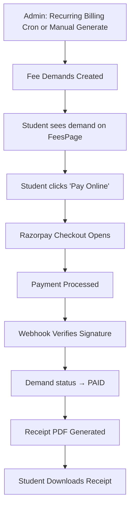

# UI Click Flow: Fee Payment & Billing

> Complete click-by-click journey for fee management — from demand generation to Razorpay payment to receipt download.

---

## Master Flow

---

## Flow 1: Admin Generates Fee Demands

| Step | Screen | What User Clicks | What Happens |
|:---|:---|:---|:---|
| 1 | Admin logs in → Sidebar | Clicks **"Fees"** | `FeesPage.tsx` loads |
| 2 | `FeesPage.tsx` | Clicks **"Fee Structures"** tab | Fee structure list loads |
| 3 | Fee Structures | Clicks **"+ Create Structure"** | Form: select programme, batch, term, add fee heads with amounts |
| 4 | Create Structure | Fills Tuition (₹50,000), Lab (₹5,000), Dev (₹2,000) | — |
| 5 | Create Structure | Clicks **"Save Structure"** | `POST /api/fee/structures` |
| 6 | `FeesPage.tsx` | Clicks **"Fee Demands"** tab | Demands list loads |
| 7 | Fee Demands | Clicks **"Generate Demands"** | `POST /api/fee/ledger/generate` → demands created for all students |
| 8 | Fee Demands | Sees table: Student Name, Amount, Due Date, Status (PENDING) | — |

---

## Flow 2: Student Pays Fee via Razorpay

| Step | Screen | What User Sees | What User Clicks | What Happens | Next |
|:---|:---|:---|:---|:---|:---|
| 1 | Student login → Sidebar | "Fees" with overdue badge | Clicks **"Fees"** | `FeesPage.tsx` loads | — |
| 2 | `FeesPage.tsx` | Summary cards: Total Due, Paid, Overdue | — | — | — |
| 3 | `FeesPage.tsx` | Pending demand row: "Term 3 Fee - ₹57,000 - PENDING" | Clicks **"Pay Online"** | Payment preparation starts | — |
| 4 | `FeesPage.tsx` | Fee breakdown modal: Tuition ₹50K + Lab ₹5K + Dev ₹2K | Reviews breakdown | — | — |
| 5 | Fee Modal | "Pay ₹57,000 via Razorpay" button | Clicks **"Pay via Razorpay"** | `POST /api/fee/demands/:id/create-order` → Razorpay order created | Razorpay |
| 6 | Razorpay Overlay | Card/UPI/NetBanking payment form | Enters payment details, clicks **"Pay"** | Payment processed by Razorpay gateway | — |
| 7 | — | — | — | Razorpay webhook `POST /api/fee/webhooks/razorpay` fires → signature verified | — |
| 8 | `FeesPage.tsx` | Demand status changes to **"PAID"** (green badge) | — | `UPDATE fee_demands SET status='PAID'`, ledger entry created | — |
| 9 | `FeesPage.tsx` | "Download Receipt" button appears | Clicks **"Download Receipt"** | `GET /api/fee/payments/receipt/:receiptNo` → PDF generated | PDF downloaded |

---

## Flow 3: Admin Reviews Ledger & Reports

| Step | Screen | What User Clicks | What Happens |
|:---|:---|:---|:---|
| 1 | `FeesPage.tsx` | Clicks **"Payment Ledger"** tab | Ledger view loads |
| 2 | Ledger tab | Types student name/ID in search | `GET /api/fee/ledger/student/:studentId` |
| 3 | Ledger tab | Sees chronological entries: DEBIT (demand) / CREDIT (payment) with running balance | — |
| 4 | `FeesPage.tsx` | Clicks **"Reports"** tab | Report options load |
| 5 | Reports | Clicks **"Collection Report"** | `GET /api/fee/reports/collection` → summary chart |
| 6 | Reports | Clicks **"Defaulters Report"** | `GET /api/fee/reports/defaulters` → list of unpaid students |

---

## Flow 4: Scholarship & Waiver

| Step | Screen | What User Clicks | What Happens |
|:---|:---|:---|:---|
| 1 | `FeesPage.tsx` | Clicks **"Scholarships"** tab | Scholarship list loads |
| 2 | Scholarships | Clicks **"+ Create Scholarship"** | Form: name, amount/percentage, eligibility criteria |
| 3 | Scholarships | Fills details, clicks **"Save"** | `POST /api/fee/scholarships` |
| 4 | `FeesPage.tsx` | Clicks **"Waivers"** tab | Waiver requests list |
| 5 | Waivers | Student clicks **"Request Waiver"** | `POST /api/fee/waivers` |
| 6 | Waivers | Admin clicks **"Approve"** on waiver | `PATCH /api/fee/waivers/:id/approve` → fee demand adjusted |

---

## Flow 5: Deposit Refund

| Step | Screen | What User Clicks | What Happens |
|:---|:---|:---|:---|
| 1 | `FeesPage.tsx` | Clicks **"Deposit Refunds"** tab | — |
| 2 | Deposit Refunds | Student clicks **"Check Eligibility"** | `GET /api/fee/deposit-refund/eligibility` |
| 3 | Deposit Refunds | Sees eligible deposits | Clicks **"Request Refund"** |
| 4 | Refund Form | Enters bank account, IFSC, holder name | Clicks **"Submit"** |
| 5 | — | — | `POST /api/fee/deposit-refund` → refund request created |

---

## Flow 6: Manual Fee Charge

| Step | Screen | What User Clicks | What Happens |
|:---|:---|:---|:---|
| 1 | `FeesPage.tsx` | Clicks **"+ Charge Fee"** button | `ChargeFeeModal.tsx` opens |
| 2 | Modal | Selects student, fee head, amount, due date | Fills details |
| 3 | Modal | Clicks **"Create Demand"** | `POST /api/fee/payments` → manual demand created |

---

## Flow 7: Late Fee Application

| Step | Screen | What User Clicks | What Happens |
|:---|:---|:---|:---|
| 1 | `FeesPage.tsx` (Ledger) | Sees overdue demand | Clicks **"Apply Late Fee"** |
| 2 | Late Fee | Enters late fee amount or percentage | Clicks **"Apply"** |
| 3 | — | — | `PATCH /api/fee/ledger/:id/late-fee` → additional charge added |

---

## Flow 8: Recurring Billing (Automated)

| Step | Trigger | What Happens |
|:---|:---|:---|
| 1 | NestJS Cron `@Cron('0 2 * * *')` — 2:00 AM daily | `RecurringBillingService.processDailyBilling` executes |
| 2 | — | Scans active students, matches batch/term against fee structures |
| 3 | — | Creates missing `fee_demands` with head-wise breakdown |
| 4 | — | Dispatches notification emails to students and parents |
| 5 | Student login | Sees new demand on `FeesPage.tsx` | — |
