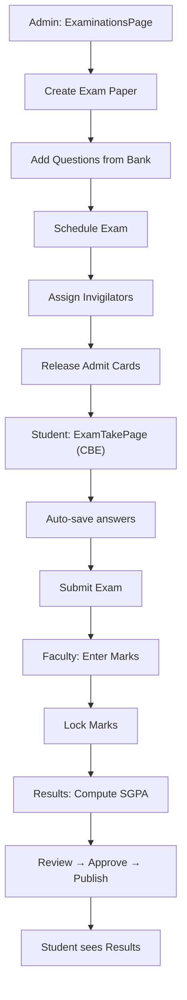

# UI Click Flow: Exam Creation to Result Publication

> Complete click-by-click journey from creating exam papers through student examination to result publication.

---

## Master Flow

---

## Phase 1: Admin Creates & Schedules Exam

| Step | Screen | What User Clicks | What Happens |
|:---|:---|:---|:---|
| 1 | Sidebar | Clicks **"Exams"** | `ExaminationsPage.tsx` loads |
| 2 | `ExaminationsPage.tsx` | Clicks **"+ Create Paper"** | Paper creation form opens |
| 3 | Create Paper | Selects Batch Term, Subject, Exam Type (Mid/Final/Internal), Duration, Total Marks | — |
| 4 | Create Paper | Clicks **"Save Paper"** | `POST /api/examination` → paper created (status: DRAFT) |
| 5 | Question Bank tab | Clicks **"Add Questions"** | Question picker opens (`GET /api/question-bank`) |
| 6 | Question picker | Selects questions by topic, difficulty, type | Adds to paper |
| 7 | Schedule tab | Clicks **"Schedule Exam"** | Schedule form: date, time, venue |
| 8 | Schedule form | Selects date, time slot, classroom | — |
| 9 | Schedule form | Clicks **"Validate Schedule"** | `POST /api/examination/schedule/validate` → checks conflicts |
| 10 | Schedule form | No conflicts → clicks **"Lock Schedule"** | `POST /api/examination/schedule/lock` → schedule finalized |
| 11 | Invigilation | Clicks **"Assign In-Charge"** | `PUT /api/examination/exam-incharge` |
| 12 | Admit Cards | Clicks **"Preview Admit Cards"** | `POST /api/examination/admit-card-preview` |
| 13 | Admit Cards | Clicks **"Release Admit Cards"** | `POST /api/examination/release-admit-card` → students can download |

---

## Phase 2: Student Takes Online Exam (CBE)

| Step | Screen | What User Sees | What User Clicks | What Happens |
|:---|:---|:---|:---|:---|
| 1 | Dashboard | "Upcoming Exam: CS301 Final" notification | Clicks **"Enter Exam"** | Navigation to `/exam/:paperId` |
| 2 | `ExamTakePage.tsx` | Environment check: webcam permission, fullscreen prompt | Clicks **"Allow Camera"** then **"Enter Full Screen"** | Browser enters fullscreen, webcam activated |
| 3 | `ExamTakePage.tsx` | Security header: timer (01:45:00), session status, student info | — | — |
| 4 | `ExamTakePage.tsx` | Question 1 displayed with radio options A/B/C/D | Selects **Option B** | `POST /api/examination/cbe/save-answer` → answer auto-saved |
| 5 | `ExamTakePage.tsx` | Question palette: Q1 turns green (answered) | Clicks **"Next"** | Question 2 loads |
| 6 | `ExamTakePage.tsx` | Question 5 — unsure | Clicks **"Flag for Review"** | Q5 turns amber in palette |
| 7 | `ExamTakePage.tsx` | Palette grid | Clicks **question number 15** | Jumps directly to Q15 |
| 8 | `ExamTakePage.tsx` | Tab switch attempt | Switches to another tab | `POST /api/examination/cbe/proctor-event { eventType: 'TAB_SWITCH' }` — warning shown |
| 9 | `ExamTakePage.tsx` | Warning: "Tab Switch 2/3 - Final warning" | Returns to exam tab | Counter incremented |
| 10 | `ExamTakePage.tsx` | Timer shows 00:05:00 remaining | Clicks **"Finish Exam"** | Confirmation dialog |
| 11 | Confirmation | "Are you sure? 3 questions unanswered" | Clicks **"Submit"** | `POST /api/examination/cbe/submit` → exam submitted |

---

## Phase 3: Invigilator Monitors Exam

| Step | Screen | What User Clicks | What Happens |
|:---|:---|:---|:---|
| 1 | Faculty login → Sidebar | Clicks **"Exam Monitor"** for specific paper | Navigation to `/exams/:paperId/monitor` |
| 2 | `ExamMonitorPage.tsx` | Grid of student cards with webcam snapshots | — |
| 3 | `ExamMonitorPage.tsx` | Student card shows "Tab Switches: 3/3" in red | Clicks **"Terminate Exam"** | Student's exam auto-submitted and locked |
| 4 | `ExamMonitorPage.tsx` | Another student: suspicious movement alert | Clicks **"Send Warning"** | Warning message displayed on student's screen |

---

## Phase 4: Faculty Enters Marks

| Step | Screen | What User Clicks | What Happens |
|:---|:---|:---|:---|
| 1 | Sidebar | Clicks **"My Subjects"** | `MySubjectsPage.tsx` loads |
| 2 | `MySubjectsPage.tsx` | Sees assigned subjects | Clicks **"Enter Marks"** for CS301 | Marks entry grid opens |
| 3 | Marks grid | Student list with mark columns (Internal, Mid, Final) | Types marks for each student | — |
| 4 | Marks grid | All marks entered | Clicks **"Save Marks"** | `POST /api/academic/marks` → saved |
| 5 | Marks grid | Clicks **"Lock Marks"** | `POST /api/academic/marks/lock` → marks frozen for review |

---

## Phase 5: Results Pipeline — Compute → Review → Approve → Publish

| Step | Screen | What User Clicks | What Happens |
|:---|:---|:---|:---|
| 1 | Admin → Sidebar | Clicks **"Exams"** → Results tab | Results pipeline dashboard loads |
| 2 | Pipeline | Sees stages: Marks Locked → Compute → Review → Approve → Publish | — |
| 3 | Pipeline | Clicks **"Compute Results"** | `POST /api/academic/results/compute` → SGPA calculated |
| 4 | Pipeline | Clicks **"Preview Results"** | `GET /api/academic/results/preview` → grade sheet preview |
| 5 | Pipeline | Clicks **"Review All"** | `POST /api/academic/results/review-all` → status → REVIEWED |
| 6 | Pipeline | Clicks **"Approve All"** | `POST /api/academic/results/approve-all` → status → APPROVED |
| 7 | Pipeline | Clicks **"Publish All"** | `POST /api/academic/results/publish-all` → results visible to students |
| 8 | Pipeline | Clicks **"Compute CGPA"** | `POST /api/academic/results/compute-cgpa` → cumulative GPA updated |

---

## Phase 6: Student Views Results

| Step | Screen | What User Clicks | What Happens |
|:---|:---|:---|:---|
| 1 | `StudentProfilePage.tsx` | Clicks **"Results"** tab | Term results list loads |
| 2 | Results tab | Clicks **"Term 3"** row | `GET /api/student-profile/term-results/:batchTermId` |
| 3 | Term detail | Sees subject-wise grades, SGPA, credits earned | — |

---

## Phase 7: Public Results

| Step | Screen | What User Clicks | What Happens |
|:---|:---|:---|:---|
| 1 | Browser | Navigates to `/results` (no login required) | `PublicResultsPage.tsx` loads |
| 2 | `PublicResultsPage.tsx` | Types enrollment number, selects term | Clicks **"Check Results"** |
| 3 | `PublicResultsPage.tsx` | Sees grade sheet (only for terms enabled via admin) | — |

---

## Alternative: PBE (Paper-Based Exam) Flow

| Step | Screen | What User Clicks | What Happens |
|:---|:---|:---|:---|
| 1 | `ExaminationsPage.tsx` | Clicks **"Answersheet Serials"** tab | Serial recording panel |
| 2 | Serial panel | Enters serial numbers for each student | `PUT /api/examination/answersheet-serials` |
| 3 | Serial panel | Clicks **"Lock Serials"** | `POST /api/examination/answersheet-serials/lock` |
| 4 | Anonymisation | Toggles **"Anonymise Exam"** | `PUT /api/examination/exam-anonymise` → marks entry shows only serial numbers |

---

## Alternative: Supplementary Exam

| Step | Screen | What User Clicks | What Happens |
|:---|:---|:---|:---|
| 1 | Results pipeline | Clicks **"Backlogs"** | `GET /api/academic/supplementary/backlogs` → failed students list |
| 2 | Backlogs | Student clicks **"Register for Supplementary"** | `POST /api/academic/supplementary/register` |
| 3 | Admin | Schedules supplementary exam | `POST /api/examination/schedule-supplementary` |
| 4 | After exam | Faculty records result | `PATCH /api/academic/supplementary/:id/result` |
