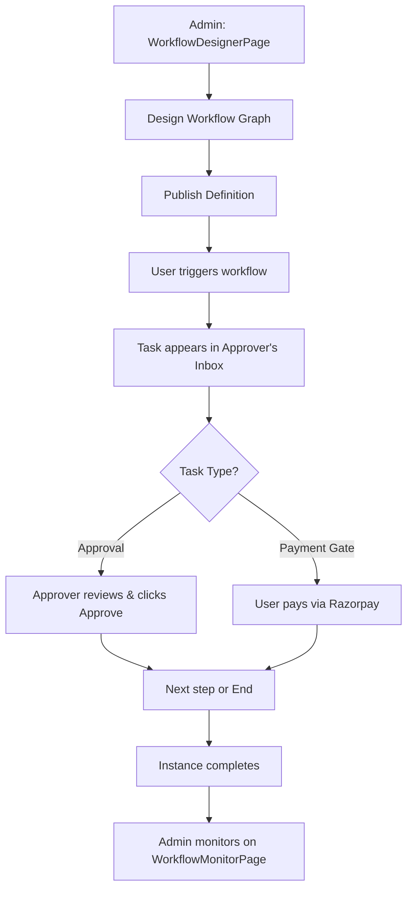

# UI Click Flow: Workflow Approval Chain

> Click-by-click journey for building, triggering, and completing a workflow approval with Razorpay payment gate.

---

## Master Flow

---

## Phase 1: Admin Designs & Publishes Workflow

| Step | Screen | What User Clicks | What Happens |
|:---|:---|:---|:---|
| 1 | Sidebar | Clicks **"Workflows"** | `WorkflowDesignerPage.tsx` loads |
| 2 | `WorkflowDesignerPage.tsx` | Sees workflow catalog | Clicks **"+ New Workflow"** |
| 3 | Designer | Selects workflow type from catalog (`GET /api/workflow/catalog`) | Blank canvas opens |
| 4 | Canvas | Drags **"Approval Node"** from left palette onto canvas | Node appears with "HOD Approval" label |
| 5 | Canvas | Drags **"Payment Gate Node"** | Payment step added |
| 6 | Canvas | Drags **"Approval Node"** again | "Dean Approval" step added |
| 7 | Canvas | Draws connection arrows: Start → HOD → Payment → Dean → End | SVG lines connect nodes |
| 8 | Right Inspector | Configures HOD node: Approver Role = "HOD", Scope = "Department" | Role binding set |
| 9 | Right Inspector | Configures Payment node: Amount = "Application Fee", Gateway = "Razorpay" | Payment gate configured |
| 10 | Right Inspector | Configures Dean node: Approver Role = "Dean" | — |
| 11 | Toolbar | Clicks **"Save Graph"** | `PUT /api/workflow/definitions/:id/graph` → graph persisted |
| 12 | Toolbar | Clicks **"Publish"** | `POST /api/workflow/definitions/:id/publish` → definition is now ACTIVE |

---

## Phase 2: User Triggers Workflow Instance

| Step | Screen | What User Clicks | What Happens |
|:---|:---|:---|:---|
| 1 | Any module | Submits a form/request that triggers a workflow | Workflow instance created automatically |
| 2 | — | — | First task assigned to HOD based on scope rules |
| 3 | — | — | HOD receives notification (email + in-app) |

---

## Phase 3: HOD Reviews & Approves

| Step | Screen | What User Sees | What User Clicks | What Happens |
|:---|:---|:---|:---|:---|
| 1 | Sidebar | Notification badge on "My Tasks" | Clicks **"My Tasks"** | `MyTasksPage.tsx` loads |
| 2 | `MyTasksPage.tsx` | Inbox table with pending tasks | — | `GET /api/workflow/inbox` populates list |
| 3 | `MyTasksPage.tsx` | Row: "Leave Request - John Doe - PENDING" | Clicks **task row** | Task detail expands with context |
| 4 | Task detail | Request details, initiator info, supporting documents | Reviews content | — |
| 5 | Task detail | Comment text area | Types **"Approved. Faculty covered."** | — |
| 6 | Task detail | Action buttons: Approve, Reject, Delegate | Clicks **"Approve"** | `POST /api/workflow/tasks/:id/act { action: 'APPROVE', comments: '...' }` |
| 7 | `MyTasksPage.tsx` | Task removed from inbox | — | Workflow advances to Payment Gate step |

---

## Phase 4: User Completes Payment Gate

| Step | Screen | What User Clicks | What Happens |
|:---|:---|:---|:---|
| 1 | User's inbox | Task: "Complete Payment - ₹500" | Clicks **task row** |
| 2 | Task detail | "Pay via Razorpay" button | Clicks **"Pay ₹500"** |
| 3 | — | — | `POST /api/workflow/tasks/:id/payment/order` → Razorpay order created |
| 4 | Razorpay | Payment form | Enters details, clicks **"Pay"** | Payment processed |
| 5 | — | — | `POST /api/workflow/tasks/:id/payment/verify` → signature verified |
| 6 | — | — | Payment gate cleared, workflow advances to Dean step |

---

## Phase 5: Dean Final Approval

| Step | Screen | What User Clicks | What Happens |
|:---|:---|:---|:---|
| 1 | Dean's `MyTasksPage.tsx` | Task appears in inbox | Reviews and clicks **"Approve"** |
| 2 | — | — | Workflow instance completes (status: COMPLETED) |
| 3 | — | — | Notification sent to initiator: "Your request has been approved" |

---

## Phase 6: Admin Monitors Workflows

| Step | Screen | What User Clicks | What Happens |
|:---|:---|:---|:---|
| 1 | Sidebar | Clicks **"Workflows"** → Monitor tab | `WorkflowMonitorPage.tsx` loads |
| 2 | `WorkflowMonitorPage.tsx` | Instance table with filters | Selects Status = "Active" |
| 3 | Instance table | Row: "Hostel Booking #42 - Step 2/4" | Clicks **row** | `InstanceDrawer.tsx` slides open |
| 4 | `InstanceDrawer.tsx` | Full workflow timeline: Step 1 ✅ Approved → Step 2 ⏳ Waiting | — |
| 5 | `WorkflowMonitorPage.tsx` | Clicks **"Aging"** tab | `GET /api/workflow/instances-aging` → bottleneck analysis |
| 6 | Admin tools | Clicks **"Run Expiry"** | `POST /api/workflow/admin/run-expiry` → expired holds cleaned up |

---

## Alternative: Rejection Flow

| Step | Screen | What Approver Clicks | What Happens |
|:---|:---|:---|:---|
| 1 | `MyTasksPage.tsx` | Types rejection reason, clicks **"Reject"** | `POST /api/workflow/tasks/:id/act { action: 'REJECT' }` |
| 2 | — | — | Instance status → REJECTED, notification to initiator |

## Alternative: Delegation Flow

| Step | Screen | What Approver Clicks | What Happens |
|:---|:---|:---|:---|
| 1 | `MyTasksPage.tsx` | Clicks **"Delegate"** | User picker opens |
| 2 | User picker | Selects alternate approver | `POST /api/workflow/tasks/:id/act { action: 'DELEGATE', targetUserId }` |
| 3 | — | — | Task reassigned to delegate's inbox |
