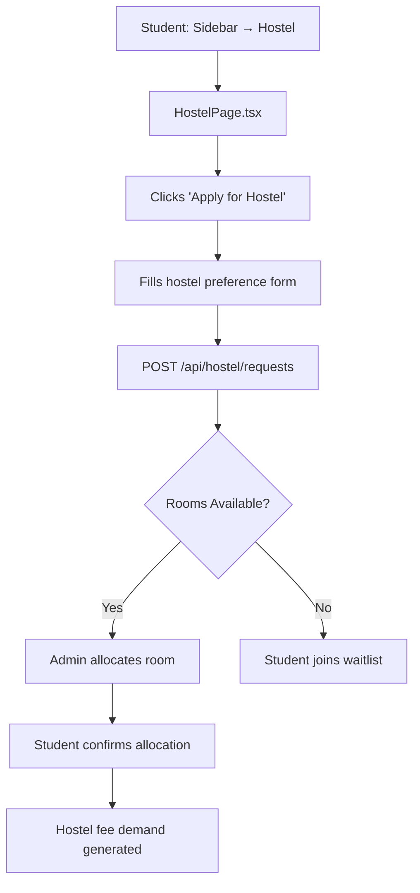

# UI Click Flow: Hostel, Transport & Library

> Click-by-click journeys for campus facilities management.

---

## Flow 1: Student Requests Hostel Room

### Step-by-Step: Student Hostel Application

| Step | Screen | What User Clicks | What Happens |
|:---|:---|:---|:---|
| 1 | Sidebar | Clicks **"Hostel"** | `HostelPage.tsx` loads |
| 2 | `HostelPage.tsx` | Sees "My Requests" section (empty) | Clicks **"Apply for Hostel"** |
| 3 | Application form | Selects preferred hostel, room type (Single/Shared/Triple), mess plan | — |
| 4 | Application form | Clicks **"Submit Request"** | `POST /api/hostel/requests` → request created |
| 5 | `HostelPage.tsx` | "My Requests" shows: "Status: PENDING, Waitlist: #5" | Waits for allocation |

### Step-by-Step: Admin Manages Hostel

| Step | Screen | What User Clicks | What Happens |
|:---|:---|:---|:---|
| 1 | Admin → Sidebar | Clicks **"Hostel"** | `HostelPage.tsx` (admin view) |
| 2 | `HostelPage.tsx` | Hostel block cards: A-Block (80% full), B-Block (45% full) | Clicks **"A-Block"** |
| 3 | Block view | Room matrix grid (color-coded: green=full, yellow=partial, slate=empty) | — |
| 4 | Room matrix | Clicks **empty room "A-201"** | Room detail with bed availability |
| 5 | Room detail | Clicks **"Allocate Student"** | Student picker opens |
| 6 | Student picker | Selects student from request waitlist | Clicks **"Block Room"** |
| 7 | — | — | `POST /api/hostel/allocations` → room blocked |
| 8 | `HostelPage.tsx` | Student's request shows "ALLOCATED - A-201" | — |
| 9 | Student | Sees allocation notification | Clicks **"Confirm"** | `PATCH /api/hostel/allocations/:id/confirm` |

### Step-by-Step: Hostel Config & Reports

| Step | Screen | What User Clicks | What Happens |
|:---|:---|:---|:---|
| 1 | `HostelPage.tsx` | Clicks **"Fee Components"** | Lists mess, room, maintenance fees |
| 2 | Fee Components | Clicks **"+ Add Component"** | `POST /api/hostel/components` |
| 3 | `HostelPage.tsx` | Clicks **"Room Rates"** for hostel | Rate table by room type |
| 4 | Room Rates | Updates rates, clicks **"Save"** | `PUT /api/hostel/hostels/:id/room-rates` |
| 5 | `HostelPage.tsx` | Clicks **"Reports" → "Occupancy"** | `GET /api/hostel/reports/occupancy` → occupancy chart |
| 6 | Reports | Clicks **"Vacant Rooms"** | `GET /api/hostel/reports/vacant` → empty room list |

---

## Flow 2: Transport Route Setup & Student Enrollment

| Step | Screen | What User Clicks | What Happens |
|:---|:---|:---|:---|
| 1 | Admin → Sidebar | Clicks **"Transport"** | `TransportPage.tsx` loads |
| 2 | `TransportPage.tsx` | Clicks **"+ Create Route"** | Route form opens |
| 3 | Route form | Enters route name, bus number, driver contact | — |
| 4 | Route form | Clicks **"Save Route"** | `POST /api/transport/routes` |
| 5 | Route detail | Clicks **"+ Add Stop"** | Stop form: stop name, pickup time, coordinates |
| 6 | Stop form | Fills details, clicks **"Save"** | `POST /api/transport/stops` |
| 7 | `TransportPage.tsx` | Clicks **"+ Add Vehicle"** | Vehicle form: type, capacity, registration |
| 8 | Vehicle form | Clicks **"Save"** | `POST /api/transport/vehicles` |
| 9 | Student enrollment | Clicks **"Enroll Student"** | `POST /api/transport/enrollments` |
| 10 | Student | Sees transport info on `StudentProfilePage.tsx` → Transport tab | Bus pass with QR code |

---

## Flow 3: Library Book Issue & Return

| Step | Screen | What User Clicks | What Happens |
|:---|:---|:---|:---|
| 1 | Librarian → Sidebar | Clicks **"Library"** | `LibraryPage.tsx` loads |
| 2 | `LibraryPage.tsx` | Book catalog search | Types **"Data Structures"** in search |
| 3 | Search results | Book cards with stock count | Clicks **book card** |
| 4 | Book detail | Available copies: 3/5 | Clicks **"Issue Book"** |
| 5 | Issue modal | Scans/enters student ID | `POST /api/library/loans/issue` → loan created |
| 6 | Active loans tab | List of issued books with due dates | — |
| 7 | Return | Student returns book, librarian clicks **"Return"** | `POST /api/library/loans/return` → loan closed |
| 8 | Overdue | System auto-generates fine for overdue books | Student sees fine on `FeesPage` |

---

## Flow 4: Resource Reservation

| Step | Screen | What User Clicks | What Happens |
|:---|:---|:---|:---|
| 1 | Admin/Staff | Navigates to resource booking | Resource calendar loads |
| 2 | Calendar | Clicks **empty slot** on date for Auditorium | Reservation form opens |
| 3 | Form | Selects resource, date, time, purpose | — |
| 4 | Form | Clicks **"Reserve"** | `POST /api/resource-reservation` → booking confirmed |
| 5 | Calendar | Reservation appears as colored block | — |

---

## Flow 5: Room Release & Refund

| Step | Screen | What User Clicks | What Happens |
|:---|:---|:---|:---|
| 1 | Admin `HostelPage.tsx` | Clicks student allocation row | Allocation detail opens |
| 2 | Allocation detail | Clicks **"Release Room"** | Release form: reason, effective date |
| 3 | Release form | Enters reason, clicks **"Release"** | `PATCH /api/hostel/allocations/:id/release` → room freed, prorated refund calculated |
