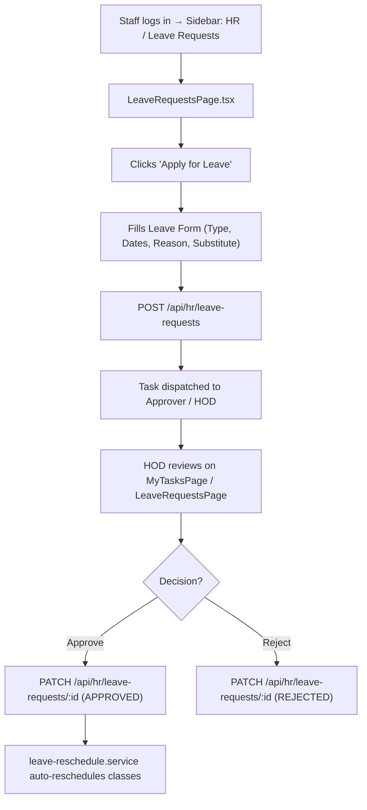
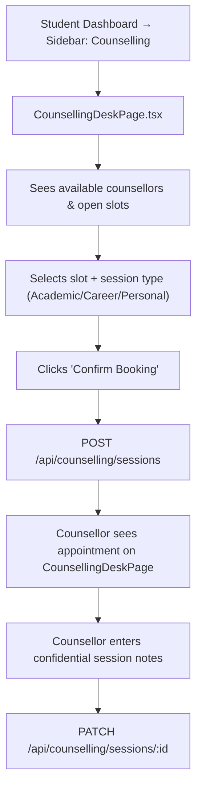

# UI Click Flow: HR, Staff Leave & Student Counselling

> Click-by-click journey for Staff HR records, Leave Applications & Approval with automated rescheduling, and Student Counselling desk operations.

---

## Flow 1: Staff Member Applies for Leave

### Step-by-Step: Leave Application & Auto-Rescheduling

| Step | Screen | What User Sees | What User Clicks | What Happens | Next Screen |
|:---|:---|:---|:---|:---|:---|
| 1 | `DashboardPage.tsx` | Staff Personal Dashboard | Clicks **"Leave Requests"** in sidebar | Navigation | `LeaveRequestsPage.tsx` |
| 2 | `LeaveRequestsPage.tsx` | Leave balance cards (Casual: 8, Sick: 5, Earned: 12) & table of past applications | Clicks **"Apply for Leave"** | Modal opens | Modal overlay |
| 3 | Leave Application Modal | Form: Leave Type dropdown, Start Date, End Date, Reason text area, Class Handover notes | Selects **"Casual Leave"**, picks dates `2026-09-10` to `2026-09-12`, fills reason | Form validation runs | Same modal |
| 4 | Leave Application Modal | Conflict preview showing 4 scheduled lecture classes during the requested dates | Clicks **"Submit Leave Request"** | `POST /api/hr/leave-requests` → status set to `PENDING` | `LeaveRequestsPage.tsx` with new pending row |
| 5 | HOD / Manager Login | HOD sees notification & task in inbox | Clicks **"My Tasks"** or **"Leave Approvals"** | Loads task detail | Approval screen |
| 6 | Approval Screen | Application details with affected timetable slots | Clicks **"Approve"** | `PATCH /api/hr/leave-requests/:id` with action `APPROVED` | — |
| 7 | Backend (`leave-reschedule.service.ts`) | Automatic timetable reconciliation | Finds replacement faculty / marks slots for makeup sessions | Timetable updated | Notification dispatched to staff & affected students |

---

## Flow 2: Staff Management & Records (HR Admin)

| Step | Screen | What User Sees | What User Clicks | What Happens | Next Screen |
|:---|:---|:---|:---|:---|:---|
| 1 | Sidebar | HR menu | Clicks **"Staff Management"** | Navigation | `HRPage.tsx` |
| 2 | `HRPage.tsx` | Staff directory table (Name, Designation, Department, Employment Type, Status) | Clicks **"+ Add Staff"** | Staff creation drawer opens | Drawer |
| 3 | Create Staff Drawer | Personal info, Employee Code, Department, Role, Salary Grade | Fills details, clicks **"Save Staff Record"** | `POST /api/hr/staff` → user and staff profile created | `HRPage.tsx` table updates |
| 4 | `HRPage.tsx` | Staff row for an existing employee | Clicks **"Manage Leave Balances"** | Balances editor opens | Modal |
| 5 | Balances Modal | Input boxes for Casual, Sick, Earned Leave quotas | Edits values, clicks **"Update Quota"** | `PATCH /api/hr/staff/:id/leave-balances` | Balances updated |

---

## Flow 3: Student Books Counselling Appointment

### Step-by-Step: Counselling Booking & Session Notes

| Step | Screen | What User Sees | What User Clicks | What Happens | Next Screen |
|:---|:---|:---|:---|:---|:---|
| 1 | Student Sidebar | Counselling link | Clicks **"Counselling"** | Navigation | `CounsellingDeskPage.tsx` |
| 2 | `CounsellingDeskPage.tsx` | List of licensed counsellors with bios, specializations, and weekly calendar slots | Clicks **"Book Session"** on Counsellor card | Slot picker modal opens | Modal |
| 3 | Slot Picker Modal | Day/time slots (e.g. Wed 3:00 PM - 4:00 PM), Session Category (Academic Stress, Career Guidance, Wellbeing) | Picks slot, selects category, adds optional private note | Clicks **"Confirm Booking"** | `POST /api/counselling/sessions` |
| 4 | `CounsellingDeskPage.tsx` | "Upcoming Session: Wed 3:00 PM" card appears with meeting room / link info | — | Status set to `SCHEDULED` | Confirmation toast |
| 5 | Counsellor Login | Counsellor logs in | Navigates to **"Counselling Desk"** | Calendar loads with booked session | `CounsellingDeskPage.tsx` (Counsellor View) |
| 6 | Counsellor Desk | Clicks on student session card | Opens confidential session workspace | Session note editor |
| 7 | Session Workspace | Private notes field (encrypted), follow-up required checkbox, next appointment date | Types notes, marks session **"Completed"**, clicks **"Save Notes"** | `PATCH /api/counselling/sessions/:id` | Notes securely persisted |

---

## Flow 4: Counselling Administration & Reporting

| Step | Screen | What User Sees | What User Clicks | What Happens | Next Screen |
|:---|:---|:---|:---|:---|:---|
| 1 | Admin Sidebar | Counselling Admin | Clicks **"Counselling Admin"** | Navigation | `CounsellingAdminPage.tsx` |
| 2 | `CounsellingAdminPage.tsx` | Counsellor roster, session capacity, category metrics | Clicks **"Add Counsellor"** | Counsellor configuration modal | Modal |
| 3 | Modal | User search (select staff user), Specialization tags, Max slots/week | Configures and clicks **"Save"** | `POST /api/counselling/counsellors` | Roster updated |
| 4 | `CounsellingAdminPage.tsx` | Reports tab | Clicks **"Export Utilization Report"** | `GET /api/counselling/reports` | Summary analytics downloaded |
