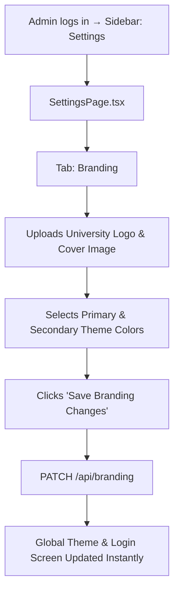
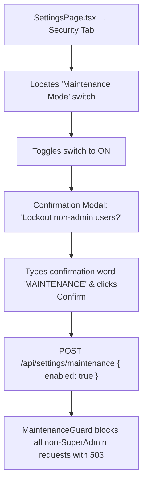

# UI Click Flow: Settings, Security & System Administration

> Click-by-click journey for SuperAdmin and University Admins configuring branding, security policies, backup schedules, ID formats, maintenance mode, and auditing.

---

## Flow 1: Branding & Visual Customization

### Step-by-Step

| Step | Screen | What User Sees | What User Clicks | What Happens | Next Screen |
|:---|:---|:---|:---|:---|:---|
| 1 | Sidebar | Settings link | Clicks **"Settings"** | Navigation | `SettingsPage.tsx` |
| 2 | `SettingsPage.tsx` | Tab strip: Branding, Integrations, Security, Backup, ID Formats, Audit | Clicks **"Branding"** tab | Branding editor loads | — |
| 3 | Branding Tab | Current Logo preview, Cover image preview, Primary color picker, University display title | Clicks **"Upload New Logo"** | File dialog opens | File selector |
| 4 | File Selector | Selects `logo.png` (max 2MB) | Clicks **"Open"** | Image uploaded to MinIO via `POST /api/branding/upload` | Preview updates |
| 5 | Branding Tab | Theme color palette | Selects Indigo `#4F46E5` and Slate `#0F172A` | Real-time preview refreshes | Same tab |
| 6 | Branding Tab | Save button | Clicks **"Save Branding Changes"** | `PATCH /api/branding` | Success toast; app theme refreshed |

---

## Flow 2: Password Policy & Account Security Configuration

| Step | Screen | What User Sees | What User Clicks | What Happens | Next Screen |
|:---|:---|:---|:---|:---|:---|
| 1 | `SettingsPage.tsx` | Tab strip | Clicks **"Security"** tab | Password policy and lockout settings load | — |
| 2 | Security Tab | Minimum length slider, Uppercase toggle, Special char toggle, History count (e.g. 5), Max login attempts (5), Lockout minutes (15) | Modifies Min Length to `10`, History Count to `3`, Max Attempts to `5` | Form state updates | Same tab |
| 3 | Security Tab | "Reject Dictionary Words" and "Reject Username in Password" checkboxes | Checks both boxes | — | Same tab |
| 4 | Security Tab | Save button | Clicks **"Save Security Policies"** | `PUT /api/settings/password-policy` | Policies active across all auth endpoints |

---

## Flow 3: Maintenance Mode Toggle

| Step | Screen | What User Sees | What User Clicks | What Happens | Next Screen |
|:---|:---|:---|:---|:---|:---|
| 1 | `SettingsPage.tsx` | Maintenance Mode toggle card with status badge (`INACTIVE`) | Clicks **Toggle switch to ON** | Warning confirmation dialog appears | Dialog overlay |
| 2 | Confirmation Dialog | Message: "Enabling maintenance mode will terminate all active non-admin sessions and block login." | Types **"MAINTENANCE"** in verification box and clicks **"Enable Maintenance Mode"** | `POST /api/settings/maintenance` | Modal closes; yellow alert banner shows across portal |
| 3 | Any Non-Admin User | User attempting any API call | — | Blocked with `503 Service Unavailable`, redirected to Maintenance overlay | Maintenance Screen |

---

## Flow 4: Database Backup & Recovery

| Step | Screen | What User Sees | What User Clicks | What Happens | Next Screen |
|:---|:---|:---|:---|:---|:---|
| 1 | `SettingsPage.tsx` | Tab strip | Clicks **"Backup & Restore"** tab | Backup management console loads | — |
| 2 | Backup Tab | List of historical backups (timestamp, size, status), Cron schedule config | Clicks **"Create Backup Now"** | `POST /api/backup/manual` fires background dump | Spinner on button |
| 3 | Backup Tab | Progress notification: "Database backup completed successfully." | New backup row appears in table | — | — |
| 4 | Backup Row | Download icon button next to backup file | Clicks **"Download"** | `GET /api/backup/:id/download` | `.sql.gz` archive downloaded to browser |

---

## Flow 5: ID Format Configuration

| Step | Screen | What User Sees | What User Clicks | What Happens | Next Screen |
|:---|:---|:---|:---|:---|:---|
| 1 | Sidebar | ID Formats menu | Clicks **"ID Formats"** | Navigation | `IdFormatsPage.tsx` |
| 2 | `IdFormatsPage.tsx` | Configured formats table (Student Enrollment, Staff Code, Application ID, Receipt No) | Clicks **"Edit"** on `Student Enrollment` | Pattern builder modal opens | Modal |
| 3 | Pattern Builder Modal | Pattern template input (`{INST:3}/{DEPT:2}/{YEAR:4}/{SEQ:4}`), Sample preview: `ENG/CS/2026/0001` | Changes pattern, sets start sequence number | Live preview updates | Same modal |
| 4 | Pattern Builder Modal | Save button | Clicks **"Save ID Format"** | `PATCH /api/id-format/:id` | Success toast; new admissions use updated generator pattern |

---

## Flow 6: Audit Log Inspection & Security Forensics

| Step | Screen | What User Sees | What User Clicks | What Happens | Next Screen |
|:---|:---|:---|:---|:---|:---|
| 1 | Sidebar | Audit Log menu | Clicks **"Audit Logs"** | Navigation | `AuditLogPage.tsx` |
| 2 | `AuditLogPage.tsx` | Filter bar (Date Range, Module, Action Type, Actor, IP), paginated log entries table | Selects Module **"AUTH"**, Action **"LOGIN_FAILED"**, Date **"Today"** | Table filters automatically | — |
| 3 | `AuditLogPage.tsx` | Clickable log entry with timestamp and IP `192.168.1.104` | Clicks **log row** | `DrillModal.tsx` opens | Modal |
| 4 | `DrillModal.tsx` | Full JSON details: Device User-Agent, failed attempt counter, request payload snippet (sanitized) | Reviews forensic detail, clicks **"Close"** | Modal closes | `AuditLogPage.tsx` |
