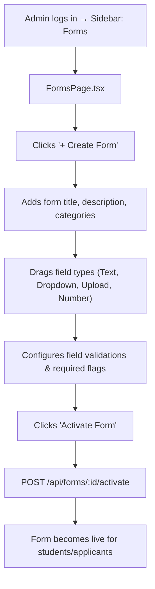
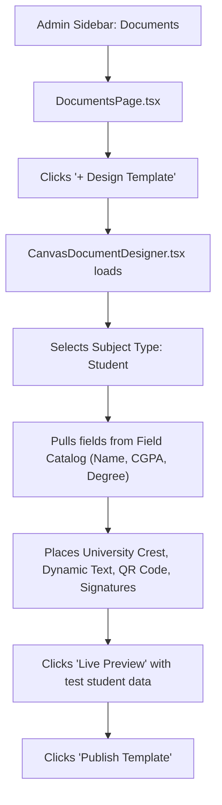

# UI Click Flow: Dynamic Forms & Document Generation

> Click-by-click journey for creating dynamic forms, collecting submissions, designing document templates in the Canvas Designer, issuing certificates, and public verification.

---

## Flow 1: Building a Dynamic Form & Publishing

### Step-by-Step

| Step | Screen | What User Sees | What User Clicks | What Happens | Next Screen |
|:---|:---|:---|:---|:---|:---|
| 1 | Sidebar | Forms menu item | Clicks **"Forms"** | Navigation | `FormsPage.tsx` |
| 2 | `FormsPage.tsx` | Form templates table (Title, Status, Submissions count, Created date) | Clicks **"+ Create Form"** | Form builder view opens | Template Builder |
| 3 | Template Builder | Left field palette (Short Text, Long Text, Dropdown, Radio, File Upload, Date, Checkbox) | Drags **"Short Text"** to builder canvas | Field block appears on canvas | Canvas |
| 4 | Canvas Field | Field properties panel on right | Types Label: **"Father's Occupation"**, checks **"Required"** | Field updates in real-time | Canvas |
| 5 | Canvas Field | Drags **"File Upload"** to canvas | Types Label: **"Income Certificate"**, sets Allowed Types: `PDF, JPG`, Max Size: `5MB` | — | Canvas |
| 6 | Template Builder | Top toolbar | Clicks **"Save Draft"** | `POST /api/forms` or `PUT /api/forms/:id` | Draft saved |
| 7 | Template Builder | Top toolbar | Clicks **"Activate"** | `POST /api/forms/:id/activate` | Form status becomes `ACTIVE` |

---

## Flow 2: Student Fills & Submits a Form

| Step | Screen | What User Sees | What User Clicks | What Happens | Next Screen |
|:---|:---|:---|:---|:---|:---|
| 1 | Student Sidebar | Forms menu | Clicks **"Forms"** | `FormsPage.tsx` (Student View) | Active Forms List |
| 2 | Active Forms List | Cards of available forms with deadline badges | Clicks **"Fill Form"** on "Scholarship Application 2026" | Dynamic form renderer loads | Form Renderer |
| 3 | Form Renderer | Inputs rendered dynamically from schema | Fills required text inputs, selects dropdown choices | Input state maintained in React state | Same view |
| 4 | Form Renderer | File upload field | Clicks **"Upload Document"** | File selected, uploaded to MinIO via `POST /api/upload/file` | Progress bar turns green |
| 5 | Form Renderer | Action buttons: Save Draft, Submit | Clicks **"Save Draft"** | `POST /api/forms/:id/save-draft` | Toast: "Draft saved" |
| 6 | Form Renderer | Final check | Clicks **"Submit Form"** | `POST /api/forms/:id/submit` | Status set to `SUBMITTED`; view switches to Read-Only (`ReadOnlyFormView.tsx`) |

---

## Flow 3: Designing a Certificate in the Canvas Document Designer

### Step-by-Step

| Step | Screen | What User Sees | What User Clicks | What Happens | Next Screen |
|:---|:---|:---|:---|:---|:---|
| 1 | Sidebar | Documents menu | Clicks **"Documents"** | Navigation | `DocumentsPage.tsx` |
| 2 | `DocumentsPage.tsx` | Templates tab with list of certificate and marksheet designs | Clicks **"+ Design Template"** | Canvas Designer loads | `CanvasDocumentDesigner.tsx` |
| 3 | `CanvasDocumentDesigner.tsx` | A4 Canvas (Portrait/Landscape toggle), left element toolbox, right styling inspector | Selects **"Landscape"**, sets background border | Canvas adapts | Canvas |
| 4 | Left Toolbox | Dynamic Fields catalog (`GET /api/documents/field-catalog?subject=student`) | Drags **"Student Full Name"** placeholder `{{student.fullName}}` onto canvas | Text element placed | Canvas |
| 5 | Left Toolbox | Dynamic Fields | Drags **"Degree Name"**, **"Graduation Date"**, **"CGPA"** placeholders | Elements placed | Canvas |
| 6 | Left Toolbox | Visual Elements | Drags **"Verification QR Code"** and **"Authorized Signatory"** to footer | QR element bound to public verify URL | Canvas |
| 7 | Top Toolbar | Test Data Preview button | Clicks **"Live Preview"** | `POST /api/documents/templates/preview` renders PDF in modal | Preview Modal |
| 8 | Preview Modal | Pixel-perfect rendered certificate with test data | Reviews layout, clicks **"Close Preview"** | Returns to designer | Designer |
| 9 | Top Toolbar | Save & Publish | Clicks **"Publish Template"** | `POST /api/documents/templates` | Status set to `ACTIVE` |

---

## Flow 4: Bulk Issuing Documents & Tracking Delivery

| Step | Screen | What User Sees | What User Clicks | What Happens | Next Screen |
|:---|:---|:---|:---|:---|:---|
| 1 | `DocumentsPage.tsx` | Issued Documents tab | Clicks **"Issue New Document"** | Issue drawer opens | Drawer |
| 2 | Issue Drawer | Template selector dropdown, Batch/Term picker, Student multi-selector | Selects **"Degree Certificate"**, Batch **"2022-2026"** | List of eligible students loads | Same drawer |
| 3 | Issue Drawer | Action button | Clicks **"Generate & Issue to 120 Students"** | `POST /api/documents/issue` batch job creates issued records with unique serial numbers | Table updates |
| 4 | Issued Documents Table | Row for student with Serial `DOC-2026-98124`, Status `PENDING_PRINT` | Clicks **"Mark Printed"** | `PATCH /api/documents/:id/print-status` | Status → `PRINTED` |
| 5 | Table | Selects multiple printed documents | Clicks **"Bulk Delivery Update"** | `POST /api/documents/bulk-delivery` | Status → `DELIVERED` |

---

## Flow 5: Public Document Verification (No Auth)

| Step | Screen | What User Sees | What User Clicks | What Happens | Next Screen |
|:---|:---|:---|:---|:---|:---|
| 1 | External Third-Party (Employer/Verifier) | Scans QR code on paper certificate or opens `/verify/DOC-2026-98124` | Navigates to public URL | Public verification endpoint called: `GET /api/documents/verify/:serialNo` | Public Verification Screen |
| 2 | Public Verification Screen | Official University verification banner, Student Name, Program, Issue Date, Validity status badge (`VALID CERTIFICATE`) | Clicks **"View Official Digital Copy"** | `GET /api/documents/verify/:serialNo/view` | Embedded secure PDF viewer |
| 3 | If Revoked / Invalid | Red alert banner: `INVALID OR REVOKED DOCUMENT` with revocation reason | — | Clear anti-fraud notification | — |
