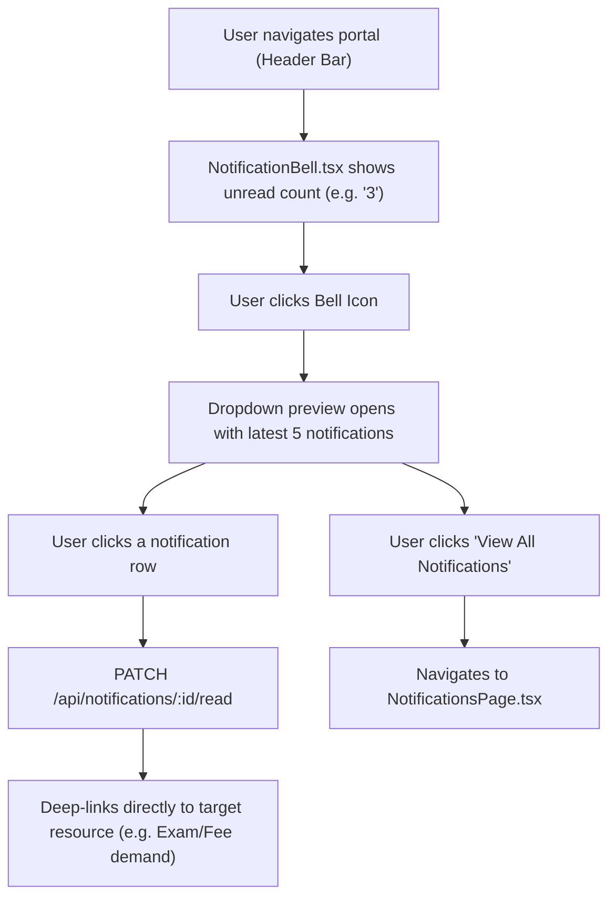
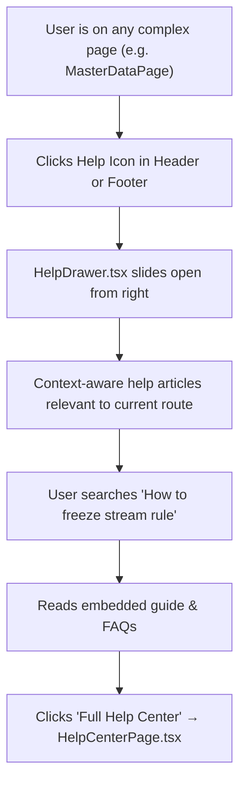

# UI Click Flow: Notifications & Help Center

> Click-by-click journey for managing global in-app notifications, reading messages, daily email summaries, and accessing contextual help & knowledge base.

---

## Flow 1: Notification Bell & In-App Alerts

### Step-by-Step

| Step | Screen | What User Sees | What User Clicks | What Happens | Next Screen |
|:---|:---|:---|:---|:---|:---|
| 1 | Portal Top Header | `NotificationBell.tsx` with red badge showing unread count (`5`) | Clicks **Bell Icon** | Notification popover opens | Popover overlay |
| 2 | Popover Overlay | List of recent alerts (Fee Due, Exam Scheduled, Task Assigned) with relative timestamps | Clicks **"Fee Due: Term 3"** notification | `PATCH /api/notifications/:id/read` fires in background | Deep-links to `/fees` |
| 3 | Popover Overlay | Bottom action link | Clicks **"View All Notifications"** | Navigation | `NotificationsPage.tsx` |
| 4 | `NotificationsPage.tsx` | Full chronological table of all alerts with filters (All, Unread, Read) | Clicks **"Mark All as Read"** | `PATCH /api/notifications/read-all` | All badges clear; count becomes `0` |
| 5 | `NotificationsPage.tsx` | Single notification row | Clicks **Trash Icon** | `DELETE /api/notifications/:id` | Item removed from list |

---

## Flow 2: Daily Digest & Channel Preferences

| Step | Screen | What User Sees | What User Clicks | What Happens | Next Screen |
|:---|:---|:---|:---|:---|:---|
| 1 | `SettingsPage.tsx` | Tab strip | Clicks **"Notifications"** tab | Notification settings console loads | — |
| 2 | Notifications Tab | Toggle switches for Email Notifications, SMS Alerts, Daily Digest Email time | Modifies Daily Digest Time to `08:00 AM`, enables SMS for Exam Notices | Changes saved | Same tab |
| 3 | Notifications Tab | Button "Send Test Notification" | Clicks **"Send Test Email"** | `POST /api/notifications/test-email` | Dispatches test SMTP message to logged-in user |

---

## Flow 3: Help Center & Contextual Drawer

### Step-by-Step

| Step | Screen | What User Sees | What User Clicks | What Happens | Next Screen |
|:---|:---|:---|:---|:---|:---|
| 1 | Any page (e.g. `ExaminationsPage.tsx`) | Header question mark `?` icon | Clicks **Help Icon** | `HelpDrawer.tsx` slides in from right | Help Drawer |
| 2 | `HelpDrawer.tsx` | Contextual quick tips: "How to schedule exams", "Understanding PBE Anonymisation" | Clicks **"Understanding PBE Anonymisation"** | Article text expands with diagrams | Help Drawer |
| 3 | `HelpDrawer.tsx` | Search bar | Types **"admit card generation"** | Instant search filters relevant knowledge base articles | Help Drawer |
| 4 | `HelpDrawer.tsx` | Bottom link "Visit Complete Knowledge Base" | Clicks **"Open Help Center"** | Full-page navigation | `HelpCenterPage.tsx` |
| 5 | `HelpCenterPage.tsx` | Searchable knowledge base categories: Getting Started, Admissions, Academics, Financials, Examinations, Security | Browses categories, downloads PDF user guides | — | — |
