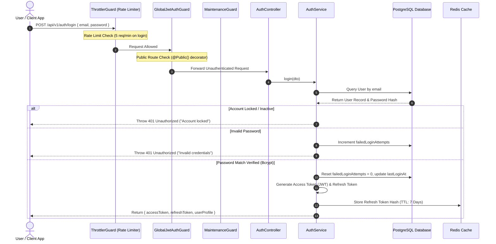
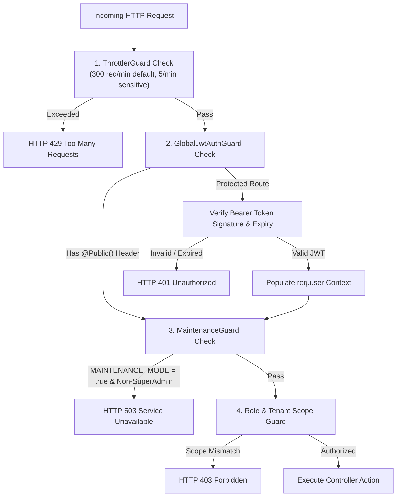

# Technical Workflow Architecture: Authentication, Guards & Security

## Overview
This document details the end-to-end technical architecture, request guard pipeline, token lifecycle, password history validation, OTP generation, and database state mutations for system authentication and security.

---

## 🔄 End-to-End Sequence Diagram: Authentication & Guard Pipeline

---

## ⚙️ Request Processing Pipeline Architecture

---

## 📊 Database Mutations & State Changes

### 1. User Table (`users`)
- `failed_login_attempts`: Incremented on invalid password; reset to `0` on successful authentication.
- `locked_until`: Populated with timestamp if `failed_login_attempts >= MAX_ATTEMPTS`.
- `last_login_at`: Updated to `now()` upon successful token issuance.

### 2. Password History Table (`password_history`)
- When password is changed/reset (`setupAccount` / `resetPassword`):
  - `INSERT INTO password_history (user_id, password_hash, created_at)`
  - Query checks: `SELECT * FROM password_history WHERE user_id = :id ORDER BY created_at DESC LIMIT N`. Throws error if new password matches any historical hash.
