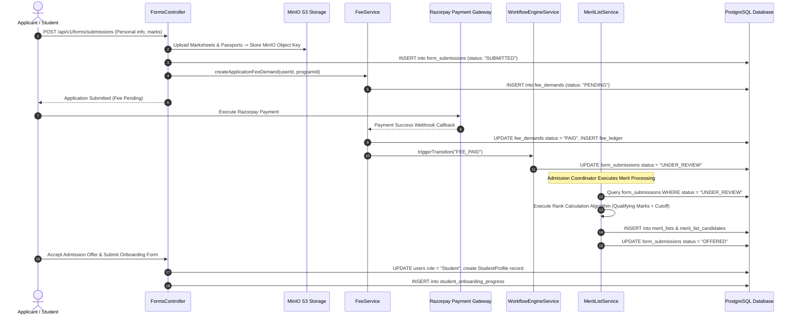
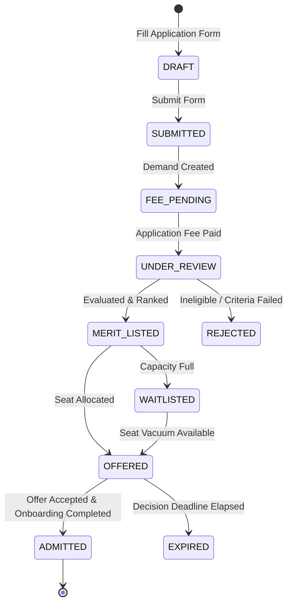

# Technical Workflow Architecture: Admissions, Merit & Onboarding

## Overview
This document details the end-to-end technical workflow architecture, sequence diagrams, state machine transitions, and database interactions for student application processing, document uploads, application fee payment, merit list ranking algorithms, seat allocation, and onboarding.

---

## 🔄 End-to-End Sequence Diagram: Admissions & Merit Lifecycle

---

## 🔀 Application State Machine Diagram

---

## 📊 Database Mutations & Entity Relationships

1. **`FormSubmission`**:
   - Created with `formTemplateId`, `data` (JSON of form answers), `status`.
   - Transitions: `SUBMITTED` -> `FEE_PENDING` -> `UNDER_REVIEW` -> `OFFERED` -> `ADMITTED`.
2. **`MeritList` & `MeritListCandidate`**:
   - `MeritList`: Scoped to `programId` and `academicYearId`.
   - `MeritListCandidate`: Stores `rank`, `score`, `category`, and seat allocation status (`ALLOCATED`, `WAITLISTED`, `REJECTED`).
3. **`StudentProfile` & `User`**:
   - Upon offer acceptance (`ADMITTED` state):
     - `UPDATE users SET role = 'Student', is_active = true`
     - `INSERT INTO student_profiles (user_id, enrollment_number, roll_number, stream_label_id, batch_id)`
