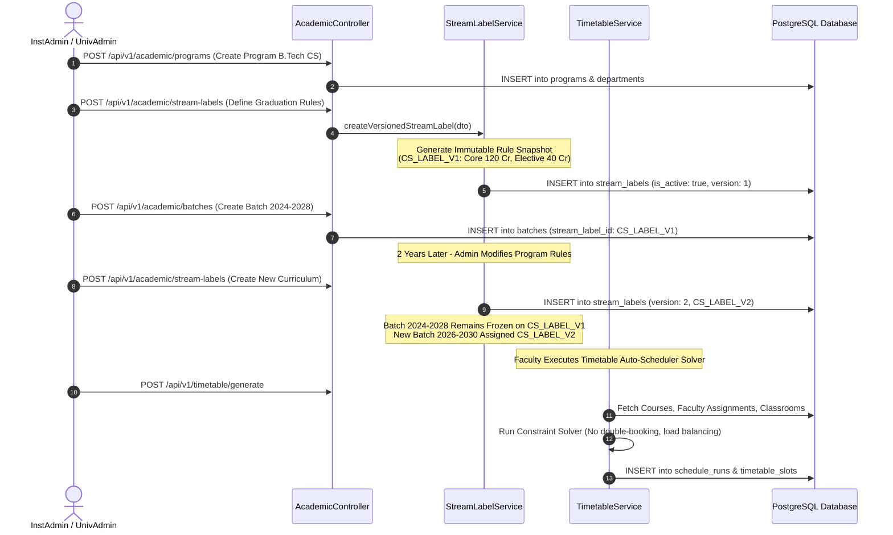

# Technical Workflow Architecture: Academic Catalog & Versioned Rules

## Overview
This document details the end-to-end technical workflow architecture, sequence diagrams, immutable rule versioning logic, subject pool elections, and automated timetable scheduling constraint algorithms.

---

## 🔄 End-to-End Sequence Diagram: Academic Setup & Versioned Stream Rules



---

## 🔀 Versioned Stream Rule & Student Binding Topology

```
                  ┌─────────────────────────────────────┐
                  │    StreamLabel: CS_RULES_2024_V1    │  (Immutable Snapshot)
                  │    • Total Credits: 160            │
                  │    • Core Subjects: 30              │
                  │    • Elective Pools: 4              │
                  └──────────────────┬──────────────────┘
                                     │
           ┌─────────────────────────┴─────────────────────────┐
           │                                                   │
┌──────────▼──────────┐                             ┌──────────▼──────────┐
│   Batch 2024-2028   │                             │  Student Profile A  │
│  (Bound at Entry)   │                             │ (Roll: CS2024-001)  │
└─────────────────────┘                             └─────────────────────┘

               --- Program Rules Updated for 2026 ---

                  ┌─────────────────────────────────────┐
                  │    StreamLabel: CS_RULES_2026_V2    │  (New Immutable Snapshot)
                  │    • Total Credits: 164            │
                  │    • Core Subjects: 32              │
                  │    • AI/ML Elective Mandatory       │
                  └──────────────────┬──────────────────┘
                                     │
           ┌─────────────────────────┴─────────────────────────┐
           │                                                   │
┌──────────▼──────────┐                             ┌──────────▼──────────┐
│   Batch 2026-2030   │                             │  Student Profile B  │
│  (Bound at Entry)   │                             │ (Roll: CS2026-001)  │
└─────────────────────┘                             └─────────────────────┘
```

---

## ⚙️ Timetable Constraint Solving Engine

The `TimetableService` executes a multi-constraint solving algorithm to map courses, faculty, sections, and classrooms into `timetable_slots`:

1. **Hard Constraints**:
   - No faculty member can be assigned to two classes simultaneously.
   - No classroom/lab can host two sections simultaneously.
   - Student sections cannot have overlapping mandatory lecture slots.
2. **Soft Constraints**:
   - Equal distribution of faculty teaching hours across weekdays.
   - Lab sessions assigned to morning slots where available.
