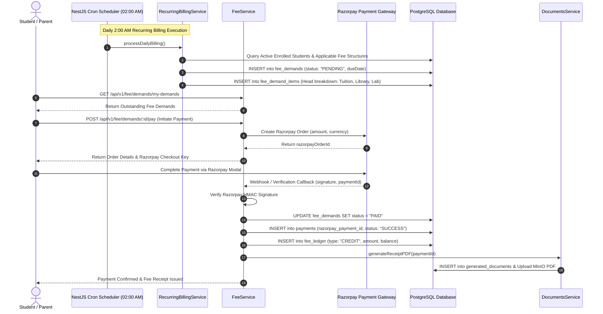
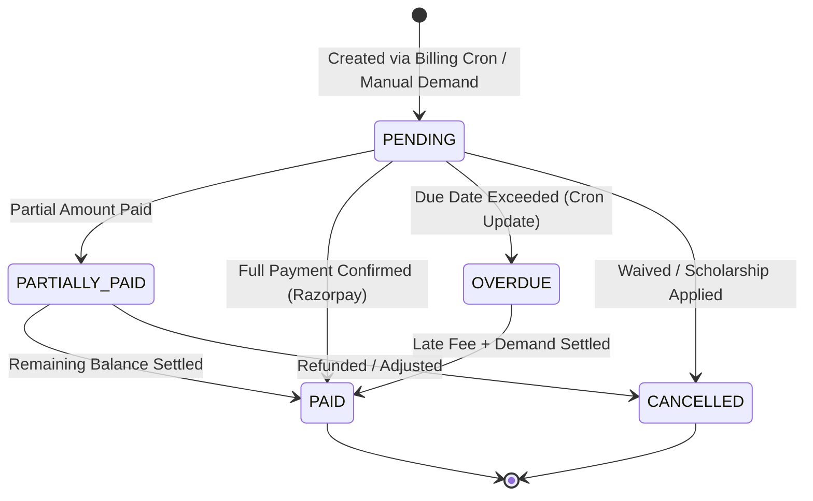

# Technical Workflow Architecture: Fee Billing, Ledger & Razorpay Integration

## Overview
This document details the end-to-end technical workflow architecture, sequence diagrams, daily 2 AM recurring billing cron, double-entry financial ledger mutations, and Razorpay payment processing integrations.

---

## 🔄 End-to-End Sequence Diagram: Fee Demand & Payment Lifecycle

---

## 🔀 Fee Demand State Machine Diagram

---

## 📊 Double-Entry Financial Ledger Mutations

All financial transactions mutate the immutable `fee_ledger` table:

1. **Fee Demand Creation**:
   - `INSERT INTO fee_ledger (user_id, demand_id, transaction_type = 'DEBIT', amount = 2500, balance_after = 2500)`
2. **Razorpay Payment Settled**:
   - `INSERT INTO fee_ledger (user_id, payment_id, transaction_type = 'CREDIT', amount = 2500, balance_after = 0)`
3. **Scholarship Waiver Applied**:
   - `INSERT INTO fee_ledger (user_id, scholarship_id, transaction_type = 'CREDIT', amount = 500, balance_after = 0)`
