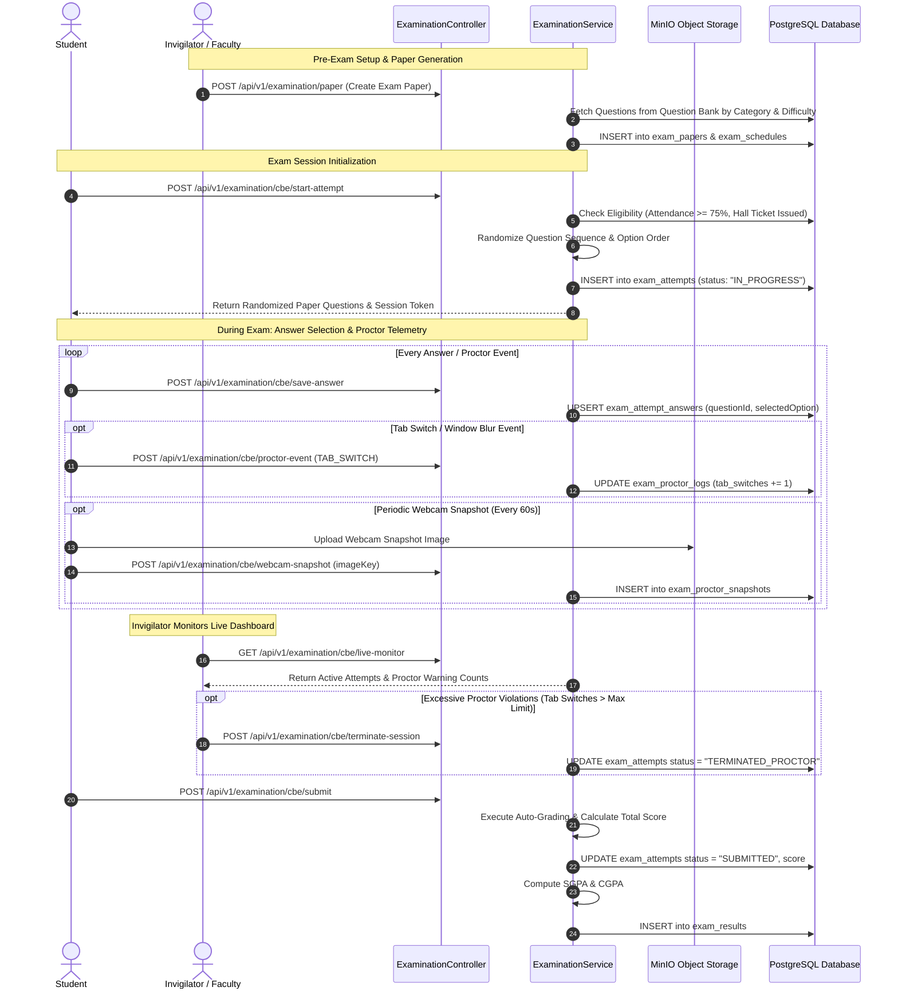
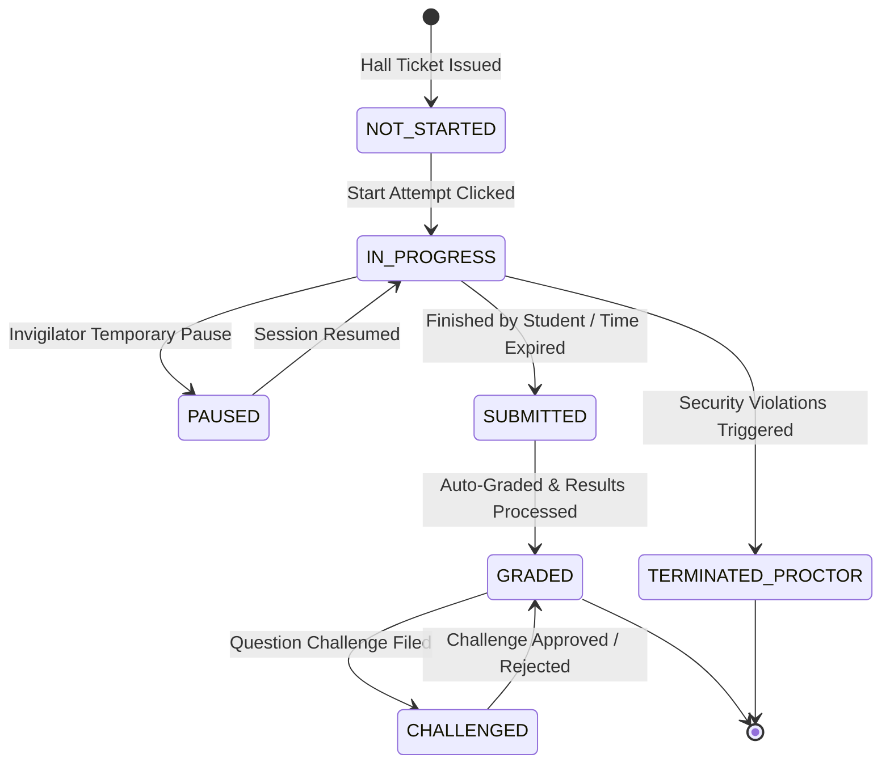

# Technical Workflow Architecture: Examinations, CBE Engine & AI Proctoring

## Overview
This document details the end-to-end technical workflow architecture, sequence diagrams, question paper shuffle algorithms, AI proctoring telemetry capture, real-time invigilator controls, and automated SGPA/CGPA grade calculation pipelines.

---

## 🔄 End-to-End Sequence Diagram: CBE Exam & AI Proctoring Lifecycle

---

## 🔀 Exam Attempt State Machine Diagram

---

## ⚙️ Grading & SGPA/CGPA Calculation Algorithm

1. **Term SGPA Calculation**:
   $$\text{SGPA} = \frac{\sum (\text{Course Credits} \times \text{Grade Points Earned})}{\sum \text{Course Credits}}$$
2. **Cumulative CGPA Calculation**:
   $$\text{CGPA} = \frac{\sum (\text{Term SGPA} \times \text{Term Total Credits})}{\sum \text{Total Program Credits Completed}}$$
