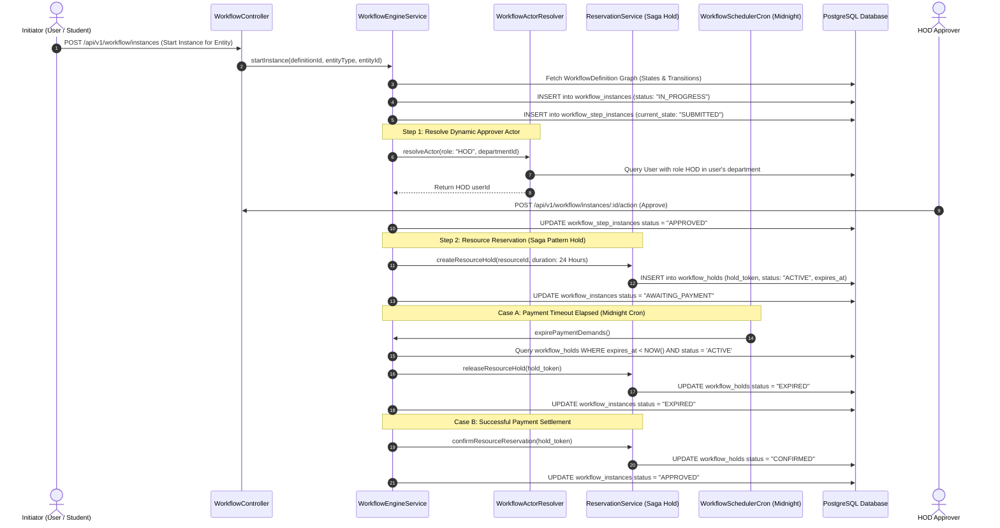
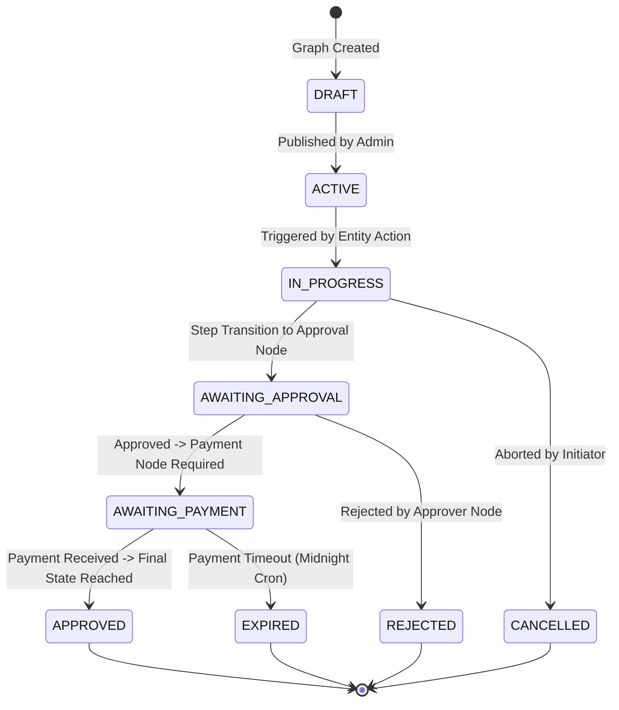

# Technical Workflow Architecture: Visual Workflow Engine & Saga Holds

## Overview
This document details the end-to-end technical workflow architecture, graph execution engine, dynamic actor resolution, payment gate holds, and Saga pattern resource reservations.

---

## 🔄 End-to-End Sequence Diagram: Visual Workflow & Saga Hold Engine

---

## 🔀 Workflow Instance State Machine Diagram

---

## ⚙️ Saga Pattern Resource Reservation Model

When a multi-step workflow requires reserving physical facilities (auditoriums, labs, hostels) or holding fees:

1. **Soft Hold Phase**: `ReservationService` creates a `WorkflowHold` record with a 24-hour expiration window. The resource is marked `HELD` to prevent double-booking.
2. **Commit Phase**: Upon successful payment confirmation via Razorpay, the hold is converted to `CONFIRMED`.
3. **Rollback (Compensating Action) Phase**: If payment is not completed within 24 hours, the `WorkflowSchedulerService` cron executes a compensating action: releases the soft hold, returns resource status to `AVAILABLE`, and cancels the workflow instance.
