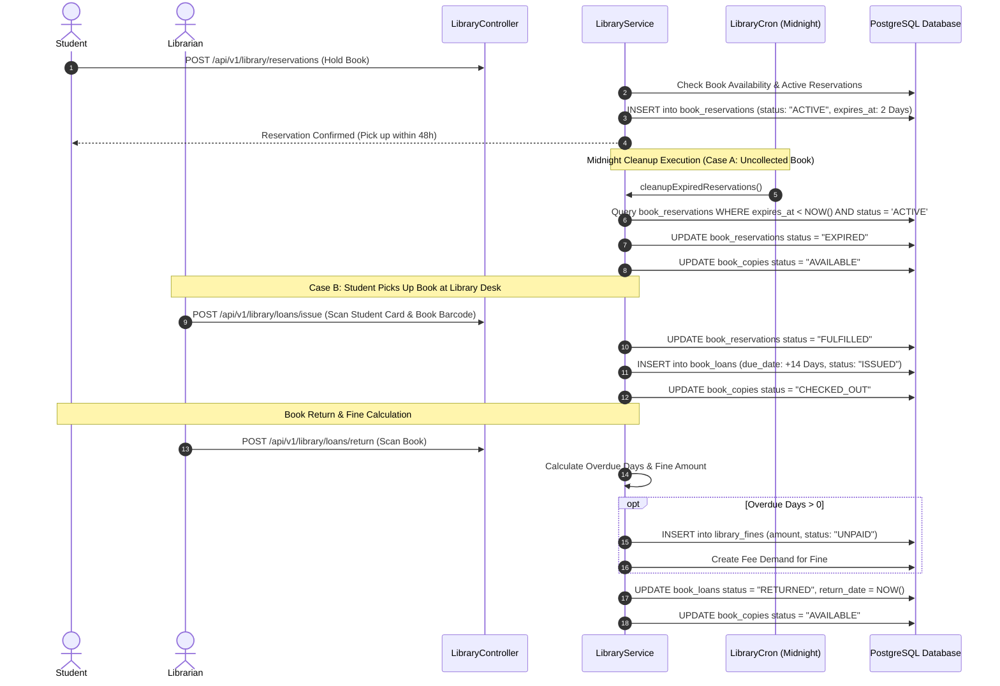
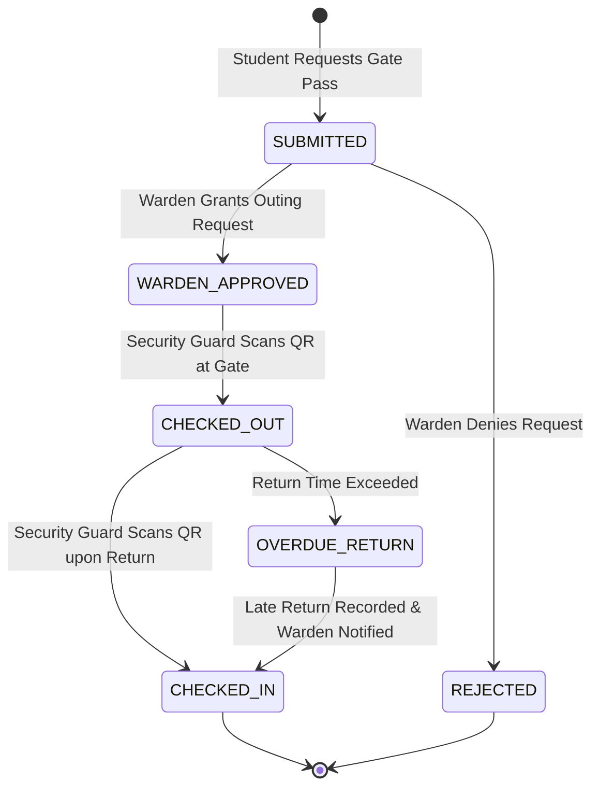

# Technical Workflow Architecture: Infrastructure & Facilities

## Overview
This document details the end-to-end technical workflow architecture, sequence diagrams, state machines, and background cleanup jobs for Hostel room allocation, Warden gate passes, Transport route passes, and Library circulation.

---

## 🔄 End-to-End Sequence Diagram: Library Circulation & Reservation

---

## 🔀 Warden Hostel Gate Pass State Machine Diagram

---

## 📊 Database Mutations across Infrastructure Entities

1. **Hostel Allocation (`hostel_allocations`)**:
   - `INSERT INTO hostel_allocations (student_id, room_id, bed_number, start_date, status = 'ALLOCATED')`
   - Updates `hostel_rooms.occupied_beds += 1`.
2. **Transport Pass (`transport_passes`)**:
   - Linked to `route_id`, `stop_id`, and `fee_demand_id`. Validated upon scanning bus pass.
