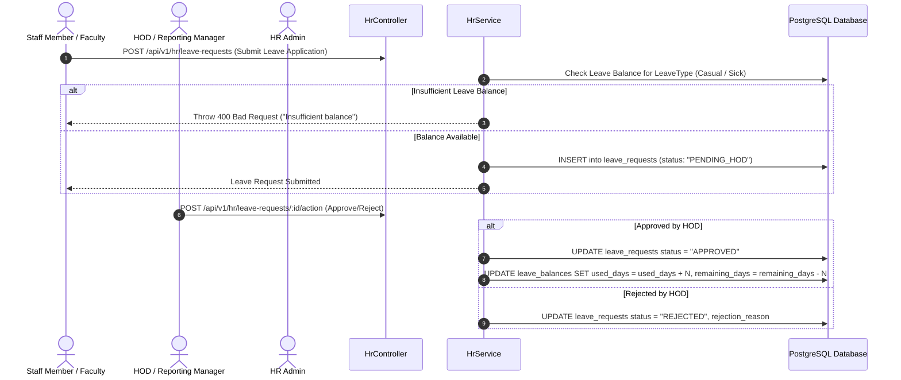
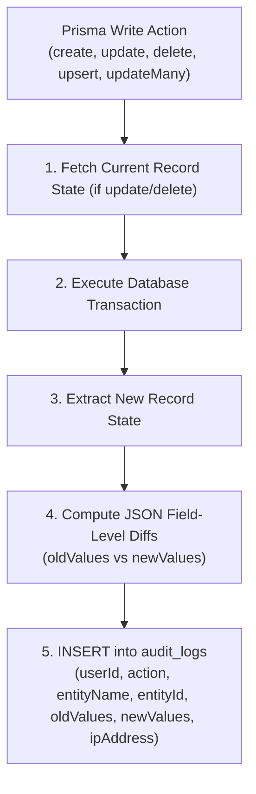

# Technical Workflow Architecture: HR, Leave, Audit & Maintenance

## Overview
This document details the end-to-end technical workflow architecture, sequence diagrams, leave approval hierarchies, field-level Prisma audit logging middleware, and database backup/restore maintenance gate modes.

---

## 🔄 End-to-End Sequence Diagram: Staff Leave Approval Lifecycle

---

## 🛡️ Field-Level Prisma Audit Logging Architecture

All database write operations pass through the custom `PrismaService` audit middleware:

---

## ⚙️ Maintenance Mode & Backup Restore Gate Architecture

When a database backup or restore procedure is triggered by SuperAdmin (`BackupService`):

1. **Gate Engagement**: Sets system state `MAINTENANCE_MODE = true`.
2. **Request Interception**: `MaintenanceGuard` intercepts all incoming requests to `core-api`:
   - Checks `req.user.roles`.
   - **SuperAdmin Account**: Allowed access to monitor restore progress.
   - **Health Check (`/api/v1/health`)**: Allowed for infrastructure monitoring.
   - **All Other Users**: Intercepted and returned **HTTP 503 Service Unavailable** with message `"System is currently undergoing scheduled database maintenance. Please try again shortly."`
3. **Completion & Lock Release**: Upon successful verification of database dump restoration, `MAINTENANCE_MODE` is reset to `false` and normal request routing resumes.
