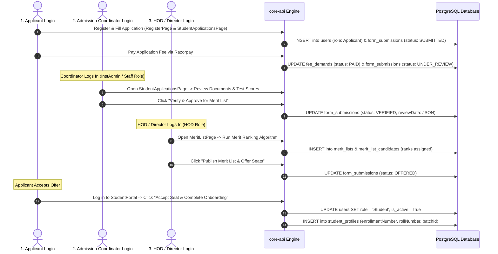
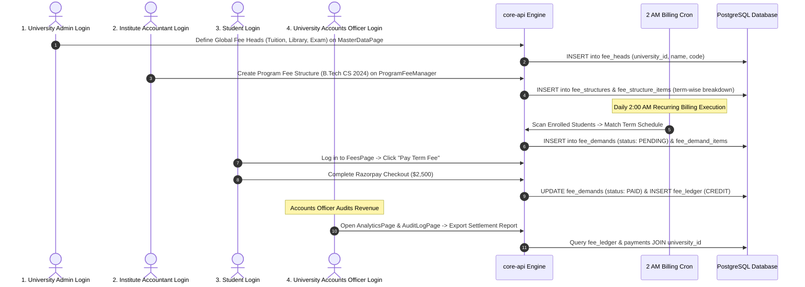
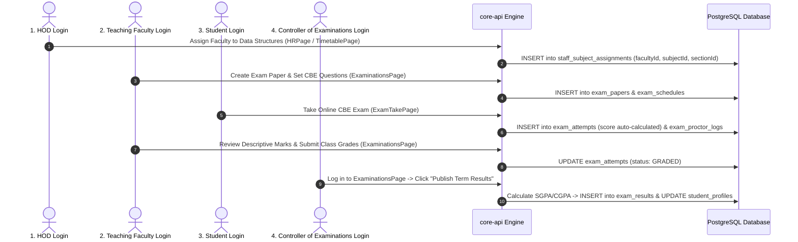
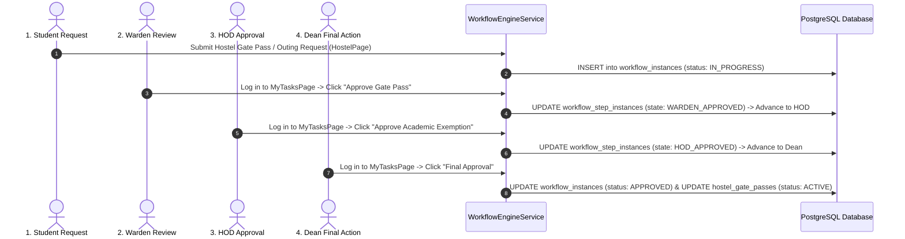

# Technical Workflow Architecture: Cross-Role & Multi-Tenant Process Flows

## Purpose
This document provides complete, granular, step-by-step workflow designs showing exactly how information moves across **Role Logins**, **Screens Seen**, **Approver Chains**, and **Tenant Hierarchy (University → Institute → Department → Student/Staff)**.

---

## 1. Complete Admissions Workflow: Applicant → Coordinator → HOD → Student

### Process Overview
Traces the journey of how a candidate registers, submits an application form, pays the application fee, gets verified by an Admission Coordinator, ranked on a Merit List by the HOD, offered a seat, and converted into an active enrolled student.

### Granular Step-by-Step Breakdown

| Stage | Role & Login Credentials | Screen Seen | User Action & Data Entered | System Processing & Database Changes | Next Role Involved |
| :--- | :--- | :--- | :--- | :--- | :--- |
| **1. Registration** | **Applicant** (`role: Applicant`) | `RegisterPage.tsx` | Enters Email, Phone, Password, Name, selects target Institute & Program. | Creates `User` (`role: Applicant`, `isActive: false`), sends OTP, updates `User` (`isActive: true`) upon verification. | Applicant (Application Form) |
| **2. Form Submission** | **Applicant** (`role: Applicant`) | `StudentApplicationsPage.tsx` | Fills personal details, previous marks, uploads passport photo & 12th marksheet PDF to MinIO. | Creates `FormSubmission` (`status: SUBMITTED`), creates `FeeDemand` for Application Fee ($50). | Applicant (Fee Payment) |
| **3. Fee Payment** | **Applicant** (`role: Applicant`) | `FeesPage.tsx` | Pays $50 via Razorpay modal checkout. | Updates `FeeDemand` (`PAID`), inserts `Payment` & `FeeLedger`, transitions `FormSubmission` (`status: UNDER_REVIEW`). | Admission Coordinator |
| **4. Document Verification** | **Admission Coordinator** (`role: InstAdmin` / Staff) | `StudentApplicationsPage.tsx` | Opens application review split-pane, inspects uploaded marksheets, enters verification notes, clicks **Approve**. | Updates `FormSubmission` (`status: VERIFIED`, `reviewData` JSON logged). | HOD / Institute Director |
| **5. Merit List Generation** | **HOD / Director** (`role: HOD` / `InstAdmin`) | `MeritListPage.tsx` | Selects Program & Batch, sets cutoff score (e.g., 85%), clicks **Generate Merit List**. | Runs ranking algorithm based on qualifying marks, creates `MeritList` and `MeritListCandidate` records. | HOD (Seat Offer) |
| **6. Offer Issuance** | **HOD / Director** (`role: HOD`) | `MeritListPage.tsx` | Reviews top N candidates, clicks **Issue Seat Offers**. | Updates `FormSubmission` (`status: OFFERED`), sends notification email/SMS to applicants. | Applicant (Acceptance) |
| **7. Acceptance & Onboarding** | **Applicant** (`role: Applicant`) | `OnboardStudentsPage.tsx` | Logs in, sees offer letter popup, clicks **Accept Offer & Pay Admission Deposit**. | Updates `User` (`role: Student`), generates `StudentProfile` (enrollment number, roll number, stream label snapshot). | Student (Active Enrollment) |

---

## 2. Complete Fee Management Workflow: University → Institute → Student → Financial Audit

### Process Overview
Traces how fee policies originate at the **University Level**, get customized at the **Institute Level**, generate term fee demands for **Students**, get paid via **Razorpay**, and get audited by the **Accounts Officer**.

### Granular Step-by-Step Breakdown

| Stage | Role & Login Credentials | Screen Seen | User Action & Data Entered | System Processing & Database Changes | Next Role Involved |
| :--- | :--- | :--- | :--- | :--- | :--- |
| **1. Global Fee Heads** | **University Admin** (`role: UnivAdmin`) | `MasterDataPage.tsx` | Creates master fee categories (e.g. Tuition Fee, Development Fee, Hostel Deposit, Exam Fee). | `INSERT INTO fee_heads (university_id, name, code, is_refundable)`. Available across all institutes. | Institute Accountant |
| **2. Program Fee Structure** | **Institute Accountant** (`role: InstAdmin` / Accountant) | `ProgramFeeManager.tsx` | Selects Institute (e.g. School of Engineering), selects Program (B.Tech CS), defines Term 1-8 breakdown. | `INSERT INTO fee_structures (institute_id, program_id, batch_id)` and `fee_structure_items` (linking fee heads to amounts per term). | Billing Cron / Accountant |
| **3. Demand Generation** | **Billing Cron / Accountant** (`System Cron` / `InstAdmin`) | `FeesPage.tsx` | Daily 2 AM cron scans active enrollments OR Accountant clicks **Trigger Mass Billing**. | `INSERT INTO fee_demands (user_id, term_id, amount, status: PENDING, due_date)`. Sends email alert. | Student / Parent |
| **4. Student Fee Payment** | **Student / Parent** (`role: Student` / Parent) | `FeesPage.tsx` | Views outstanding demand card ($2,500), clicks **Pay Now**, completes Razorpay modal. | Razorpay HMAC verified -> `UPDATE fee_demands SET status = 'PAID'`, `INSERT INTO fee_ledger (type: CREDIT)`, PDF receipt generated. | University Accounts Officer |
| **5. Financial Audit** | **Accounts Officer** (`role: UnivAdmin` / Accountant) | `AnalyticsPage.tsx` / `AuditLogPage.tsx` | Views collection progress, filters by institute, exports daily bank settlement reconciliation CSV. | Aggregates `fee_ledger` and `payments` records across institutes. | Complete |

---

## 3. Academic & Examination Workflow: Course Assignment → Exam → Result Publication

### Process Overview
Traces how courses are assigned to faculty by the HOD, how examinations are scheduled and proctored, how marks are submitted, and how final SGPA/CGPA grades are published.

### Granular Step-by-Step Breakdown

| Stage | Role & Login Credentials | Screen Seen | User Action & Data Entered | System Processing & Database Changes | Next Role Involved |
| :--- | :--- | :--- | :--- | :--- | :--- |
| **1. Faculty Assignment** | **HOD** (`role: HOD`) | `HRPage.tsx` / `TimetablePage.tsx` | Selects Department, selects Subject (CS301), selects Section A, assigns Lecturer Dr. Smith. | `INSERT INTO staff_subject_assignments (user_id, subject_id, section_id, term_id)`. | Teaching Faculty |
| **2. Exam Setup** | **Teaching Faculty** (`role: Lecturer` / Professor) | `ExaminationsPage.tsx` | Creates Question Bank items, sets up CBE Exam Paper (50 MCQs, duration 90 mins, passing score 40%). | `INSERT INTO questions` and `INSERT INTO exam_papers`. Invigilators assigned. | Student |
| **3. Exam Taking & Proctoring** | **Student** (`role: Student`) | `ExamTakePage.tsx` | Enters exam code, completes webcam proctoring check, answers questions within timer window. | `INSERT INTO exam_attempts (status: IN_PROGRESS)`, real-time tab switch & webcam snapshot logging to `exam_proctor_logs`. | Teaching Faculty / Invigilator |
| **4. Evaluation & Marking** | **Teaching Faculty** (`role: Lecturer`) | `ExaminationsPage.tsx` | Reviews auto-graded MCQ scores + evaluates manual answers, clicks **Submit Grades**. | `UPDATE exam_attempts SET status = 'GRADED', score = X`. | Controller of Examinations |
| **5. Grade Publication** | **Controller of Examinations** (`role: UnivAdmin` / COE) | `ExaminationsPage.tsx` | Reviews grade distributions, approves moderation adjustments, clicks **Publish Term Results**. | Computes SGPA & CGPA formulas -> `INSERT INTO exam_results`, updates student transcript records. | Student (Transcript View) |

---

## 4. Multi-Level Request Approval Workflow: Student → Warden → HOD → Dean

### Process Overview
Traces how a student submits a special request (e.g. Hostel Outing Gate Pass, Course Drop Request, Facility Reservation), which moves through a multi-tier approval chain.

### Granular Step-by-Step Breakdown

| Stage | Role & Login Credentials | Screen Seen | User Action & Data Entered | System Processing & Database Changes | Next Role Involved |
| :--- | :--- | :--- | :--- | :--- | :--- |
| **1. Request Initiation** | **Student** (`role: Student`) | `HostelPage.tsx` / `MyTasksPage.tsx` | Selects Outing Request form, enters destination, departure time, return time, reason. | `WorkflowEngineService.startInstance()` -> `INSERT INTO workflow_instances` & `hostel_gate_passes (status: PENDING)`. | Warden |
| **2. Tier 1: Warden Review** | **Warden** (`role: InstAdmin` / Warden) | `MyTasksPage.tsx` | Sees pending gate pass task in inbox, verifies parent permission note, clicks **Approve**. | Updates `workflow_step_instances` -> Advances workflow graph to Step 2 (HOD Review). | HOD |
| **3. Tier 2: HOD Review** | **HOD** (`role: HOD`) | `MyTasksPage.tsx` | Sees task in inbox, verifies student class schedule non-conflict, clicks **Approve**. | Updates `workflow_step_instances` -> Advances workflow graph to Step 3 (Dean Approval). | Dean / Director |
| **4. Tier 3: Dean Approval** | **Dean / Director** (`role: InstAdmin` / Dean) | `MyTasksPage.tsx` | Reviews complete approval history comments, clicks **Final Approve**. | `UPDATE workflow_instances SET status = 'APPROVED'`, `UPDATE hostel_gate_passes SET status = 'ACTIVE'`. Generates QR gate pass. | Student & Security Guard |
