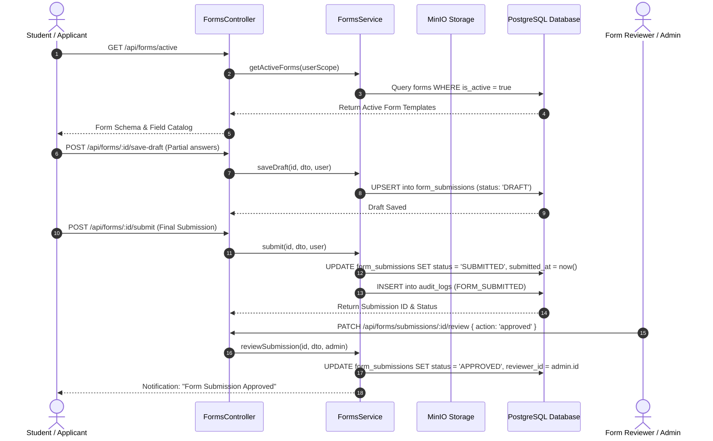
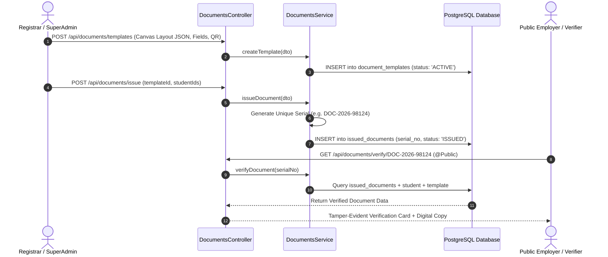
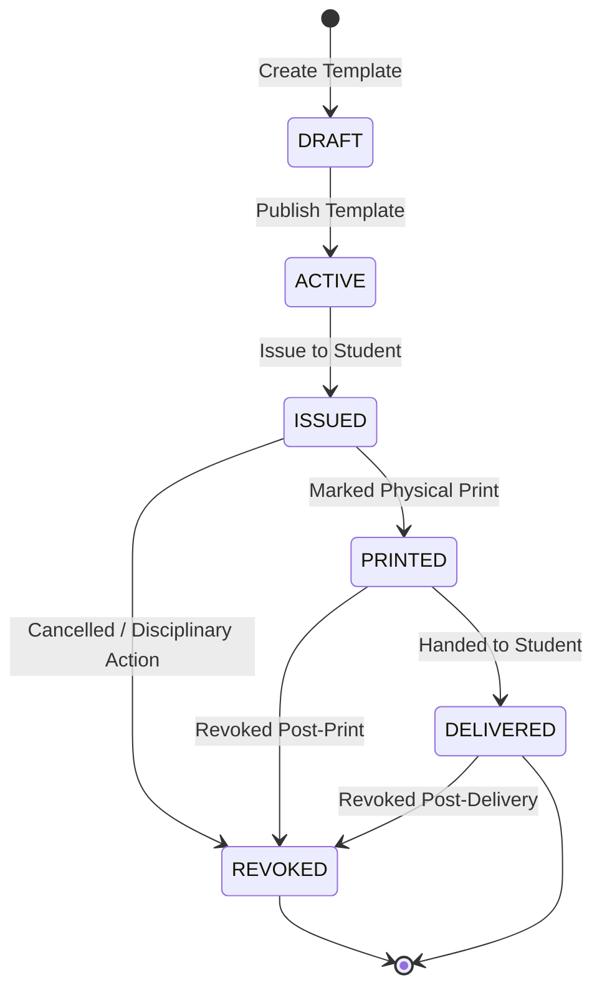

# Technical Workflow Architecture: Forms, Documents & Notifications

## Overview
This document details the end-to-end technical workflow architecture, sequence diagrams, state machine transitions, and database mutations for dynamic form generation, submission reviews, the Canvas Document Designer, certificate issuance & printing, public anti-fraud verification, and multi-channel notifications.

---

## 🔄 End-to-End Sequence Diagram: Dynamic Forms & Submissions

---

## 🔄 End-to-End Sequence Diagram: Canvas Document Designer & Verification

---

## 🔀 Document Issuance State Machine Diagram

---

## 📊 Database Mutations & Schema Entities

1. **`FormTemplate` (`forms`)**:
   - `id`, `title`, `description`, `fields` (JSON Schema), `is_active`, `course_type`, `institute_id`.
2. **`FormSubmission` (`form_submissions`)**:
   - `id`, `form_id`, `user_id`, `data` (JSON response payload), `status` (`DRAFT`, `SUBMITTED`, `APPROVED`, `REJECTED`), `rejection_note`, `reviewed_at`.
3. **`DocumentTemplate` (`document_templates`)**:
   - `id`, `name`, `subject` (`STUDENT`, `STAFF`), `canvas_layout` (JSON coordinates & elements), `signatories` (JSON array), `is_active`.
4. **`IssuedDocument` (`issued_documents`)**:
   - `id`, `template_id`, `recipient_id`, `serial_no`, `print_status` (`PENDING`, `PRINTED`), `delivery_status` (`PENDING`, `DELIVERED`), `is_revoked`, `revoked_reason`.
5. **`Notification` (`notifications`)**:
   - `id`, `user_id`, `title`, `message`, `type`, `is_read`, `action_url`, `created_at`.
