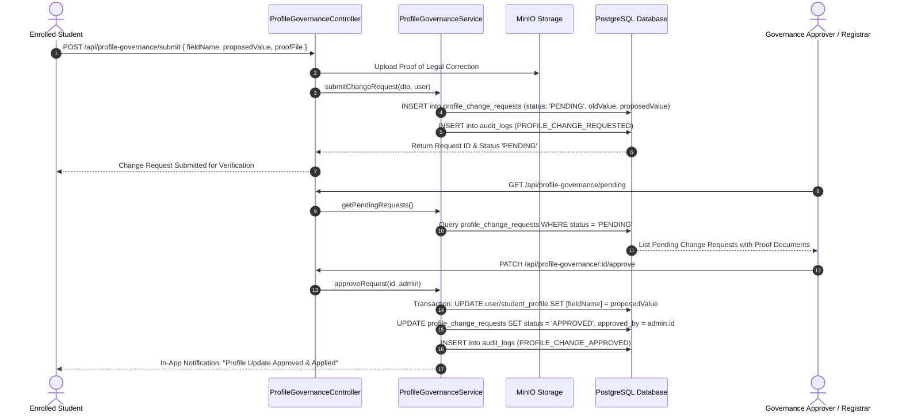
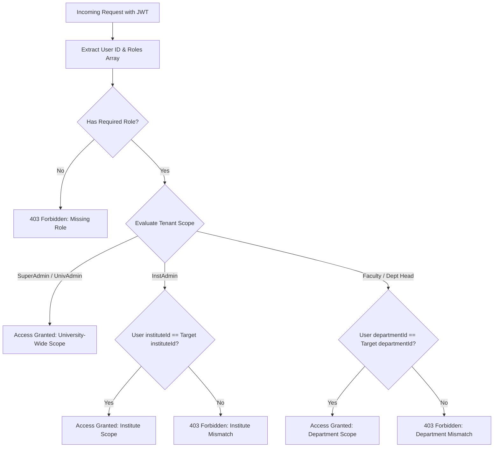

# Technical Workflow Architecture: User Management, Multi-Role Governance & Profile Pipelines

## Overview
This document details the technical workflow architecture, sequence diagrams, RBAC / scope resolution mechanics, and maker-checker approval pipelines for User Administration, Multi-Role Assignment, and Profile Governance.

---

## 🔄 End-to-End Sequence Diagram: Profile Governance Maker-Checker Pipeline

---

## 🔄 Role & Scope Resolution Pipeline

---

## 📊 Database Mutations & Entity Relationships

1. **`User` (`users`)**:
   - `id`, `email`, `password_hash`, `first_name`, `last_name`, `phone`, `is_active`, `locked_until`, `failed_login_attempts`, `must_change_password`, `university_id`, `institute_id`, `department_id`.
2. **`UserRoleAssignment` (`user_role_assignments`)**:
   - `id`, `user_id`, `role_id`, `scope` (`UNIVERSITY`, `INSTITUTE`, `DEPARTMENT`), `institute_id`, `department_id`.
3. **`ProfileChangeRequest` (`profile_change_requests`)**:
   - `id`, `user_id`, `field_name`, `current_value`, `proposed_value`, `justification`, `proof_document_url`, `status` (`PENDING`, `APPROVED`, `REJECTED`), `reviewer_id`, `reviewed_at`, `rejection_reason`.
