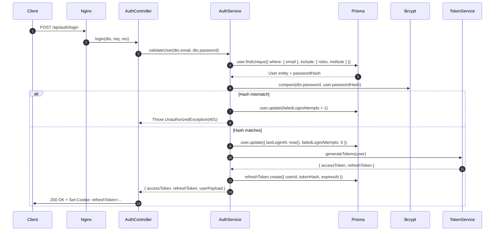

# Module 01: Auth & Access Control — End-to-End Action Processes

> **Scope**: Request and response lifecycles, HTTP payloads, NestJS controller mappings, security guards, Prisma service methods, and database mutations for authentication, token refresh, OTP dispatch, password lifecycle, and impersonation.

---

## Action 1: User Login (`POST /api/auth/login`)



### Protocol & Lifecycle Specifications

- **HTTP Method & URL**: `POST /api/auth/login`
- **Request Headers**: `Content-Type: application/json`
- **Request Body (DTO: `LoginDto`)**:
  ```json
  {
    "email": "faculty.john@university.edu",
    "password": "SecurePassword123!",
    "captchaToken": "optional-uuid-string",
    "captchaAnswer": "4X9K"
  }
  ```
- **Validation Pipeline**:
  - `class-validator`: `@IsEmail()`, `@IsNotEmpty()`, `@MinLength(8)`.
  - Captcha verification guard (activated when `failedLoginAttempts >= 3`).
- **NestJS Controller**: `AuthController.login(@Body() dto: LoginDto, @Req() req: Request, @Res() res: Response)`
- **Service Invocation**: `AuthService.login(dto, ipAddress, userAgent)`
- **Prisma Database Mutations**:
  ```prisma
  // 1. Fetch user record with roles
  prisma.user.findUnique({
    where: { email: dto.email.toLowerCase().trim() },
    include: { roles: true, institute: true, studentProfile: true }
  })

  // 2. On success, record login audit & issue refresh token
  prisma.refreshToken.create({
    data: {
      userId: user.id,
      tokenHash: sha256(refreshToken),
      expiresAt: new Date(Date.now() + 7 * 24 * 60 * 60 * 1000),
      ipAddress: req.ip,
      userAgent: req.headers['user-agent']
    }
  })

  prisma.auditLog.create({
    data: {
      action: "AUTH_LOGIN_SUCCESS",
      userId: user.id,
      entity: "User",
      entityId: user.id,
      ipAddress: req.ip
    }
  })
  ```
- **Response Payload (200 OK)**:
  ```json
  {
    "accessToken": "eyJhbGciOiJIUzI1NiIsInR5cCI6IkpXVCJ9...",
    "refreshToken": "d8f3b2a1...",
    "user": {
      "id": "usr_9921448",
      "email": "faculty.john@university.edu",
      "name": "Dr. John Doe",
      "applicationRole": "TeachingFaculty",
      "applicationRoles": ["TeachingFaculty"],
      "roles": ["Assistant Professor"],
      "instituteId": "inst_01",
      "mustChangePassword": false
    }
  }
  ```

---

## Action 2: Mobile OTP Dispatch & Verification (`POST /api/auth/register/send-otp` & `verify-otp`)

### 2A: Send OTP
- **HTTP Method & URL**: `POST /api/auth/register/send-otp`
- **Request Body**:
  ```json
  {
    "mobileNumber": "+919876543210"
  }
  ```
- **Backend Flow**:
  1. Rate limiter check: max 3 OTPs per mobile per hour.
  2. Generate cryptographically secure 6-digit numeric OTP (`crypto.randomInt(100000, 999999)`).
  3. Store hash in Redis / `MobileOtp` table with 5-minute TTL.
  4. Dispatch via SMS Provider (DLT template mapped).
- **Prisma Mutation**:
  ```prisma
  prisma.mobileOtp.upsert({
    where: { mobileNumber: dto.mobileNumber },
    create: {
      mobileNumber: dto.mobileNumber,
      otpHash: bcrypt.hashSync(otp, 10),
      expiresAt: new Date(Date.now() + 5 * 60 * 1000)
    },
    update: {
      otpHash: bcrypt.hashSync(otp, 10),
      expiresAt: new Date(Date.now() + 5 * 60 * 1000),
      attempts: 0
    }
  })
  ```
- **Response (200 OK)**:
  ```json
  {
    "success": true,
    "message": "OTP sent successfully",
    "expiresInSeconds": 300
  }
  ```

### 2B: Verify OTP
- **HTTP Method & URL**: `POST /api/auth/register/verify-otp`
- **Request Body**:
  ```json
  {
    "mobileNumber": "+919876543210",
    "otp": "582914"
  }
  ```
- **Backend Flow**:
  1. Lookup `MobileOtp` record where `mobileNumber = dto.mobileNumber`.
  2. Verify `expiresAt > now()` and `attempts < 5`.
  3. Compare `bcrypt.compareSync(dto.otp, record.otpHash)`.
  4. Issue signed `verificationToken` (JWT) proving mobile ownership, required by `register` endpoint.
- **Response (200 OK)**:
  ```json
  {
    "verified": true,
    "verificationToken": "eyJhbGciOiJIUzI1NiIsInR5cCI6IkpXVCJ9..."
  }
  ```

---

## Action 3: Token Refresh (`POST /api/auth/refresh`)

- **HTTP Method & URL**: `POST /api/auth/refresh`
- **Request Headers**: `Authorization: Bearer <refreshToken>` or HttpOnly Cookie.
- **Backend Flow**:
  1. Verify refresh token signature with `JWT_REFRESH_SECRET`.
  2. Lookup active token hash in `RefreshToken` table.
  3. If revoked or not found: reject with 401 Unauthorized (potential token reuse attack).
  4. Issue fresh `accessToken` (15-min lifespan) and rotated `refreshToken`.
- **Response (200 OK)**:
  ```json
  {
    "accessToken": "eyJhbGciOi...",
    "refreshToken": "new_rotated_token_..."
  }
  ```

---

## Action 4: SuperAdmin User Impersonation (`POST /api/auth/impersonate/:userId`)

- **HTTP Method & URL**: `POST /api/auth/impersonate/:userId`
- **Guards**: `JwtAuthGuard`, `RolesGuard('SuperAdmin')`
- **Backend Flow**:
  1. Validate caller holds `SuperAdmin` role.
  2. Retrieve target user record by `userId`.
  3. Issue impersonation session token containing:
     - `sub`: `targetUser.id`
     - `impersonatorId`: `superAdminUser.id`
     - `isImpersonated`: `true`
  4. Log action to `AuditLog` table (`AUTH_IMPERSONATE_START`).
- **Response (200 OK)**:
  ```json
  {
    "accessToken": "eyJ...",
    "user": {
      "id": "target_user_id",
      "name": "Jane Doe",
      "applicationRole": "HOD",
      "isImpersonated": true,
      "impersonator": {
        "id": "admin_user_id",
        "name": "System Administrator"
      }
    }
  }
  ```
