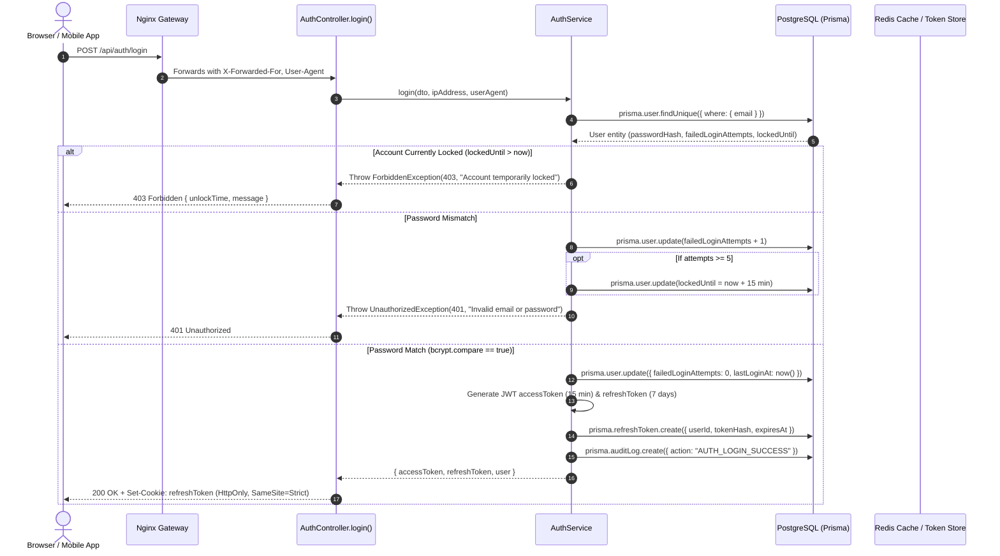
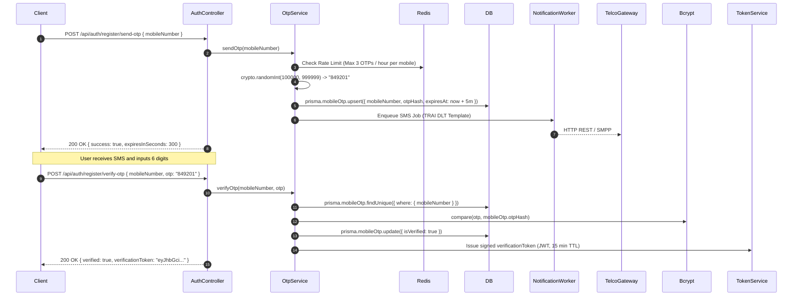
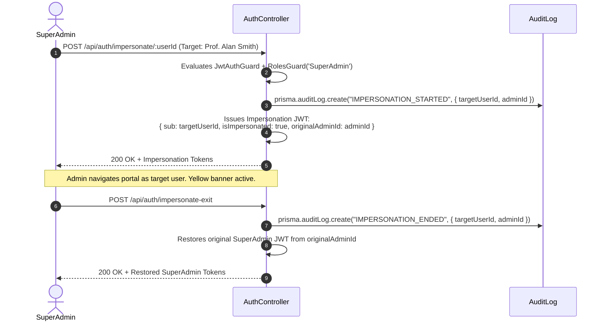

# Module 01: Auth & Access Control — End-to-End Action Processes

> **Enterprise Technical Specification**: Comprehensive request and response lifecycles, HTTP payloads, NestJS controller mappings, security guards, Prisma service methods, database transactions, and cryptographic verification pipelines for authentication, session rotation, multi-channel OTP verification, identity management, and administrative impersonation.

---

## Complete Action & Endpoint Catalog

| Action # | Endpoint | HTTP Method | Primary Actor | Description & Security Scope |
|:---:|:---|:---:|:---|:---|
| **01** | `/api/auth/login` | `POST` | All Users | Authenticates credentials, validates captcha, checks lockout status, issues JWT tokens. |
| **02** | `/api/auth/register/send-otp` | `POST` | Applicant | Dispatches 6-digit cryptographically secure SMS OTP via TRAI-approved DLT gateway. |
| **03** | `/api/auth/register/verify-otp` | `POST` | Applicant | Verifies SMS OTP against hashed storage; issues signed proof-of-ownership token. |
| **04** | `/api/auth/register/send-email-otp`| `POST` | Applicant | Dispatches 6-digit email OTP via institutional SMTP. |
| **05** | `/api/auth/register/verify-email-otp`| `POST` | Applicant | Verifies email OTP; issues signed email verification token. |
| **06** | `/api/auth/register` | `POST` | Applicant | Atomically registers applicant, hashes password (bcrypt), and creates `RegistrationRequest`. |
| **07** | `/api/auth/refresh` | `POST` | Authenticated | Rotates active session; revokes old refresh token and issues fresh access/refresh pair. |
| **08** | `/api/auth/logout` | `POST` | Authenticated | Revokes refresh token in database, invalidates session cache, and clears auth cookies. |
| **09** | `/api/auth/me` | `GET` | Authenticated | Returns resolved user profile, primary & multi-roles, staff/student links, and institute. |
| **10** | `/api/auth/me` | `PATCH` | Authenticated | Updates personal preferences, theme, and non-governed contact details. |
| **11** | `/api/auth/forgot-password` | `POST` | All Users | Generates secure 1-hour password reset token and emails cryptographic reset link. |
| **12** | `/api/auth/reset-password` | `POST` | All Users | Validates token, checks password policy and historical reuse, updates password hash. |
| **13** | `/api/auth/forgot-password/sms` | `POST` | All Users | Generates and sends SMS OTP for phone-based password recovery. |
| **14** | `/api/auth/reset-password/sms` | `POST` | All Users | Verifies SMS OTP and resets user password. |
| **15** | `/api/auth/change-password` | `POST` | Authenticated | Changes password; enforces previous password verification and 3-cycle history checks. |
| **16** | `/api/auth/change-email/request` & `confirm` | `POST` | Authenticated | Two-phase email update with verification links to both old and new addresses. |
| **17** | `/api/auth/change-mobile/request` & `confirm`| `POST` | Authenticated | Two-phase phone update with dual OTP validation. |
| **18** | `/api/auth/impersonate/:userId` | `POST` | SuperAdmin | Issues scoped impersonation JWT carrying original admin and target identity payloads. |
| **19** | `/api/auth/impersonate-exit` | `POST` | Impersonator | Restores original SuperAdmin identity from session cookies without re-prompting password. |
| **20** | `/api/auth/public/*` | `GET` | Public | Public academic catalog feeds (institutes, courses, fee structures) for registration wizard. |

---

## Action 1: User Login (`POST /api/auth/login`)



### Protocol Specifications
- **HTTP Method & URL**: `POST /api/auth/login`
- **Request Headers**: `Content-Type: application/json`
- **Request Body (DTO: `LoginDto`)**:
  ```json
  {
    "email": "dean.engineering@university.edu",
    "password": "SecureEnterprisePassword#2026",
    "captchaToken": "cap_88192a01",
    "captchaAnswer": "7K9P"
  }
  ```
- **Validation Pipeline**:
  - `@IsEmail()`: RFC 5322 compliant email validator.
  - `@IsNotEmpty()`: Required field check.
  - `@MinLength(8)`: Minimum length guard.
  - `CaptchaGuard`: Enforced if IP address or user record has $\ge 3$ prior failed attempts.
- **Prisma Database Mutations**:
  ```prisma
  await prisma.$transaction(async (tx) => {
    // 1. Reset failure counter & record login timestamp
    await tx.user.update({
      where: { id: user.id },
      data: {
        failedLoginAttempts: 0,
        lockedUntil: null,
        lastLoginAt: new Date()
      }
    });

    // 2. Persist SHA-256 hashed refresh token
    await tx.refreshToken.create({
      data: {
        userId: user.id,
        tokenHash: crypto.createHash("sha256").update(refreshToken).digest("hex"),
        expiresAt: new Date(Date.now() + 7 * 24 * 60 * 60 * 1000),
        ipAddress: req.ip,
        userAgent: req.headers["user-agent"]
      }
    });

    // 3. Write immutable audit log
    await tx.auditLog.create({
      data: {
        action: "AUTH_LOGIN_SUCCESS",
        userId: user.id,
        entity: "User",
        entityId: user.id,
        ipAddress: req.ip
      }
    });
  });
  ```
- **Response Payload (200 OK)**:
  ```json
  {
    "accessToken": "eyJhbGciOiJIUzI1NiIsInR5cCI6IkpXVCJ9.eyJzdWIiOiJ1c3JfMDEi...",
    "refreshToken": "d7a8b9c0e1f2...",
    "user": {
      "id": "usr_01",
      "email": "dean.engineering@university.edu",
      "name": "Dr. Eleanor Vance",
      "applicationRole": "InstAdmin",
      "applicationRoles": ["InstAdmin", "TeachingFaculty"],
      "roles": ["Dean", "Professor"],
      "instituteId": "inst_engineering_01",
      "universityId": "univ_main_01",
      "mustChangePassword": false,
      "isActive": true
    }
  }
  ```

---

## Action 2: Mobile OTP Dispatch & Verification (`POST /api/auth/register/send-otp` & `verify-otp`)



### Protocol Specifications
- **Endpoints**:
  - `POST /api/auth/register/send-otp`: Initiates SMS challenge.
  - `POST /api/auth/register/verify-otp`: Confirms 6-digit PIN and issues verification token.
- **Request Body (`send-otp`)**:
  ```json
  {
    "mobileNumber": "+919876543210"
  }
  ```
- **Request Body (`verify-otp`)**:
  ```json
  {
    "mobileNumber": "+919876543210",
    "otp": "849201"
  }
  ```
- **Response (`verify-otp` 200 OK)**:
  ```json
  {
    "verified": true,
    "verificationToken": "eyJhbGciOiJIUzI1NiIsInR5cCI6IkpXVCJ9.eyJtb2JpbGUiOiIrOTE5ODc2NTQzMjEwIiwiaWF0IjoxNj...",
    "expiresInSeconds": 900
  }
  ```

---

## Action 3: Applicant Full Registration (`POST /api/auth/register`)

- **HTTP Method & URL**: `POST /api/auth/register`
- **Request Body (DTO: `RegisterApplicantDto`)**:
  ```json
  {
    "name": "Sarah Connor",
    "email": "sarah.connor@gmail.com",
    "mobileNumber": "+919876543210",
    "password": "ApplicantPass#2026",
    "mobileVerificationToken": "eyJhbGciOi...",
    "programmeId": "prog_btech_cse_01",
    "instituteId": "inst_engineering_01",
    "courseId": "course_btech_01",
    "batchId": "batch_2026_2030",
    "category": "GENERAL"
  }
  ```
- **Backend Flow**:
  1. Validates `mobileVerificationToken` signature and ensures it matches `mobileNumber`.
  2. Confirms email is globally unique in `User` table.
  3. Hashes password using bcrypt ($rounds = 10$).
  4. Executes atomic Prisma transaction:
     - Creates `User` record with `applicationRole = 'Applicant'`.
     - Creates `RegistrationRequest` record with status `DRAFT`.
     - Links academic target (`programmeId`, `batchId`).
     - Emits `APPLICANT_WELCOME_EMAIL` job to BullMQ worker.
- **Prisma Database Mutation**:
  ```prisma
  await prisma.$transaction(async (tx) => {
    const user = await tx.user.create({
      data: {
        name: dto.name,
        email: dto.email.toLowerCase().trim(),
        passwordHash: await bcrypt.hash(dto.password, 10),
        applicationRole: "Applicant",
        applicationRoles: ["Applicant"],
        roles: [],
        instituteId: dto.instituteId,
        isActive: true,
        mustChangePassword: false
      }
    });

    const regRequest = await tx.registrationRequest.create({
      data: {
        userId: user.id,
        programmeId: dto.programmeId,
        instituteId: dto.instituteId,
        batchId: dto.batchId,
        category: dto.category,
        status: "DRAFT",
        applicationNumber: `APP-${new Date().getFullYear()}-${Math.floor(100000 + Math.random() * 900000)}`
      }
    });

    return { user, regRequest };
  });
  ```
- **Response (201 Created)**:
  ```json
  {
    "success": true,
    "userId": "usr_applicant_0921",
    "applicationNumber": "APP-2026-481902",
    "status": "DRAFT",
    "message": "Account created successfully. Please log in to complete your application."
  }
  ```

---

## Action 4: Token Rotation & Session Refresh (`POST /api/auth/refresh`)

- **HTTP Method & URL**: `POST /api/auth/refresh`
- **Request Headers**: `Authorization: Bearer <refreshToken>` or HttpOnly Cookie.
- **Security & Replay Protection**:
  1. Hashes incoming refresh token with SHA-256.
  2. Queries `RefreshToken` table where `tokenHash == hash`.
  3. **Breach Detection**: If the token exists but `revokedAt != null`, this indicates a compromised token replay attack! The system immediately triggers a security revocation event:
     ```prisma
     await prisma.refreshToken.updateMany({
       where: { userId: existingToken.userId },
       data: { revokedAt: new Date() }
     });
     ```
     All active sessions for that user are immediately terminated.
  4. If token is valid and unexpired:
     - Old token is marked `revokedAt = now()`.
     - Brand new refresh token and access token are generated and returned.
- **Response (200 OK)**:
  ```json
  {
    "accessToken": "eyJhbGciOiJIUzI1Ni...",
    "refreshToken": "fresh_rotated_token_hex..."
  }
  ```

---

## Action 5: In-App Password Change with History Rules (`POST /api/auth/change-password`)

- **HTTP Method & URL**: `POST /api/auth/change-password`
- **Guards**: `JwtAuthGuard`
- **Request Body (DTO: `ChangePasswordDto`)**:
  ```json
  {
    "currentPassword": "OldPassword#2025",
    "newPassword": "NewSecurePassword#2026"
  }
  ```
- **Enterprise Policy Rules**:
  1. Validates `currentPassword` matches `user.passwordHash`.
  2. Enforces institutional password policy:
     - Minimum 8 characters.
     - At least 1 uppercase letter ($[A-Z]$).
     - At least 1 lowercase letter ($[a-z]$).
     - At least 1 number ($[0-9]$).
     - At least 1 special character ($[!@#$%^&*]$).
  3. **Password History Re-use Prevention**:
     Queries `PasswordHistory` table for user's last 3 password hashes. Compares `newPassword` against each hash using `bcrypt.compare`. If any match:
     ```typescript
     throw new BadRequestException("New password cannot match any of your last 3 passwords.");
     ```
  4. Updates `user.passwordHash` and stores old hash in `PasswordHistory`.
- **Response (200 OK)**:
  ```json
  {
    "success": true,
    "message": "Password changed successfully. Active sessions updated."
  }
  ```

---

## Action 6: SuperAdmin Impersonation Mode (`POST /api/auth/impersonate/:userId` & `impersonate-exit`)



### Protocol Specifications
- **Start Impersonation**: `POST /api/auth/impersonate/:userId`
  - Required Role: `SuperAdmin`
  - Response (200 OK):
    ```json
    {
      "accessToken": "eyJhbGciOi...",
      "user": {
        "id": "usr_faculty_481",
        "name": "Prof. Alan Smith",
        "applicationRole": "TeachingFaculty",
        "isImpersonated": true,
        "impersonatedBy": {
          "id": "usr_superadmin_01",
          "name": "Global Administrator"
        }
      }
    }
    ```
- **Exit Impersonation**: `POST /api/auth/impersonate-exit`
  - Restores caller to `usr_superadmin_01` session without re-authenticating.
