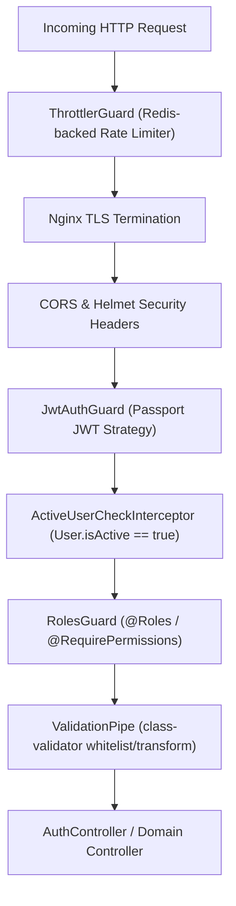
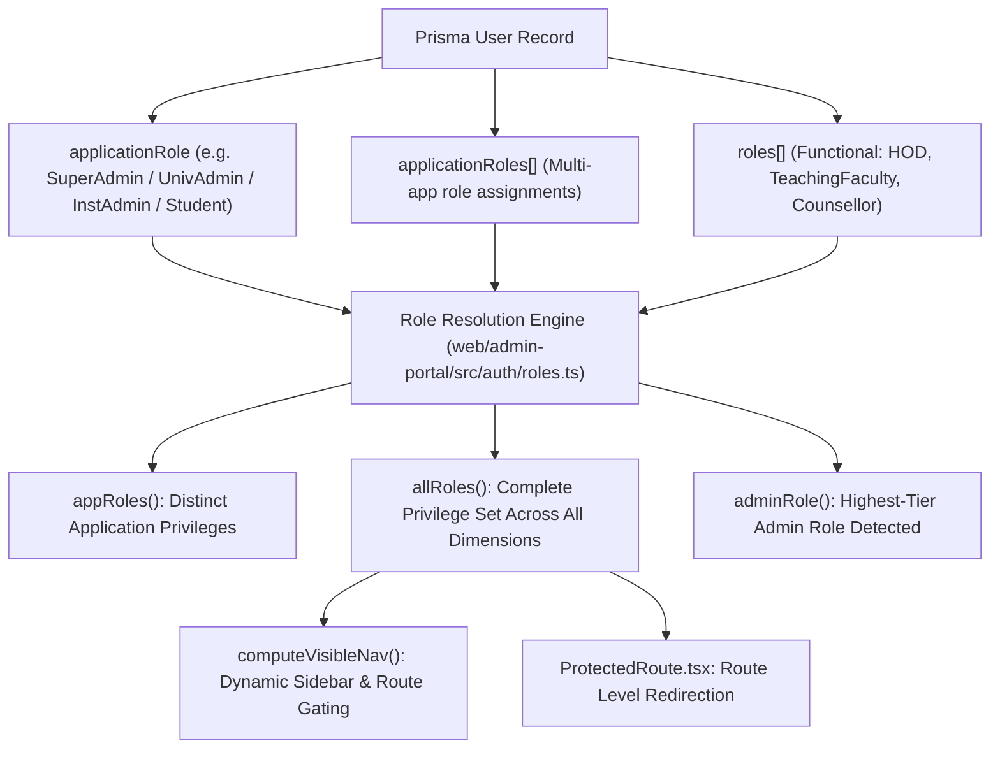
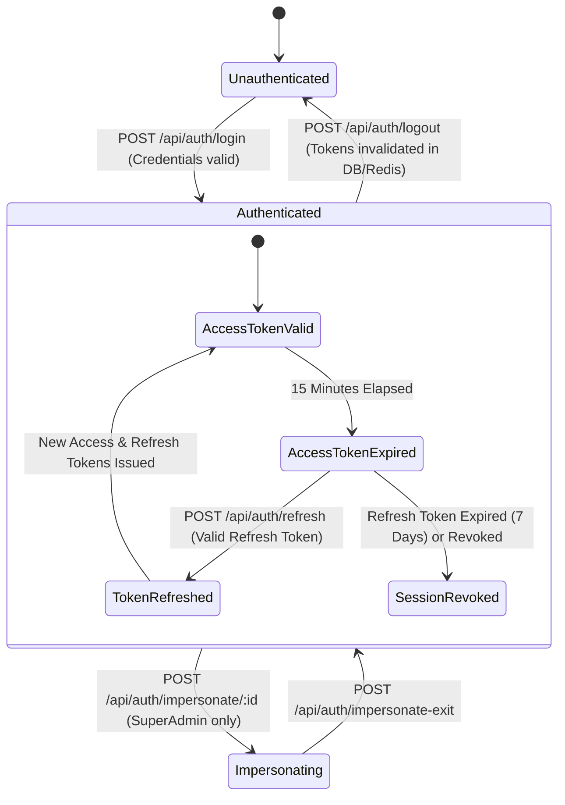
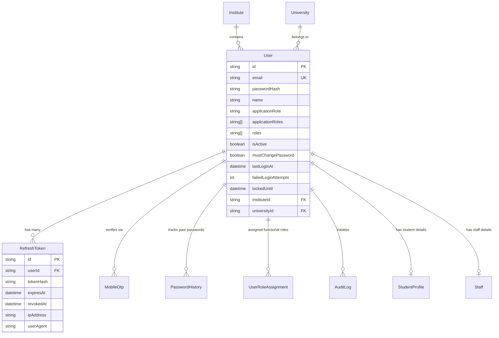

# Module 01: Auth & Access Control — Technical Architecture

> **Scope**: Security architecture, JWT token rotation mechanics, RBAC multi-role resolution pipeline, password hashing algorithms, and session management.

---

## 1. Security Architecture & Guard Pipeline

Every protected HTTP request passes through NestJS execution context interceptors, guards, and validation pipes before reaching domain controllers.

---

## 2. Multi-Dimensional Role & Permission Resolution

The system allows users to hold multiple roles across both **Application Roles** (security tier) and **Functional Roles** (job/department designations).

### Role Hierarchy & Evaluation Precedence
1. **`SuperAdmin`**: Evaluated first. Bypasses institute boundaries; can access all tenants, settings, backups, and audit logs.
2. **`UnivAdmin`**: Scoped to the university. Can configure institutes, university-wide fee heads, document templates, and workflows.
3. **`InstAdmin`**: Scoped to a specific `instituteId`. Manages departments, batches, students, and staff within that institute.
4. **`HOD` / `TeachingFaculty`**: Scoped to departments, courses, and subject sections. Allowed to access `/timetable` (personal timetable view), `/my-subjects`, `/my-invigilation`, and `/attendance`.
5. **`Student` / `Applicant`**: Scoped to own student record. Restricted to `/dashboard`, `/my-applications`, `/fees`, `/attendance`, `/electives`, and `/counsellor-desk`.

---

## 3. JWT Token Rotation & Session Lifecycle

### Token Specifications
- **Access Token**:
  - Format: JWT (RS256 or HS256)
  - Expiry: 15 minutes (`900s`)
  - Payload: `{ sub: userId, email, applicationRole, applicationRoles, roles, instituteId, universityId, isImpersonated }`
- **Refresh Token**:
  - Format: Cryptographically secure 256-bit random hex string.
  - Expiry: 7 days (`604800s`)
  - Storage: Stored hashed (`SHA-256`) in PostgreSQL `RefreshToken` table with `revokedAt` timestamp and device metadata.
- **Rotation Policy**: On every `/api/auth/refresh` call, the old refresh token is marked revoked, and a brand new refresh token is issued.

---

## 4. Database Entity Relationships

---

## 5. Error Handling & Security Mitigation Matrix

| Failure Mode | HTTP Status | Internal Code | Client Presentation | Mitigation / Defense Strategy |
|:---|:---|:---|:---|:---|
| Invalid credentials | `401 Unauthorized` | `AUTH_CREDENTIALS_INVALID` | Toast: "Invalid email or password" | Generic error message prevents username enumeration; increments failed counter. |
| Exceeded 5 failed attempts | `403 Forbidden` | `ACCOUNT_TEMPORARILY_LOCKED` | Alert: "Account locked for 15 minutes" | Account lock with exponential backoff; triggers security email alert to user. |
| Missing/expired JWT | `401 Unauthorized` | `TOKEN_EXPIRED` | Automatic Axios interceptor refresh | Axios interceptor attempts background refresh; if fails, clears store & navigates `/login`. |
| Reused refresh token | `401 Unauthorized` | `TOKEN_REUSE_DETECTED` | Force logout across all devices | Immediate revocation of all refresh tokens for that `userId`; audit log alert generated. |
| Inactive/suspended user | `403 Forbidden` | `USER_ACCOUNT_SUSPENDED` | Modal: "Account deactivated by admin" | Checked on every authenticated request via `ActiveUserCheckInterceptor`. |
