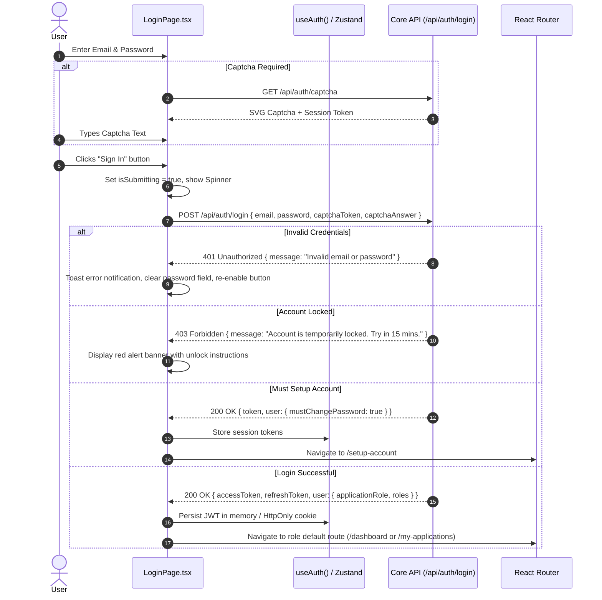
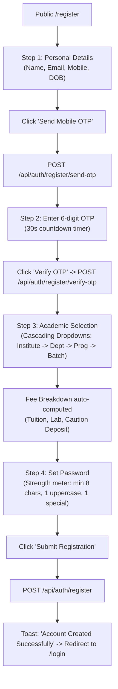

# Module 01: Auth & Access Control — UI Click Flows

> **Scope**: User authentication, registration, multi-factor verification (SMS/Email OTP), password reset cycles, account setup, role-based redirection, and administrator impersonation.

---

## Screen Inventory

| Route | Page Component | Primary Actors | Key Capabilities |
|:---|:---|:---|:---|
| `/login` | `LoginPage.tsx` | All Users | Email/password login, Captcha challenge, Remember me, links to Register/Forgot Password. |
| `/register` | `RegisterPage.tsx` | Public Applicants | Multi-step registration, mobile OTP, email OTP, program selection, fee preview. |
| `/forgot-password` | `ForgotPasswordPage.tsx` | All Users | Password reset initiation via Email magic link or SMS OTP. |
| `/reset-password` | `ResetPasswordPage.tsx` | All Users | Token validation, password policy meter, new password submission. |
| `/setup-account` | `SetupAccountPage.tsx` | New Staff / Students | Forced first-time password change, profile photo upload, security question setup. |
| `/` (Header/Topbar) | `AdminLayout.tsx` | SuperAdmin / UnivAdmin | Impersonation banner, Exit Impersonation button, Role switcher dropdown. |

---

## Flow 1: Standard User Login & Role-Based Redirection

### Granular Step-by-Step Table

| Step | Screen | User Interaction | Visual Changes & State | System Action / API Call | Redirection / Modal |
|:---|:---|:---|:---|:---|:---|
| 1.1 | `/login` | Visits URL | Form displays email, password fields, "Remember Me" checkbox, "Sign In" button. | `GET /api/auth/public/registration-config` to check if registration is enabled. | None |
| 1.2 | `/login` | Types email and password | Real-time input validation (RFC 5322 regex for email). Sign-in button enables if valid. | None | None |
| 1.3 | `/login` | Clicks **"Sign In"** | Button displays rotating spinner, inputs are disabled. | `POST /api/auth/login` with credentials. | On success: `/dashboard` (Staff/Admin) or `/my-applications` (Applicant) |
| 1.4 | `/login` | Clicks **"Forgot password?"** | Link hover animation with underline. | None | Navigates to `/forgot-password` |
| 1.5 | `/login` | Clicks **"Register as Applicant"** | Button hover transition. | None | Navigates to `/register` |

---

## Flow 2: Applicant Multi-Step Registration with Mobile & Email OTP

### Granular Step-by-Step Table

| Step | Screen | User Interaction | Visual Changes & State | System Action / API Call | Redirection / Modal |
|:---|:---|:---|:---|:---|:---|
| 2.1 | `/register` | Visits registration page | Multi-step progress bar (Personal Info $\to$ Contact $\to$ Course $\to$ Password). | `GET /api/auth/public/institutes` | Step 1 active |
| 2.2 | `/register` | Enters Mobile Number & clicks **"Send OTP"** | Button shows timer "Resend in 30s", OTP input field appears below. | `POST /api/auth/register/send-otp` | Modal toast "OTP sent to +91 ******4521" |
| 2.3 | `/register` | Enters 6-digit OTP & clicks **"Verify"** | Field turns green with checkmark icon; mobile is marked `verified`. | `POST /api/auth/register/verify-otp` | Advances to Course Selection |
| 2.4 | `/register` | Selects Institute dropdown | Department dropdown populates dynamically. | `GET /api/auth/public/departments?instituteId=...` | Cascading select |
| 2.5 | `/register` | Selects Programme & Batch | Course fee breakdown card renders below showing breakdown. | `GET /api/auth/public/application-fee?programmeId=...` | Summary card shows |
| 2.6 | `/register` | Sets password, confirms password, agrees to terms | Real-time strength meter updates from Weak (red) to Strong (emerald). | None | None |
| 2.7 | `/register` | Clicks **"Complete Registration"** | Submitting spinner, form inputs locked. | `POST /api/auth/register` | Success alert $\to$ Redirect `/login` |

---

## Flow 3: Password Recovery (Email Link & SMS OTP)

| Step | Screen | User Interaction | Visual Changes & State | System Action / API Call | Redirection / Modal |
|:---|:---|:---|:---|:---|:---|
| 3.1 | `/forgot-password` | Visits `/forgot-password` | Tabs: "Reset via Email" and "Reset via SMS". | None | Email tab default |
| 3.2 | `/forgot-password` | Enters registered email and clicks **"Send Reset Link"** | Button displays loading indicator. | `POST /api/auth/forgot-password` | Success alert: "Check your inbox for password reset instructions." |
| 3.3 | Email Inbox | Clicks reset link in email | Opens browser at `/reset-password?token=XYZ...` | `GET /api/auth/public/password-policy` | Navigates to `/reset-password` |
| 3.4 | `/reset-password` | Enters new password & confirmation | Policy validator checks: min length, symbol, number, uppercase. | None | Green checklist appears |
| 3.5 | `/reset-password` | Clicks **"Set New Password"** | Spinner runs. | `POST /api/auth/reset-password { token, newPassword }` | Toast: "Password updated successfully. Please log in." $\to$ `/login` |

---

## Flow 4: First-Time Account Setup (`/setup-account`)

| Step | Screen | User Interaction | Visual Changes & State | System Action / API Call | Redirection / Modal |
|:---|:---|:---|:---|:---|:---|
| 4.1 | `/setup-account` | Redirected here after first login with default credentials | Full-screen wizard: "Welcome to UniversityERP — Setup Your Account". | None | Wizard Step 1 |
| 4.2 | `/setup-account` | Enters current temporary password and new password | Validates password meets university policy and doesn't match last 3 passwords. | None | Step 1 |
| 4.3 | `/setup-account` | Uploads profile picture (drag & drop or browse) | Image preview with crop tool; file size validated (< 2MB, JPG/PNG). | `POST /api/upload/profile-photo` | Step 2 |
| 4.4 | `/setup-account` | Selects 2 security recovery questions & answers | Form fields validate non-empty answers. | None | Step 3 |
| 4.5 | `/setup-account` | Clicks **"Finish Setup & Enter Portal"** | Spinner activates. | `POST /api/auth/change-password` + `PATCH /api/auth/me` | Navigates to `/dashboard` |

---

## Flow 5: SuperAdmin Impersonation Mode

| Step | Screen | User Interaction | Visual Changes & State | System Action / API Call | Redirection / Modal |
|:---|:---|:---|:---|:---|:---|
| 5.1 | `/users` | SuperAdmin clicks user row actions $\to$ **"Impersonate User"** | Confirmation dialog: "Impersonating will switch your active session to this user." | None | ConfirmDialog opens |
| 5.2 | `/users` | Clicks **"Confirm Impersonate"** | Session updates. | `POST /api/auth/impersonate/:userId` | Redirects to `/dashboard` |
| 5.3 | Topbar (All Pages) | Impersonation banner appears at top of screen | High-visibility yellow warning banner: *"Viewing as [User Name] ([Role]) — Exit Impersonation"*. | None | Permanent banner |
| 5.4 | Topbar | SuperAdmin clicks **"Exit Impersonation"** | Spinner runs in banner. | `POST /api/auth/impersonate-exit` | Restores original SuperAdmin session $\to$ `/users` |
