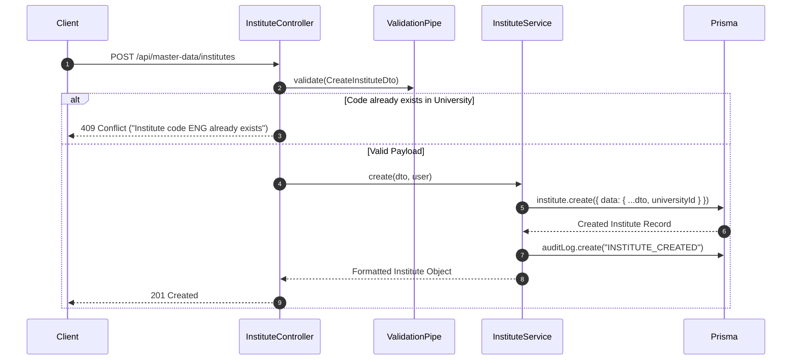

# Module 02: Master Data & Academic Structure — End-to-End Action Processes

> **Scope**: Detailed backend HTTP requests, DTO schemas, controllers, transactional operations, and Prisma mutations for University, Institute, Department, Programme, Course, Batch, Section, and Campus Resources.

---

## Action 1: Create Institute (`POST /api/master-data/institutes`)



### Protocol Specifications
- **HTTP Method & URL**: `POST /api/master-data/institutes`
- **Request Headers**: `Authorization: Bearer <token>`, `Content-Type: application/json`
- **Request Body (DTO: `CreateInstituteDto`)**:
  ```json
  {
    "universityId": "univ_main_001",
    "code": "ENG",
    "name": "Faculty of Engineering & Technology",
    "shortName": "FET",
    "address": "North Campus, Knowledge Park III",
    "email": "eng.dean@university.edu",
    "phone": "+91114567890",
    "deanName": "Dr. Aris Thorne",
    "website": "https://eng.university.edu"
  }
  ```
- **Nullish Acceptance**: Per commit `23d658bf`, optional string fields accept `null` or empty strings without triggering validation errors.
- **Controller**: `InstituteController.create(@Body() dto: CreateInstituteDto, @Req() req: AuthenticatedRequest)`
- **Prisma Database Mutation**:
  ```prisma
  await prisma.$transaction(async (tx) => {
    const institute = await tx.institute.create({
      data: {
        code: dto.code.trim().toUpperCase(),
        name: dto.name.trim(),
        universityId: dto.universityId,
        address: dto.address ?? null,
        email: dto.email ?? null,
        phone: dto.phone ?? null,
        deanName: dto.deanName ?? null,
        website: dto.website ?? null,
        isActive: true
      }
    });

    await tx.auditLog.create({
      data: {
        action: "INSTITUTE_CREATE",
        userId: req.user.id,
        entity: "Institute",
        entityId: institute.id,
        newData: institute
      }
    });

    return institute;
  });
  ```
- **Response (201 Created)**:
  ```json
  {
    "id": "inst_eng_9918",
    "universityId": "univ_main_001",
    "code": "ENG",
    "name": "Faculty of Engineering & Technology",
    "isActive": true,
    "createdAt": "2026-09-11T12:00:00.000Z"
  }
  ```

---

## Action 2: SuperAdmin Unlock Batch Term (`PATCH /api/master-data/batch-terms/:id/unlock`)

- **HTTP Method & URL**: `PATCH /api/master-data/batch-terms/:id/unlock`
- **Guards**: `JwtAuthGuard`, `RolesGuard('SuperAdmin')`
- **Backend Flow (Commit `0a43259c`)**:
  1. Lookup `BatchTerm` by `:id`. Verify status is currently `LOCKED`.
  2. Query `StudentSubjectEnrollment` and `StudentTermElection` counts for this `batchTermId`.
  3. If enrolled student count > 0: reject with `400 Bad Request` ("Cannot unlock term with enrolled students").
  4. If 0 students enrolled: update status to `ACTIVE`, record audit log with reason.
- **Prisma Mutation**:
  ```prisma
  const count = await prisma.studentSubjectEnrollment.count({
    where: { batchTermSubject: { batchTermId: id } }
  });

  if (count > 0) {
    throw new BadRequestException(`Cannot unlock: ${count} students enrolled.`);
  }

  const updated = await prisma.batchTerm.update({
    where: { id },
    data: {
      isLocked: false,
      status: "ACTIVE",
      unlockedAt: new Date(),
      unlockedBy: req.user.id
    }
  });
  ```
- **Response (200 OK)**:
  ```json
  {
    "id": "bt_term_4401",
    "isLocked": false,
    "status": "ACTIVE",
    "message": "Batch term unlocked successfully"
  }
  ```

---

## Action 3: Bulk Spreadsheet Department Import (`POST /api/master-data/bulk-import/departments`)

- **HTTP Method & URL**: `POST /api/master-data/bulk-import/departments`
- **Request Body**:
  ```json
  {
    "instituteId": "inst_eng_9918",
    "rows": [
      { "code": "CSE", "name": "Computer Science & Engineering", "hodName": "Dr. Smith" },
      { "code": "ECE", "name": "Electronics & Communication", "hodName": "Dr. Vance" }
    ]
  }
  ```
- **Backend Execution**:
  1. Validates each row against schema (`code` required, regex `^[A-Z0-9_-]+$`).
  2. Executes Prisma `upsert` in an atomic transaction to ensure zero partial failure.
  3. Emits audit log entry `BULK_IMPORT_DEPARTMENTS` with count of created/updated records.
- **Response (200 OK)**:
  ```json
  {
    "success": true,
    "processedCount": 2,
    "createdCount": 2,
    "updatedCount": 0
  }
  ```
