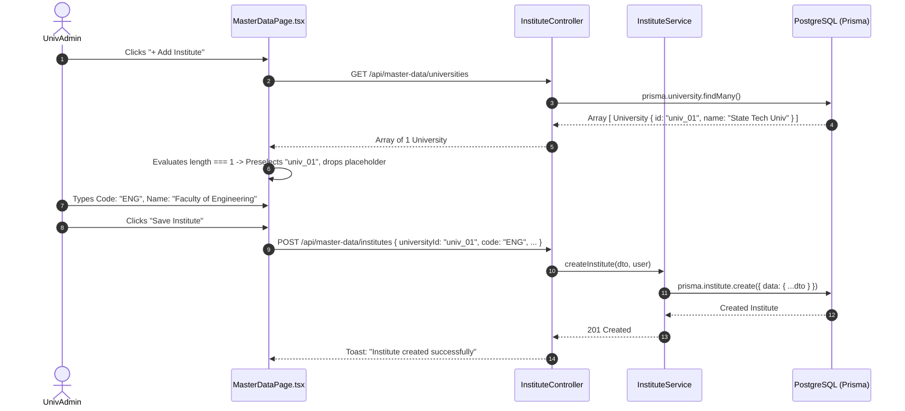

# Module 02: Master Data & Academic Structure — End-to-End Action Processes

> **Enterprise Technical Specification**: Comprehensive hierarchical entity management, transactional database operations, DTO validation pipelines, cascading constraints, nullish field handling (commit `23d658bf`), sole university auto-selection (commit `fe6dfbd7`), SuperAdmin batch term unlocking (commit `0a43259c`), 5-tab Program Label rule specifications, and bulk spreadsheet import grids.

---

## Complete Action & Endpoint Catalog

| Action # | Endpoint | HTTP Method | Primary Actor | Description & Security Scope |
|:---:|:---|:---:|:---|:---|
| **01** | `/api/master-data/universities` | `GET` / `PUT` | SuperAdmin | Manages university root entity, domain branding, and config JSON (nullish optional fields per `23d658bf`). |
| **02** | `/api/master-data/institutes` | `POST` / `GET` | UnivAdmin | Provisions collegiate institutes; automatically selects sole university if count is 1 (commit `fe6dfbd7`). |
| **03** | `/api/master-data/departments` | `POST` / `GET` | InstAdmin | Manages academic departments (e.g., Computer Science, Electrical Engineering) and assigns HOD. |
| **04** | `/api/master-data/programmes` | `POST` / `GET` | UnivAdmin / InstAdmin | Defines degree programmes (e.g., B.Tech, M.Tech, MBA) and assigns total term durations. |
| **05** | `/api/master-data/courses` | `POST` / `GET` | InstAdmin | Configures syllabus courses and academic regulations governing programme offerings. |
| **06** | `/api/master-data/batches` | `POST` / `GET` | InstAdmin | Provisions cohort batches (e.g., 2026-2030), target intake capacities, and academic start years. |
| **07** | `/api/master-data/batch-terms/:id/unlock` | `PATCH` | SuperAdmin | Overrides locked status of completed term; strictly enforced only if enrolled student count is 0 (commit `0a43259c`). |
| **08** | `/api/master-data/sections` | `POST` | InstAdmin | Subdivides batch terms into classroom sections (Section A, Section B) with individual student quotas. |
| **09** | `/api/master-data/stream-labels` | `POST` / `PATCH` | UnivAdmin | 5-Tab rule engine configuring Structure, Grading bands, Attendance limits, Re-assessment, and Supplementary rules. |
| **10** | `/api/master-data/program-labels/:id/draft` | `DELETE` | UnivAdmin | Discards uncommitted draft revisions in academic label catalog (commit `ef3a3df5`). |
| **11** | `/api/master-data/campus-resources` | `POST` / `GET` | InstAdmin | Registers classrooms, labs, lecture halls, and auditoriums with seating capacity and equipment tags. |
| **12** | `/api/master-data/bulk-import/:entity` | `POST` | InstAdmin | High-throughput spreadsheet bulk import (Departments, Courses, Streams) with transactional rollback on error. |

---

## Action 1: Create Institute with Sole University Preselection (`POST /api/master-data/institutes`)

Per commit `fe6dfbd7`, if only one University exists in the database, the frontend auto-selects it and drops the empty placeholder.



### Protocol Specifications
- **HTTP Method & URL**: `POST /api/master-data/institutes`
- **Guards**: `JwtAuthGuard`, `RolesGuard('SuperAdmin', 'UnivAdmin')`
- **Request Body (DTO: `CreateInstituteDto`)**:
  ```json
  {
    "universityId": "univ_01",
    "code": "ENG",
    "name": "Faculty of Engineering & Technology",
    "shortName": "FET",
    "address": "North Campus, Knowledge Park III",
    "email": "eng.dean@university.edu",
    "phone": "+91114567890",
    "deanName": "Dr. Aris Thorne",
    "website": "https://eng.university.edu"
  }
  ```
- **Nullish Field Handling (Commit `23d658bf`)**:
  Optional fields (`address`, `email`, `phone`, `deanName`, `website`) accept `null` or empty strings without triggering schema validation exceptions.
- **Prisma Database Mutation**:
  ```prisma
  await prisma.$transaction(async (tx) => {
    const institute = await tx.institute.create({
      data: {
        universityId: dto.universityId,
        code: dto.code.trim().toUpperCase(),
        name: dto.name.trim(),
        shortName: dto.shortName?.trim() ?? null,
        address: dto.address?.trim() ?? null,
        email: dto.email?.trim() ?? null,
        phone: dto.phone?.trim() ?? null,
        deanName: dto.deanName?.trim() ?? null,
        website: dto.website?.trim() ?? null,
        isActive: true
      }
    });

    await tx.auditLog.create({
      data: {
        action: "INSTITUTE_CREATED",
        userId: req.user.id,
        entity: "Institute",
        entityId: institute.id,
        newData: institute
      }
    });

    return institute;
  });
  ```
- **Response (201 Created)**:
  ```json
  {
    "id": "inst_eng_9918",
    "universityId": "univ_01",
    "code": "ENG",
    "name": "Faculty of Engineering & Technology",
    "isActive": true,
    "createdAt": "2026-09-11T12:00:00.000Z"
  }
  ```

---

## Action 2: SuperAdmin Unlock Batch Term (`PATCH /api/master-data/batch-terms/:id/unlock`)

Per commit `0a43259c`, a SuperAdmin can unlock a locked batch term provided no students are enrolled.

```mermaid
sequenceDiagram
    autonumber
    actor Admin as SuperAdmin
    participant Ctrl as BatchTermController
    participant Service as BatchTermService
    participant DB as PostgreSQL (Prisma)

    Admin->>Ctrl: PATCH /api/master-data/batch-terms/:id/unlock { reason }
    Ctrl->>Service: unlockBatchTerm(id, reason, user)
    Service->>DB: prisma.batchTerm.findUnique({ where: { id } })
    Service->>DB: Check studentSubjectEnrollment.count({ where: { batchTermId: id } })
    
    alt Enrolled Students > 0 (count = 42)
        Service-->>Ctrl: Throw BadRequestException("Cannot unlock: 42 students enrolled")
        Ctrl-->>Admin: 400 Bad Request
    else Clean Term (count = 0)
        Service->>DB: $transaction [
            1. batchTerm.update({ isLocked: false, status: 'ACTIVE' })
            2. auditLog.create("BATCH_TERM_SUPERADMIN_UNLOCKED")
        ]
        DB-->>Service: Committed
        Service-->>Ctrl: { success: true, status: 'ACTIVE' }
        Ctrl-->>Admin: 200 OK
    end
```

### Protocol Specifications
- **HTTP Method & URL**: `PATCH /api/master-data/batch-terms/:id/unlock`
- **Guards**: `JwtAuthGuard`, `RolesGuard('SuperAdmin')`
- **Request Body (DTO: `UnlockBatchTermDto`)**:
  ```json
  {
    "reason": "Administrative restructuring of curriculum before student registration commences."
  }
  ```
- **Prisma Atomic Mutation**:
  ```prisma
  const count = await prisma.studentSubjectEnrollment.count({
    where: { batchTermSubject: { batchTermId: id } }
  });

  if (count > 0) {
    throw new BadRequestException(`Cannot unlock: ${count} students enrolled in this term.`);
  }

  const updated = await prisma.batchTerm.update({
    where: { id },
    data: {
      isLocked: false,
      status: "ACTIVE",
      unlockedAt: new Date(),
      unlockedBy: req.user.id
    }
  });
  ```
- **Response (200 OK)**:
  ```json
  {
    "id": "bt_term_4401",
    "isLocked": false,
    "status": "ACTIVE",
    "message": "Batch term unlocked successfully"
  }
  ```

---

## Action 3: 5-Tab Program Label Rule Engine (`POST /api/master-data/stream-labels`)

Per commit `ef3a3df5`, academic regulations are configured through a 5-tab schema representing structural and evaluation rules.

- **HTTP Method & URL**: `POST /api/master-data/stream-labels`
- **Guards**: `JwtAuthGuard`, `RolesGuard('UnivAdmin', 'SuperAdmin')`
- **Request Body (DTO: `ProgramLabelRulesetDto`)**:
  ```json
  {
    "name": "B.Tech Autonomous Regulations 2026",
    "termType": "SEMESTER",
    "totalTerms": 8,
    "durationYears": 4,
    "gradingRules": {
      "passingPercentage": 40,
      "gradingScale": "10_POINT_SGPA",
      "gradeBands": [
        { "grade": "O", "minMark": 90, "points": 10, "label": "Outstanding" },
        { "grade": "A+", "minMark": 80, "points": 9, "label": "Excellent" },
        { "grade": "A", "minMark": 70, "points": 8, "label": "Very Good" },
        { "grade": "B+", "minMark": 60, "points": 7, "label": "Good" },
        { "grade": "B", "minMark": 50, "points": 6, "label": "Above Average" },
        { "grade": "C", "minMark": 40, "points": 5, "label": "Pass" },
        { "grade": "F", "minMark": 0, "points": 0, "label": "Fail" }
      ]
    },
    "attendanceRules": {
      "minimumAttendancePercentage": 75,
      "medicalCondonationPercentage": 10,
      "condonationFeePerSubject": 500
    },
    "reassessmentRules": {
      "reEvaluationAllowed": true,
      "feePerSubject": 1000,
      "maxSubjectsAllowed": 3
    },
    "supplementaryRules": {
      "maxActiveBacklogsAllowedToPromote": 3
    }
  }
  ```
- **Response (201 Created)**:
  ```json
  {
    "id": "plabel_btech_auton_2026",
    "name": "B.Tech Autonomous Regulations 2026",
    "isActive": true,
    "createdAt": "2026-09-11T12:00:00.000Z"
  }
  ```
