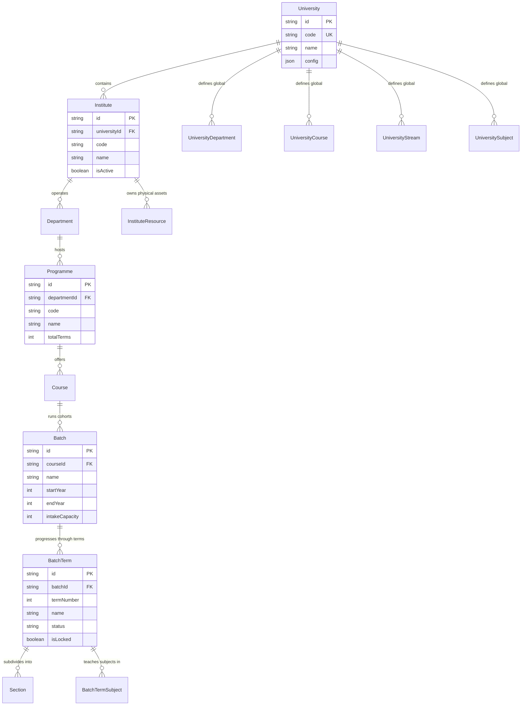
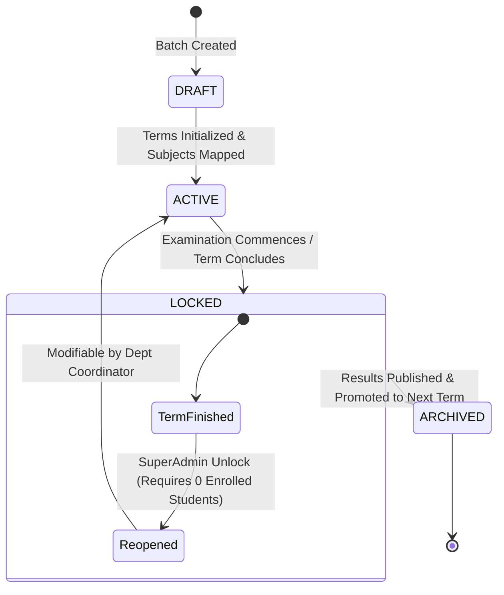

# Module 02: Master Data & Academic Structure — Technical Architecture

> **Scope**: Academic entity relationship hierarchy, cascading lifecycle constraints, configurable academic structure (custom level names and disable-able middle layer per commit `0d04842c`), and transaction boundaries.

---

## 1. Academic Hierarchy & Entity Relationships

The academic hierarchy supports multi-tenant university environments with flexible tier configurations.



---

## 2. Configurable Academic Hierarchy (Commit `0d04842c`)

Universities can configure custom naming conventions (e.g., "Faculty" vs "School" vs "Institute", or "Department" vs "Division") and optionally disable the middle layer (e.g. running Programmes directly under Institutes without Departments).

```mermaid
flowchart TD
    UniConfig["University.config.academicStructure"] --> LevelNames["Custom Level Labels<br/>{ institute: 'College', department: 'Faculty', programme: 'Degree' }"]
    UniConfig --> MiddleLayer["disableMiddleLayer: boolean"]
    
    MiddleLayer -->|false (Default)| FullHierarchy["Institute -> Department -> Programme -> Course"]
    MiddleLayer -->|true| CollapsedHierarchy["Institute -> Programme -> Course (Direct link)"]
    
    LevelNames --> DynamicUI["MasterDataPage.tsx: Dynamic Tab & Column Labels"]
    LevelNames --> ValidationEngine["ValidationPage.tsx: Schema Integrity Engine"]
```

---

## 3. Batch Term Lifecycle & Lock Integrity



### Locking Invariants
1. A locked `BatchTerm` cannot have subjects added, removed, or credit weightages modified.
2. A locked `BatchTerm` cannot be unlocked by regular `InstAdmin` or `HOD` if any student has grade records or marksheet entries.
3. SuperAdmin override unlock requires an explicit validation that `StudentSubjectEnrollment.count == 0` to prevent database inconsistency.
