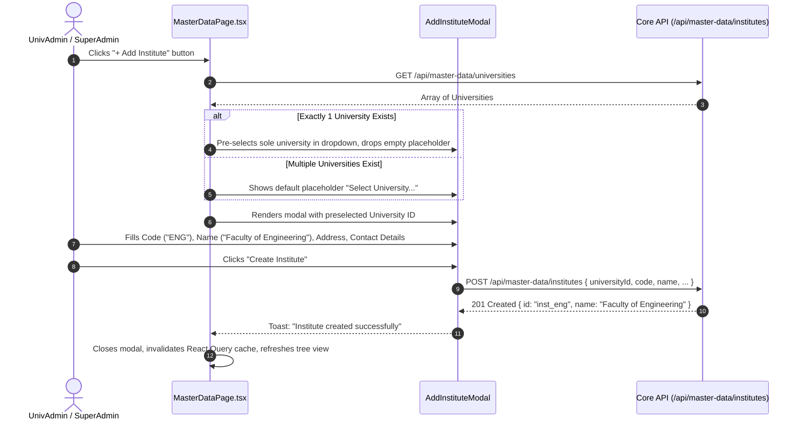
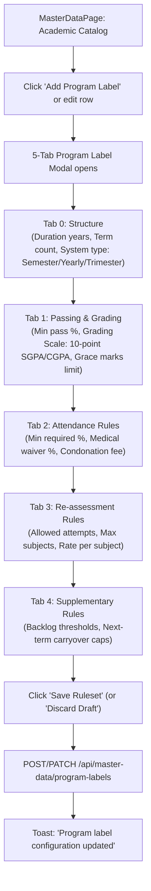

# Module 02: Master Data & Academic Structure — UI Click Flows

> **Scope**: University, Institute, Department, Programme, Course, Batch, Section, Campus Resources, Academic Label Catalog (Program Labels, Stream Labels, Subject Labels), and Bulk Grid Operations.

---

## Screen Inventory

| Route | Page Component | Primary Actors | Key Capabilities |
|:---|:---|:---|:---|
| `/master-data` | `MasterDataPage.tsx` | SuperAdmin, UnivAdmin, InstAdmin | Complete academic and physical hierarchy management, multi-tab modal designers, bulk spreadsheet editors, resource reservations. |
| `/validation` | `ValidationPage.tsx` | UnivAdmin, InstAdmin | Structural integrity checks, missing data indicators, orphaned entity detection, batch readiness audits. |

---

## Flow 1: Add Institute & Auto-Selection of Sole University

### Granular Step-by-Step Table

| Step | Screen | User Interaction | Visual Changes & State | System Action / API Call | Redirection / Modal |
|:---|:---|:---|:---|:---|:---|
| 1.1 | `/master-data` | Clicks **"+ Add Institute"** button | Modal fades in. | `GET /api/master-data/universities` | Modal dialog opens |
| 1.2 | Modal | Inspects "University" select box | If only 1 university exists, it is pre-selected and required. | Code update `fe6dfbd7` verified | Preselected value |
| 1.3 | Modal | Types Code: `ENG`, Name: `School of Engineering` | Real-time uppercase formatting on Code; unique code validation. | None | Form input |
| 1.4 | Modal | Enters optional fields (Address, Phone, Email, Dean Name) | Accepts empty or null values per `23d658bf`. | None | Nullish allowed |
| 1.5 | Modal | Clicks **"Save Institute"** | Button displays saving spinner, inputs disabled. | `POST /api/master-data/institutes` | Toast $\to$ Closes modal |

---

## Flow 2: Program Label Multi-Tab Academic Rule Designer

### Granular Step-by-Step Table

| Step | Tab / Screen | User Interaction | Visual Changes & State | System Action / API Call | Redirection / Modal |
|:---|:---|:---|:---|:---|:---|
| 2.1 | Catalog Tab | Clicks **"New Program Label"** | Program Label Wizard modal opens at Tab 0. | None | Wizard opened |
| 2.2 | Tab 0: Structure | Enters Label Name (`B.Tech Autonomous`), Selects Term System (`Semester`), Duration (`4 Years / 8 Terms`). | Preview schematic updates live. | None | Form inputs |
| 2.3 | Tab 0: Structure | Clicks **"Next →"** (or Tab 1) | Tab 0 saved in wizard local state, switches to Tab 1. | None | Tab 1 active |
| 2.4 | Tab 1: Grading | Configures Grade Letter Bands (O: 90-100, A+: 80-89, etc.), Passing % (`40%`), Class Divisions. | Table rows reorder by min mark. | None | Tab 1 |
| 2.5 | Tab 2: Attendance | Sets Mandatory Attendance (`75%`), Medical concession (`10%`), Condonation fee (`₹500`). | Warning banner if condonation is disabled. | None | Tab 2 |
| 2.6 | Tab 3: Re-assessment | Enables Re-evaluation & Scrutiny toggles, sets base fee per paper. | Fee fields display currency indicator (`₹`). | None | Tab 3 |
| 2.7 | Tab 4: Supplementary | Sets maximum allowed active backlogs to progress (`3`). | Rule summary preview box renders. | None | Tab 4 |
| 2.8 | Wizard Footer | Clicks **"Save Ruleset"** | Spinner runs on submit button. | `POST /api/master-data/stream-labels` | Toast $\to$ Closes modal |
| 2.9 | Wizard Footer | Clicks **"Discard Draft"** (if editing draft) | Reverts uncommitted draft changes per `ef3a3df5`. | `DELETE /api/master-data/program-labels/:id/draft` | Closes modal |

---

## Flow 3: Bulk Spreadsheet Edit for Departments, Courses, Streams

| Step | Screen | User Interaction | Visual Changes & State | System Action / API Call | Redirection / Modal |
|:---|:---|:---|:---|:---|:---|
| 3.1 | `/master-data` | Navigates to Departments or Courses tab | Table displays listing with actions. | `GET /api/master-data/departments` | Listing loaded |
| 3.2 | `/master-data` | Clicks **"Bulk Edit"** (`<Table2>` icon button) | Fullscreen spreadsheet modal renders with editable data grid. | Data loaded into in-memory table | Modal opens |
| 3.3 | Grid Modal | Edits cell values directly (Codes, Names, Intake Capacities, Status) | Modified cells highlighted with subtle yellow background indicator. | Local state tracking | In-place edits |
| 3.4 | Grid Modal | Clicks **"Download Template / Export"** | Downloads current view as XLSX or CSV file. | Client-side spreadsheet export | File downloaded |
| 3.5 | Grid Modal | Pastes data from external Excel sheet | Grid validates columns, flags parsing errors in red. | None | Validation badges |
| 3.6 | Grid Modal | Clicks **"Save All Changes"** | Progress bar shows batch update progress. | `POST /api/master-data/bulk-import/departments` | Toast: "24 records updated" |

---

## Flow 4: Batch Term Unlocking (SuperAdmin Override)

| Step | Screen | User Interaction | Visual Changes & State | System Action / API Call | Redirection / Modal |
|:---|:---|:---|:---|:---|:---|
| 4.1 | `/master-data` | Selects a Batch $\to$ Term that is locked (`status: LOCKED`) | Term badge shows red Lock icon with "Term Locked". | None | Row selected |
| 4.2 | Row Actions | SuperAdmin clicks **"Unlock Term"** (`<Unlock>` icon) | Confirm dialog: "Unlock Batch Term? Only allowed if 0 students enrolled." | Checks student count in term | ConfirmDialog |
| 4.3 | ConfirmDialog | If students enrolled: button disabled with message *"Cannot unlock: 42 students enrolled."* | Alert banner shows enrolled student count. | `GET /api/master-data/batch-terms/:id/student-count` | Blocked |
| 4.4 | ConfirmDialog | If 0 students enrolled: SuperAdmin enters reason & clicks **"Confirm Unlock"** | Term status updates to `ACTIVE`, Lock icon changes to green unlocked badge. | `PATCH /api/master-data/batch-terms/:id/unlock` | Toast: "Batch term unlocked" per commit `0a43259c` |
