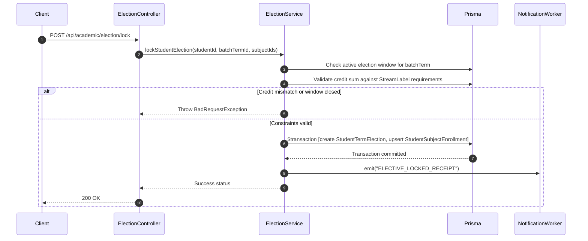

# Module 03: Academics, Curriculum & Timetable — End-to-End Action Processes

> **Scope**: Backend request-to-response cycles, DTO payloads, NestJS controller mappings, and Prisma mutations for student elective elections, timetable scheduling, faculty self-projections, attendance register marking, and draft result publishing.

---

## Action 1: Student Elective Election & Lock (`POST /api/academic/election/lock`)



### Protocol Specifications
- **HTTP Method & URL**: `POST /api/academic/election/lock`
- **Guards**: `JwtAuthGuard`, `StudentGuard`
- **Request Body (DTO: `LockElectionDto`)**:
  ```json
  {
    "batchTermId": "bterm_0982",
    "electedSubjectIds": [
      "subj_cloud_arch_01",
      "subj_cyber_sec_04"
    ]
  }
  ```
- **Controller**: `ElectionController.lock(@Req() req, @Body() dto: LockElectionDto)`
- **Prisma Database Mutation**:
  ```prisma
  await prisma.$transaction(async (tx) => {
    // 1. Create or update election record as locked
    const election = await tx.studentTermElection.upsert({
      where: {
        studentId_batchTermId: {
          studentId: req.user.studentId,
          batchTermId: dto.batchTermId
        }
      },
      create: {
        studentId: req.user.studentId,
        batchTermId: dto.batchTermId,
        isLocked: true,
        lockedAt: new Date()
      },
      update: {
        isLocked: true,
        lockedAt: new Date()
      }
    });

    // 2. Enroll student into each elected BatchTermSubject
    for (const subjId of dto.electedSubjectIds) {
      await tx.studentSubjectEnrollment.create({
        data: {
          studentId: req.user.studentId,
          batchTermSubjectId: subjId,
          enrollmentType: "ELECTIVE",
          status: "ENROLLED"
        }
      });
    }

    return election;
  });
  ```
- **Response (200 OK)**:
  ```json
  {
    "success": true,
    "lockedAt": "2026-09-11T12:00:00.000Z",
    "enrolledSubjectCount": 2
  }
  ```

---

## Action 2: Retrieve Teaching Staff Weekly Timetable (`GET /api/timetable/staff/:staffId` & `/self`)

- **HTTP Method & URL**: `GET /api/timetable/staff/self` (or `/api/timetable/my`)
- **Backend Flow (Commit `d789ee4f`)**:
  1. Resolves `staffId` directly from authenticated `req.user.staffId` (or via user impersonation session).
  2. Queries `TimetableEntry` joined with `TimeSlot`, `BatchTermSubject`, `Room`, and `Section`.
  3. Formats entries into a day-of-week matrix (1 = Monday, ..., 7 = Sunday) with slot collision checks.
- **Prisma Query**:
  ```prisma
  const entries = await prisma.timetableEntry.findMany({
    where: {
      staffSubject: {
        staffId: resolvedStaffId
      }
    },
    include: {
      timeSlot: true,
      batchTermSubject: {
        include: {
          universitySubject: true,
          batchTerm: { include: { batch: true } }
        }
      },
      room: true,
      section: true
    },
    orderBy: [
      { timeSlot: { dayOfWeek: "asc" } },
      { timeSlot: { startTime: "asc" } }
    ]
  });
  ```
- **Response (200 OK)**:
  ```json
  {
    "staffId": "stf_8812",
    "staffName": "Prof. David Miller",
    "totalWeeklyLectures": 14,
    "entries": [
      {
        "id": "tt_entry_101",
        "dayOfWeek": 1,
        "timeSlot": { "label": "09:00 - 10:00", "startTime": "09:00", "endTime": "10:00" },
        "subjectCode": "CS301",
        "subjectName": "Operating Systems",
        "section": "Section A",
        "room": "Room 302 (Block B)"
      }
    ]
  }
  ```

---

## Action 3: Mark Daily Attendance Register (`POST /api/academic/attendance`)

- **HTTP Method & URL**: `POST /api/academic/attendance`
- **Request Body (DTO: `MarkAttendanceDto`)**:
  ```json
  {
    "batchTermSubjectId": "bts_9921",
    "sectionId": "sec_01",
    "date": "2026-09-11",
    "timeSlotId": "slot_01",
    "records": [
      { "studentId": "std_01", "status": "PRESENT" },
      { "studentId": "std_02", "status": "ABSENT", "remarks": "Unexcused" },
      { "studentId": "std_03", "status": "MEDICAL_LEAVE" }
    ]
  }
  ```
- **Backend Flow**:
  1. Validates caller is the assigned faculty for `batchTermSubjectId` or holds `HOD` / `InstAdmin` role.
  2. Executes batch upsert of `StudentAttendance` records for the date and lecture slot.
  3. Recalculates `SubjectAttendanceSummary` percentage for each student.
  4. If percentage drops below threshold (`75%`), queues warning notification to student and parent.
- **Response (200 OK)**:
  ```json
  {
    "success": true,
    "recordedCount": 3,
    "date": "2026-09-11"
  }
  ```
