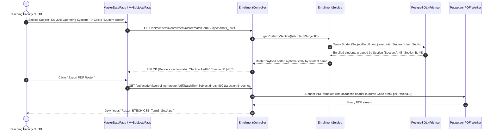

# Module 03: Academics, Curriculum & Timetable — End-to-End Action Processes

> **Enterprise Technical Specification**: Detailed academic lifecycle operations, curriculum mapping, elective subject pool allocations, weekly timetable scheduling with three-dimensional conflict resolution, teaching staff timetable self-projections (commit `d789ee4f`), daily lecture attendance registers, subject enrollment rosters with section tabs and PDF generation (commit `f8e83dfa`), continuous evaluation marks entry, draft result balloons (commit `af104358`), and term result calculations.

---

## Complete Action & Endpoint Catalog

| Action # | Endpoint | HTTP Method | Primary Actor | Description & Security Scope |
|:---:|:---|:---:|:---|:---|
| **01** | `/api/academic/election/pools` | `GET` | Student / Staff | Retrieves active elective subject pools, credit constraints, and remaining seats for a batch term. |
| **02** | `/api/academic/election/lock` | `POST` | Enrolled Student | Submits and locks chosen elective subjects; atomically enrolls student into `StudentSubjectEnrollment`. |
| **03** | `/api/academic/enrollment/roster` | `GET` | Faculty / HOD | Enrolled-student roster per batch with section tabs, alphabetical sorting, and academic header (commit `f8e83dfa`). |
| **04** | `/api/academic/enrollment/roster/pdf` | `GET` | Faculty / HOD | Generates printable PDF roster with full institutional hierarchy prefix (Univ/Inst/Dept/Course/Prog/Batch/Term). |
| **05** | `/api/timetable/staff/self` (or `/my`) | `GET` | Teaching Faculty | Faculty personal weekly timetable self-view; accounts for user impersonation sessions (commit `d789ee4f`). |
| **06** | `/api/timetable/slots` | `POST` / `GET` | InstAdmin | Configures institutional lecture time slots (e.g. 09:00 - 10:00) and day-of-week recurrence. |
| **07** | `/api/timetable/schedule` | `POST` | Academic Scheduler | Runs conflict detection and books classroom, teacher, and section for recurring weekly lectures. |
| **08** | `/api/timetable/special` | `POST` | HOD / Dean | Books guest lectures and one-off seminars; overrides regular time slots with conflict alerts. |
| **09** | `/api/timetable/holidays` | `POST` / `DELETE`| InstAdmin | Records institutional holidays; automatically prompts for lecture reschedule plans. |
| **10** | `/api/academic/attendance` | `POST` | Teaching Faculty | Marks lecture attendance register (Present, Absent, Late, Medical) with real-time percentage recalculation. |
| **11** | `/api/academic/attendance/summary` | `GET` | Student / Faculty | Retrieves aggregate lecture attendance percentage against 75% mandatory threshold. |
| **12** | `/api/academic/marks` | `POST` / `PATCH` | Teaching Faculty | Records Continuous Internal Evaluation (CIE) component marks (Quizzes, Midterms, Assignments). |
| **13** | `/api/academic/marks/lock` | `POST` | HOD | Immutably locks subject component marks; prevents retroactive grade alterations. |
| **14** | `/api/academic/results/draft` | `GET` | Exam Cell / HOD | Generates term results draft with per-row `NoMarks` and `Unlocked` status balloons (commit `af104358`). |
| **15** | `/api/academic/results/publish` | `POST` | Exam Controller | Calculates final SGPA/CGPA, credits earned, and publishes official term grades. |

---

## Action 1: Enrolled Student Subject Roster & PDF Export (`GET /api/academic/enrollment/roster` & `roster/pdf`)

Per commits `f8e83dfa` and `7c9eda16`, subject enrollment returns a section-tabbed roster with alphabetical sorting and structured PDF report export.



### Protocol Specifications
- **HTTP Method & URL**: `GET /api/academic/enrollment/roster`
- **Query Parameters**: `batchTermSubjectId=bts_9921`
- **Response Payload (200 OK)**:
  ```json
  {
    "subject": {
      "code": "CS301",
      "name": "Operating Systems",
      "credits": 4,
      "courseCode": "BTECH-CSE",
      "programme": "Bachelor of Technology in Computer Science",
      "term": "Term 3"
    },
    "sections": [
      {
        "sectionId": "sec_01",
        "sectionName": "Section A",
        "totalEnrolled": 48,
        "students": [
          {
            "studentId": "std_01",
            "rollNumber": "2026-CSE-001",
            "enrollmentNumber": "ENR-2026-0912",
            "name": "Aaron Paul",
            "attendancePercentage": 88.4,
            "status": "ENROLLED"
          }
        ]
      }
    ]
  }
  ```

---

## Action 2: Teaching Staff Personal Timetable Self-View (`GET /api/timetable/staff/self`)

Per commit `d789ee4f`, non-admin teaching faculty default to their own personalized weekly timetable grid, with support for impersonation sessions.

- **HTTP Method & URL**: `GET /api/timetable/staff/self`
- **Guards**: `JwtAuthGuard`
- **Backend Flow**:
  1. Resolves `staffId` directly from `req.user.staffId` (or target user if impersonating).
  2. If user has no associated `Staff` profile: throws `403 Forbidden` ("User is not a registered staff member").
  3. Queries `TimetableEntry` joined with `TimeSlot`, `Room`, and `Section`.
  4. Organizes entries by `dayOfWeek` (1=Mon ... 7=Sun) and `timeSlot.startTime`.
- **Response (200 OK)**:
  ```json
  {
    "staff": {
      "id": "stf_8812",
      "name": "Dr. Alan Turing",
      "employeeCode": "EMP-CSE-004",
      "designation": "Professor"
    },
    "weeklyLecturesCount": 12,
    "grid": {
      "1": [
        {
          "slot": "09:00 - 10:00",
          "subjectCode": "CS301",
          "subjectName": "Operating Systems",
          "section": "Section A",
          "room": "Hall 302 (Block B)"
        }
      ]
    }
  }
  ```

---

## Action 3: Term Results Draft with NoMarks / Unlocked Status Balloons (`GET /api/academic/results/draft`)

Per commit `af104358`, term result drafts supply per-row status warning balloons for missing marks and unlocked components.

- **HTTP Method & URL**: `GET /api/academic/results/draft`
- **Query Parameters**: `batchTermId=bterm_01&showNoMarks=true&showUnlocked=true`
- **Response Payload (200 OK)**:
  ```json
  {
    "batchTermId": "bterm_01",
    "totalStudents": 120,
    "readyForPublishCount": 114,
    "warningCount": 6,
    "draftRows": [
      {
        "studentId": "std_042",
        "rollNumber": "2026-CSE-042",
        "name": "Sarah Connor",
        "sgpa": 9.25,
        "cgpa": 9.10,
        "result": "PASS",
        "warnings": [
          {
            "type": "NO_MARKS",
            "subjectCode": "CS304",
            "message": "Theory marks not entered by Prof. Miller"
          },
          {
            "type": "UNLOCKED",
            "subjectCode": "CS302",
            "message": "Internal marksheet not yet locked by HOD"
          }
        ]
      }
    ]
  }
  ```
