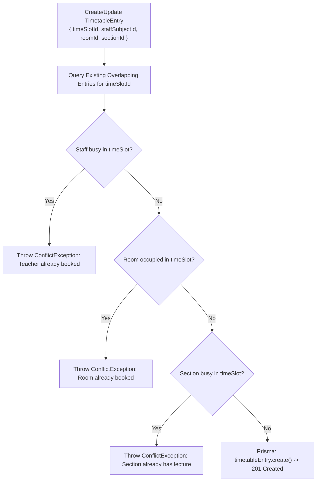
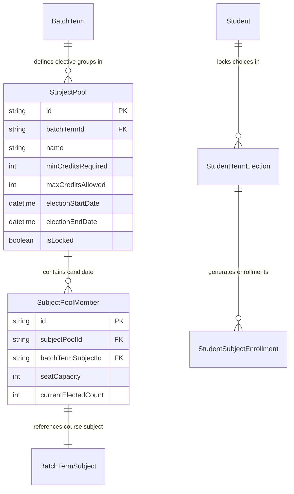
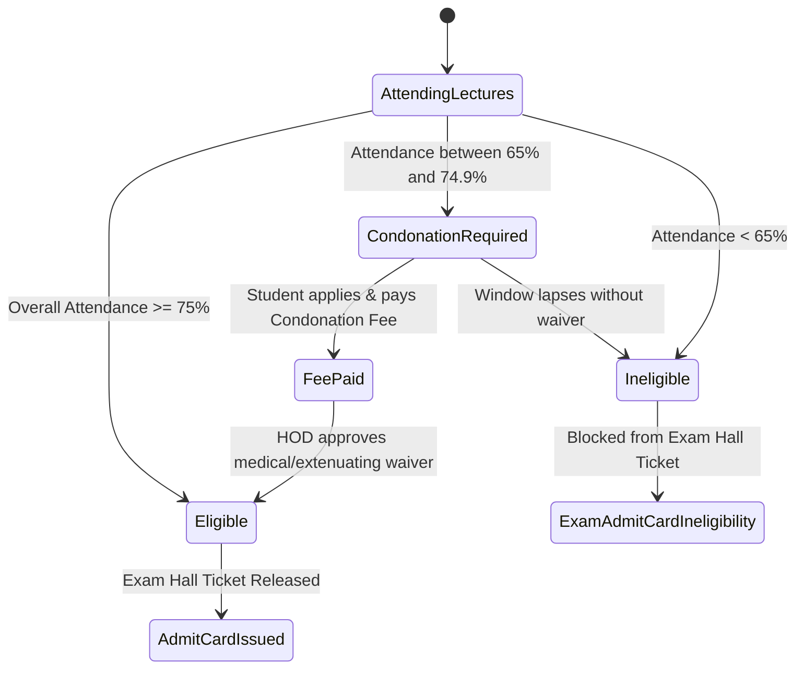

# Module 03: Academics, Curriculum & Timetable — Technical Architecture

> **Scope**: Timetable scheduling algorithms, slot conflict resolution logic, subject pool elective distribution engine, attendance computation formulas, and term completion state machines.

---

## 1. Timetable Scheduling & Collision Detection Engine

The timetable system prevents three types of resource conflicts across physical and academic entities:
1. **Teacher Conflict**: A faculty member cannot be scheduled in two distinct rooms or sections during the same `TimeSlot`.
2. **Room Conflict**: A physical classroom or laboratory cannot host multiple sections concurrently (unless explicitly configured as a shared lecture hall).
3. **Section Conflict**: A student section cannot have overlapping lecture slots.

---

## 2. Elective Subject Pool Architecture

---

## 3. Attendance Calculation & Eligibility Rule Model

Attendance is computed dynamically and aggregated in `SubjectAttendanceSummary`.

$$\text{Attendance Percentage} = \left(\frac{\text{Lectures Attended} + \text{Approved Medical Leaves}}{\text{Total Conducted Lectures}}\right) \times 100$$

