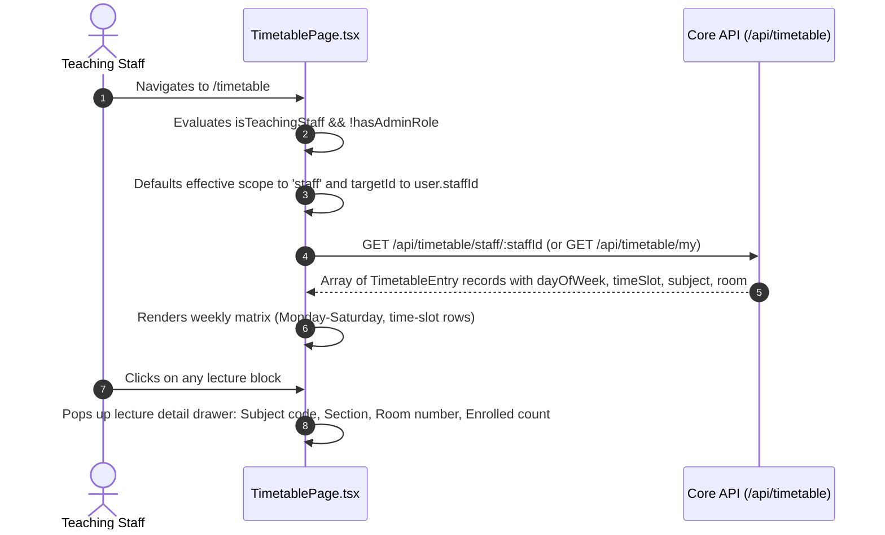
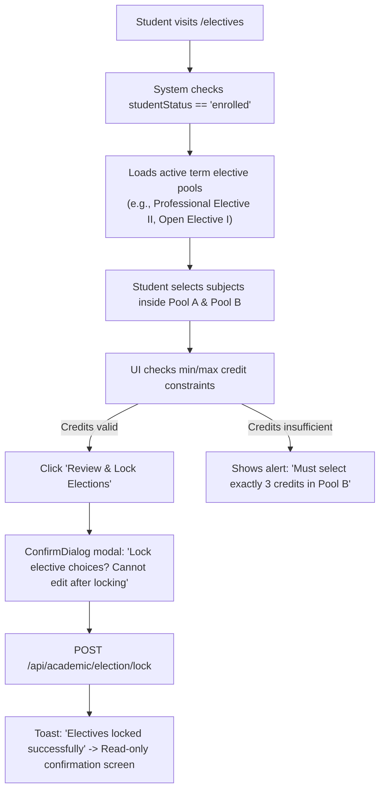

# Module 03: Academics, Curriculum & Timetable — UI Click Flows

> **Scope**: Batch-term subject configurations, subject pools, student elective elections, weekly class timetable grids, teaching staff self-view, attendance marking, roster PDF exports, and term results drafts.

---

## Screen Inventory

| Route | Page Component | Primary Actors | Key Capabilities |
|:---|:---|:---|:---|
| `/timetable` | `TimetablePage.tsx` | All Staff, Students | Weekly timetable projection grid by Section or Staff, teaching staff self-view (per commit `d789ee4f`), time-slot setup, special lectures, holidays & reschedules. |
| `/attendance` | `AttendancePage.tsx` | TeachingFaculty, HOD, InstAdmin | Section-wise student attendance registers, bulk mark Present/Absent/Late/Medical, threshold warnings, attendance summaries. |
| `/electives` | `ElectivesPage.tsx` | Enrolled Students | Subject pool elective election, priority ranking, credit requirement validation, submission confirmation. |
| `/my-subjects` | `MySubjectsPage.tsx` | TeachingFaculty, HOD | Topic weightage configuration, internal evaluation criteria mix, lesson plan progress tracking. |

---

## Flow 1: Teaching Staff Timetable Self-View

### Granular Step-by-Step Table

| Step | Screen | User Interaction | Visual Changes & State | System Action / API Call | Redirection / Modal |
|:---|:---|:---|:---|:---|:---|
| 1.1 | `/timetable` | Visits `/timetable` as faculty | Auto-selects "My Timetable" tab. Scope dropdown is locked or hidden for non-admins. | `GET /api/timetable/staff/self` | Matrix renders |
| 1.2 | `/timetable` | Views weekly grid | Lectures color-coded by subject; shows Room and Section tags (e.g. `CSE-4A [R-302]`). | None | Day columns 1-6 |
| 1.3 | `/timetable` | Toggles Day Filter tab (e.g. "Wednesday") | Focuses matrix on specific day slots. | None | Day filtered |
| 1.4 | `/timetable` | Clicks **"Print / Export PDF"** | Generates PDF timetable view with academic header and professor designation. | Client PDF render | Print preview |

---

## Flow 2: Enrolled Student Subject Roster & PDF Export with Section Tabs

Per commit `f8e83dfa`, subject enrollment view provides section tabs, alphabetical sorting, and PDF roster generation.

| Step | Screen | User Interaction | Visual Changes & State | System Action / API Call | Redirection / Modal |
|:---|:---|:---|:---|:---|:---|
| 2.1 | `/master-data` or `/my-subjects` | Clicks on Subject $\to$ **"Enrolled Students"** | Roster modal opens showing section tabs (`Section A`, `Section B`). | `GET /api/academic/enrollment/roster?subjectId=...` | Modal opens |
| 2.2 | Roster Modal | Clicks tab **"Section B (48)"** | Table refreshes showing Section B students, sorted alphabetically by student name. | None | Tab active |
| 2.3 | Roster Modal | Inspects table columns | Roll Number, Enrollment No, Student Name, Attendance %, Internal Marks, Status. | None | Status pills |
| 2.4 | Roster Modal | Clicks **"Export PDF Roster"** | Generates PDF with full institutional header (Univ / Inst / Dept / Course / Prog / Batch / Term / Section). | `GET /api/academic/enrollment/roster/pdf` | PDF downloaded |

---

## Flow 3: Student Elective Selection Workflow

### Granular Step-by-Step Table

| Step | Screen | User Interaction | Visual Changes & State | System Action / API Call | Redirection / Modal |
|:---|:---|:---|:---|:---|:---|
| 3.1 | `/electives` | Enrolled student opens page | Active elective window shown with countdown timer ("Closes in 3 days"). | `GET /api/academic/election/pools` | Pools rendered |
| 3.2 | `/electives` | Expands "Elective Pool 1: Cloud & Distributed Systems" | Radio options list available subjects, syllabus links, faculty assigned, remaining seats. | None | Cards expand |
| 3.3 | `/electives` | Selects "CS-402: Cloud Architecture" | Selected card highlights with emerald border; credit total updates (e.g. `Current: 3 / Required: 3`). | None | Real-time calc |
| 3.4 | `/electives` | Clicks **"Submit & Lock Choices"** | Confirmation popup with selected course codes and names. | None | Modal opens |
| 3.5 | Modal | Clicks **"Confirm Lock"** | Spinner runs. | `POST /api/academic/election/lock` | Toast $\to$ Locked card |

---

## Flow 4: Term Results Draft with Status Balloons

Per commit `af104358`, term result draft provides per-row balloons for `NoMarks` and `Unlocked` status, plus toggle checkboxes.

| Step | Screen | User Interaction | Visual Changes & State | System Action / API Call | Redirection / Modal |
|:---|:---|:---|:---|:---|:---|
| 4.1 | `/exams` or `/master-data` | Opens Term Results Draft tab | Table renders student marks rows. | `GET /api/academic/results/draft?termId=...` | Draft table |
| 4.2 | Results Draft | Inspects filter checkboxes in toolbar | Checkboxes: `[x] Show No-Marks`, `[x] Show Unlocked` (both default ON). | None | Filters active |
| 4.3 | Results Draft | Unchecks `Show No-Marks` | Table instantly filters out students without marks entered, leaving ready candidates. | Local filter update | Table updates |
| 4.4 | Results Table | Hover on warning balloon in row | Tooltip: *"Pending Theory Marks from Prof. Smith"* or *"Internal marks not locked"*. | None | Tooltip popover |
| 4.5 | Results Draft | Clicks **"Publish Term Results"** (when all clean) | Confirmation modal with grade distribution summary. | `POST /api/academic/results/publish` | Results published |
