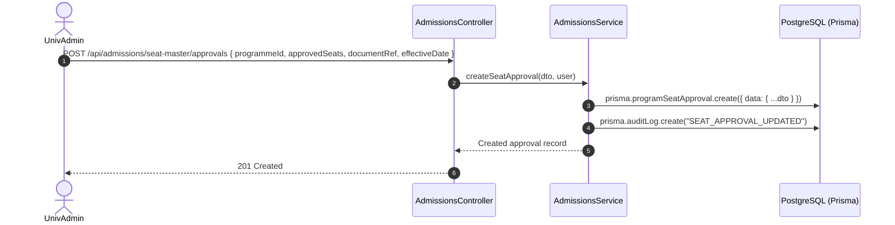
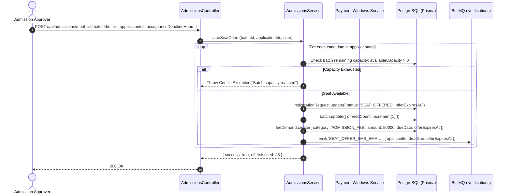

# Module 04: Admissions & Student Lifecycle — End-to-End Action Processes

> **Enterprise Technical Specification**: Detailed request and response pipelines, DTO schemas, transactional database operations, and state machine transitions for Seat Master statutory capacity tracking, applicant merit scoring, seat offer issuance, onboarding bulk import, guarded student removal (commit `f6baee56`), enrollment cancellation/refund workflow, and governed student profiles.

---

## Complete Action & Endpoint Catalog

| Action # | Endpoint | HTTP Method | Primary Actor | Description & Security Scope |
|:---:|:---|:---:|:---|:---|
| **01** | `/api/admissions/seat-master` | `GET` | InstAdmin / UnivAdmin | Queries hierarchical Seat Master matrix with Institute $\to$ Department $\to$ Programme $\to$ Batch rows. |
| **02** | `/api/admissions/seat-master/approvals` | `POST` | UnivAdmin | Configures statutory approved intake (AICTE/UGC) with effective start date and regulatory document proof. |
| **03** | `/api/admissions/seat-master/approvals/:id` | `PATCH` | UnivAdmin | Updates regulatory seat approval limits. |
| **04** | `/api/admissions/seat-master/batches/:id/seats` | `PATCH` | InstAdmin | Updates operational batch target size (must satisfy $\le$ Approved Intake). |
| **05** | `exportSeatMasterXlsx` & `Pdf` | Client Fn | Admissions Desk | Filtered view export to Excel/PDF (Program, Batch, Term, Approved, Size, Filled, Offered, Available per `eaffc7d5`). |
| **06** | `/api/admissions/applications` | `GET` | Admission Approver | Filtered applicant search by status (Draft, Under Review, Verified, Rejected), category, and score. |
| **07** | `/api/admissions/merit-list/:batchId` | `GET` | Admission Approver | Computes normalized composite scores and generates ranked merit roster with tie-breaker logic. |
| **08** | `/api/admissions/merit-list/:batchId/offer` | `POST` | Admission Approver | Issues formal seat offers to selected merit ranks; starts countdown payment timer (commit `6f060a59`). |
| **09** | `/api/admissions/merit-list/:batchId/reject` | `POST` | Admission Approver | Rejects ineligible candidates with mandatory reason; notifies applicant via SMS & Email. |
| **10** | `/api/onboarding/validate` | `POST` | InstAdmin | Dry-run validation of batch student CSV/Excel data; checks roll duplicates and email conflicts. |
| **11** | `/api/onboarding/commit` | `POST` | InstAdmin | Executes batch enrollment transaction; creates User accounts, Student records, and section assignments. |
| **12** | `/api/onboarding/delete` | `POST` | SuperAdmin / InstAdmin | Guarded "Remove a student" (undo onboarding per `f6baee56`); reverts status to `OFFER_ACCEPTED`. |
| **13** | `/api/admissions/cancel-enrollment` | `POST` | Enrolled Student | Submits voluntary admission cancellation and fee refund request. |
| **14** | `/api/admissions/cancel-enrollment/:id/approve` | `POST` | Registrar / Finance | Approves cancellation, calculates statutory refund deduction, releases seat back to pool. |
| **15** | `/api/student-profile/profile` | `GET` & `PATCH` | Student | Retrieves and updates student personal information subject to profile governance rules. |

---

## Action 1: Seat Master Regulatory Approval & Capacity Update (`POST /api/admissions/seat-master/approvals`)



### Protocol Specifications
- **HTTP Method & URL**: `POST /api/admissions/seat-master/approvals`
- **Guards**: `JwtAuthGuard`, `RolesGuard('SuperAdmin', 'UnivAdmin')`
- **Request Body (DTO: `CreateSeatApprovalDto`)**:
  ```json
  {
    "programmeId": "prog_btech_cse_01",
    "approvedSeats": 120,
    "effectiveAcademicYearStart": "2026-08-01",
    "approvalBody": "AICTE",
    "approvalOrderNumber": "F.No. Western/1-99281029/2026/EOA",
    "documentId": "doc_aicte_eoa_2026"
  }
  ```
- **Validation Pipeline**:
  - `@IsInt()`, `@Min(1)`: Positive capacity constraint.
  - `@IsNotEmpty()`: Order number and approving authority required for legal compliance.
- **Prisma Database Mutation**:
  ```prisma
  await prisma.programSeatApproval.create({
    data: {
      programmeId: dto.programmeId,
      approvedSeats: dto.approvedSeats,
      effectiveAcademicYearStart: new Date(dto.effectiveAcademicYearStart),
      approvalBody: dto.approvalBody,
      approvalOrderNumber: dto.approvalOrderNumber,
      documentId: dto.documentId,
      createdById: req.user.id
    }
  });
  ```
- **Response (201 Created)**:
  ```json
  {
    "id": "seat_appr_8819",
    "programmeId": "prog_btech_cse_01",
    "approvedSeats": 120,
    "effectiveDate": "2026-08-01T00:00:00.000Z"
  }
  ```

---

## Action 2: Merit Ranking & Automated Seat Offer Dispatch (`POST /api/admissions/merit-list/:batchId/offer`)



### Protocol Specifications
- **HTTP Method & URL**: `POST /api/admissions/merit-list/:batchId/offer`
- **Guards**: `JwtAuthGuard`, `RolesGuard('Admission Approver', 'InstAdmin', 'UnivAdmin')`
- **Request Body (DTO: `IssueSeatOfferDto`)**:
  ```json
  {
    "applicationIds": [
      "app_2026_001",
      "app_2026_002",
      "app_2026_003"
    ],
    "acceptanceWindowHours": 48
  }
  ```
- **Backend Flow**:
  1. Computes `offerExpiresAt = now() + acceptanceWindowHours` (falls back to university setting `admissionFeeHours` per commit `6f060a59`).
  2. Creates admission fee demand with strict payment deadline.
  3. Increments `batch.offeredCount` to lock physical seat allocation.
  4. Dispatches SMS/Email with payment portal link.
- **Response (200 OK)**:
  ```json
  {
    "success": true,
    "offersIssued": 3,
    "deadline": "2026-09-13T12:00:00.000Z"
  }
  ```

---

## Action 3: Guarded Undo Student Onboarding (`POST /api/onboarding/delete`)

Per commit `f6baee56`, administrators can roll back an accidental student onboarding operation.

- **HTTP Method & URL**: `POST /api/onboarding/delete`
- **Guards**: `JwtAuthGuard`, `RolesGuard('SuperAdmin', 'UnivAdmin', 'InstAdmin')`
- **Request Body (DTO: `UndoOnboardingDto`)**:
  ```json
  {
    "studentId": "std_2026_cse_042",
    "enrollmentNumber": "2026-CSE-042",
    "reason": "Administrative correction: assigned to wrong batch stream."
  }
  ```
- **Dependency Guard Checklist (Checked atomically)**:
  1. $\text{StudentMarks count} == 0$: Verifies no internal or external grades have been recorded.
  2. $\text{StudentAttendance count} == 0$: Verifies no lecture attendance has been logged.
  3. $\text{IssuedDocument count} == 0$: Verifies no ID card or bona-fide certificate has been issued.
  4. Non-refundable fee settlement: Verifies no semester fee transactions have been finalized.
- **Prisma Atomic Rollback Mutation**:
  ```prisma
  await prisma.$transaction(async (tx) => {
    // 1. Verify zero academic activity
    const marksCount = await tx.studentMarks.count({ where: { studentId: dto.studentId } });
    if (marksCount > 0) throw new BadRequestException("Cannot remove student: marks exist.");

    // 2. Clear section and subject enrollments
    await tx.studentSubjectEnrollment.deleteMany({ where: { studentId: dto.studentId } });

    // 3. Revert user identity to Applicant
    const student = await tx.student.findUnique({ where: { id: dto.studentId } });
    await tx.user.update({
      where: { id: student.userId },
      data: { applicationRole: "Applicant", roles: [] }
    });

    // 4. Restore application request status to OFFER_ACCEPTED
    if (student.registrationRequestId) {
      await tx.registrationRequest.update({
        where: { id: student.registrationRequestId },
        data: { status: "OFFER_ACCEPTED" }
      });
    }

    // 5. Decrement batch enrollment count
    await tx.batch.update({
      where: { id: student.batchId },
      data: { currentEnrollment: { decrement: 1 } }
    });

    // 6. Delete student record
    await tx.student.delete({ where: { id: dto.studentId } });

    // 7. Record immutable audit log
    await tx.auditLog.create({
      data: {
        action: "STUDENT_ONBOARDING_REVERTED",
        userId: req.user.id,
        entity: "Student",
        entityId: dto.studentId,
        details: { enrollmentNo: dto.enrollmentNumber, reason: dto.reason }
      }
    });
  });
  ```
- **Response (200 OK)**:
  ```json
  {
    "success": true,
    "message": "Student onboarding reverted. Application restored to OFFER_ACCEPTED state.",
    "enrollmentNumber": "2026-CSE-042"
  }
  ```

---

## Action 4: Admission Cancellation & Statutory Refund Pipeline (`POST /api/admissions/cancel-enrollment`)

- **HTTP Method & URL**: `POST /api/admissions/cancel-enrollment`
- **Guards**: `JwtAuthGuard`, `StudentGuard`
- **Request Body**:
  ```json
  {
    "reason": "Secured admission in National Institute of Technology (NIT)",
    "bankDetails": {
      "accountNumber": "918273645019",
      "ifscCode": "SBIN0001234",
      "accountHolderName": "Sarah Connor",
      "bankName": "State Bank of India"
    },
    "supportingDocumentId": "doc_nit_offer_letter"
  }
  ```
- **Backend Flow & UGC Statutory Deduction Rule**:
  1. Determines refund percentage based on days before formal academic term commencement:
     - $> 15$ days before commencement: 100% refund (minus max ₹1,000 processing fee).
     - $\le 15$ days before: 90% refund.
     - $\le 15$ days after: 80% refund.
     - $> 30$ days after: 0% refund.
  2. Creates `CancelEnrollmentRequest` record with calculated refund amount.
  3. Routes approval task to Finance Officer and Registrar.
- **Response (201 Created)**:
  ```json
  {
    "requestId": "canc_req_99120",
    "status": "PENDING_APPROVAL",
    "eligibleRefundAmount": 49000,
    "processingFeeDeducted": 1000
  }
  ```
