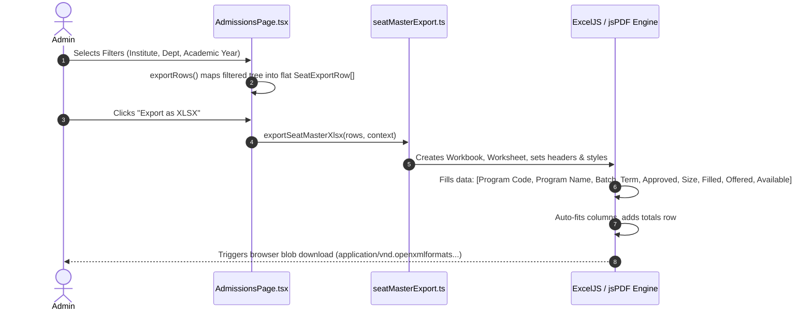

# Module 04: Admissions & Student Lifecycle — End-to-End Action Processes

> **Scope**: Application ingestion, payment verification, merit list ranking algorithm, seat reservation locks, onboarding transactional creation, and guarded onboarding rollback ("Remove a student" per commit `f6baee56`).

---

## Action 1: Seat Master Filtered Export (`exportSeatMasterXlsx` & `exportSeatMasterPdf`)

Per commit `eaffc7d5`, the Seat Master exports the exact visible filtered rows to Microsoft Excel or Adobe PDF formats.

### Export Pipeline


### Data Structure (`SeatExportRow`)
```typescript
export interface SeatExportRow {
  programCode: string;   // e.g. "BTECH-CSE"
  programName: string;   // e.g. "Bachelor of Technology in Computer Science"
  batchName: string;     // e.g. "2026-2030"
  termName: string;      // e.g. "Term 1"
  approved: number;      // Statutory approved intake (e.g. 120)
  size: number;          // Target batch size (e.g. 120)
  filled: number;        // Actually enrolled students (e.g. 98)
  offered: number;       // Offers pending acceptance (e.g. 15)
  available: number;     // Remaining open capacity (approved - filled - offered = 7)
}
```

---

## Action 2: Guarded Undo Student Onboarding (`DELETE /api/onboarding/students/:id`)

Per commit `f6baee56`, reverting student onboarding executes within a strict Prisma transaction that checks for financial or academic side-effects before rollback.

```mermaid
sequenceDiagram
    autonumber
    Client->>OnboardingController: DELETE /api/onboarding/students/:id { reason }
    OnboardingController->>OnboardingService: removeOnboardedStudent(id, reason, user)
    OnboardingService->>Prisma: Check student marks, attendance, exam registrations
    alt Student has exam attendance or academic grades
        OnboardingService-->>OnboardingController: Throw PreconditionFailedException("Cannot remove: Student has academic records")
    else Clean enrollment
        OnboardingService->>Prisma: $transaction [
            1. Delete StudentSubjectEnrollment rows
            2. Delete FeeLedger entries (if uncollected)
            3. Restore RegistrationRequest status to 'OFFER_ACCEPTED'
            4. Revert User applicationRole to 'Applicant'
            5. Decrement Batch.filledCount
            6. Delete Student record
            7. Record AuditLog entry 'STUDENT_ONBOARDING_REVERTED'
        ]
        Prisma-->>OnboardingService: Transaction committed
        OnboardingService-->>OnboardingController: Success payload
        OnboardingController-->>Client: 200 OK
    end
```

### Protocol Specifications
- **HTTP Method & URL**: `DELETE /api/onboarding/students/:id`
- **Guards**: `JwtAuthGuard`, `RolesGuard('SuperAdmin', 'UnivAdmin', 'InstAdmin')`
- **Request Body**:
  ```json
  {
    "enrollmentNumber": "2026-CSE-042",
    "reason": "Accidental duplicate batch assignment during orientation"
  }
  ```
- **Prisma Database Mutation**:
  ```prisma
  await prisma.$transaction(async (tx) => {
    const student = await tx.student.findUnique({
      where: { id },
      include: { user: true, studentSubjectEnrollments: true, studentMarks: true }
    });

    if (student.studentMarks.length > 0) {
      throw new BadRequestException("Cannot revert: Student has recorded marks.");
    }

    // Delete enrollments
    await tx.studentSubjectEnrollment.deleteMany({ where: { studentId: id } });

    // Restore registration request status
    if (student.registrationRequestId) {
      await tx.registrationRequest.update({
        where: { id: student.registrationRequestId },
        data: { status: "OFFER_ACCEPTED" }
      });
    }

    // Revert user role
    await tx.user.update({
      where: { id: student.userId },
      data: { applicationRole: "Applicant" }
    });

    // Decrement batch count
    await tx.batch.update({
      where: { id: student.batchId },
      data: { currentEnrollment: { decrement: 1 } }
    });

    // Delete student entity
    await tx.student.delete({ where: { id } });

    // Audit log
    await tx.auditLog.create({
      data: {
        action: "STUDENT_ONBOARDING_REVERTED",
        userId: req.user.id,
        entity: "Student",
        entityId: id,
        details: { enrollmentNo: dto.enrollmentNumber, reason: dto.reason }
      }
    });
  });
  ```
- **Response (200 OK)**:
  ```json
  {
    "success": true,
    "message": "Student onboarding reverted successfully",
    "revertedEnrollmentNo": "2026-CSE-042"
  }
  ```

---

## Action 3: Application Submission & Payment Verification

- **HTTP Method & URL**: `POST /api/admissions/applications` & `POST /api/fee/verify`
- **Backend Flow**:
  1. Validates applicant details, eligibility criteria, and uploads.
  2. Creates `RegistrationRequest` record with status `PENDING_PAYMENT`.
  3. Client pays application fee via payment gateway.
  4. Webhook or verification call updates status to `SUBMITTED`, locks applicant details, and issues receipt number.
- **Response (200 OK)**:
  ```json
  {
    "id": "reg_req_9921",
    "status": "SUBMITTED",
    "applicationNumber": "APP-2026-0812",
    "submittedAt": "2026-09-11T12:00:00.000Z"
  }
  ```
