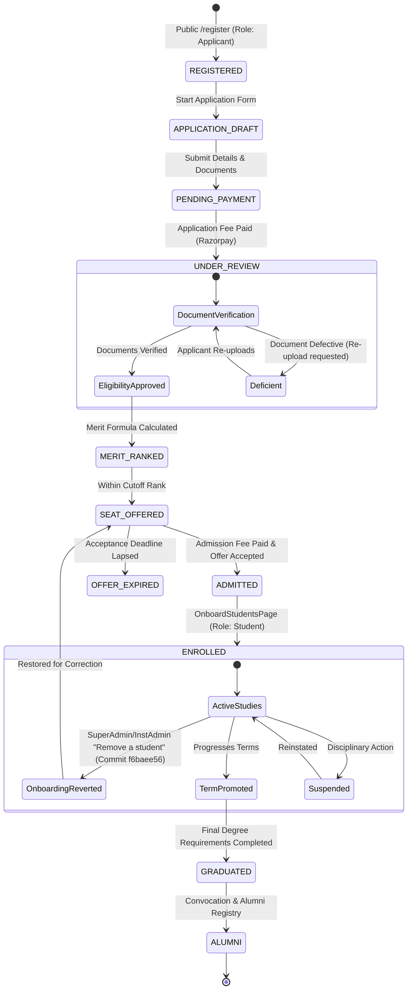
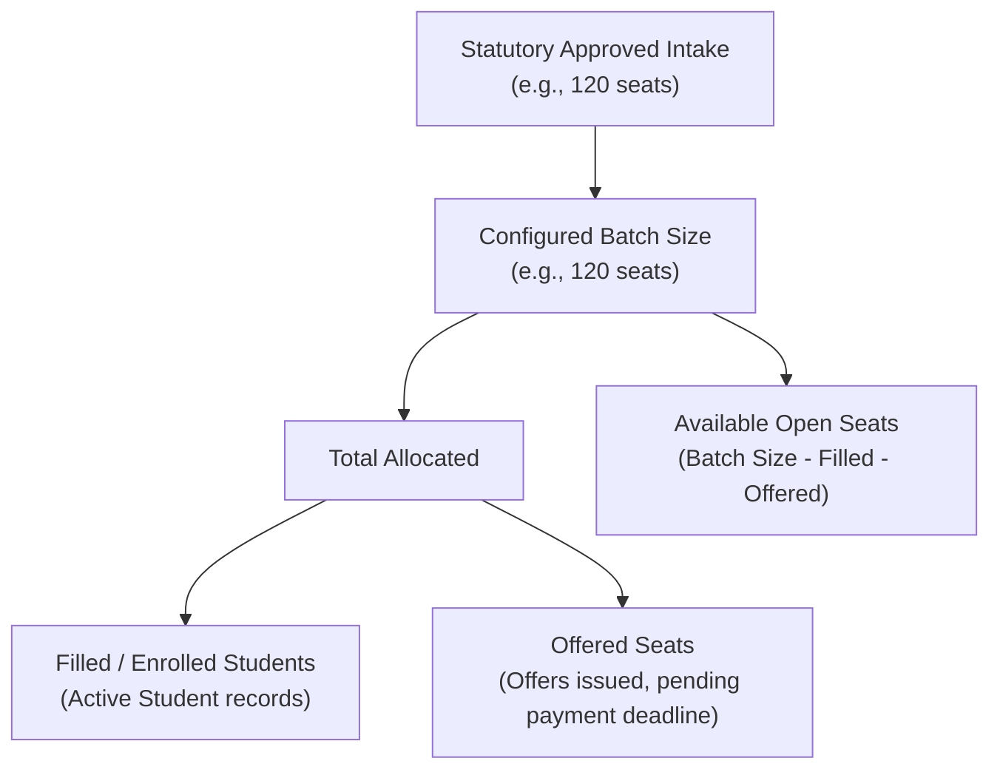

# Module 04: Admissions & Student Lifecycle — Technical Architecture

> **Scope**: Complete lifecycle state machines from Applicant to Student to Alumni, Seat Master capacity reservation equations, and rollback boundaries.

---

## 1. Student Lifecycle State Machine



---

## 2. Seat Master Accounting Equations

The Seat Master tracks three concurrent metrics to prevent over-admission while honoring statutory intake limits set by regulatory bodies (AICTE, UGC, Bar Council, etc.).

$$\text{Approved Intake} \ge \text{Target Batch Size}$$
$$\text{Available Capacity} = \text{Target Batch Size} - (\text{Filled / Enrolled} + \text{Active Unexpired Offers})$$



---

## 3. Profile Governance & Change Request Architecture

Student personal details (Name, DOB, Parent Names, Category) are legally governed. Once enrolled, a student cannot directly mutate their profile; changes must pass through a governed workflow.

```mermaid
sequenceDiagram
    autonumber
    actor Student
    participant Portal as StudentProfilePage.tsx
    participant API as ProfileGovernanceController
    participant Admin as InstAdmin / Registrar
    participant DB as Prisma (ProfileChangeRequest & Log)

    Student->>Portal: Requests Name Correction (Uploads Gazette Notification)
    Portal->>API: POST /api/profile-governance/requests { field: "legalName", newValue: "...", proofDocId }
    API->>DB: profileChangeRequest.create({ status: "PENDING_APPROVAL" })
    API-->>Portal: Toast: "Change request submitted for registrar approval"
    Admin->>API: GET /api/profile-governance/requests
    Admin->>API: PATCH /api/profile-governance/requests/:id/approve
    API->>DB: $transaction [
        1. Update Student / User legalName
        2. Set profileChangeRequest.status = 'APPROVED'
        3. Insert into ProfileChangeLog for permanent legal audit trail
    ]
    API-->>Admin: Success
    API->>Student: Notification: "Profile update approved"
```
