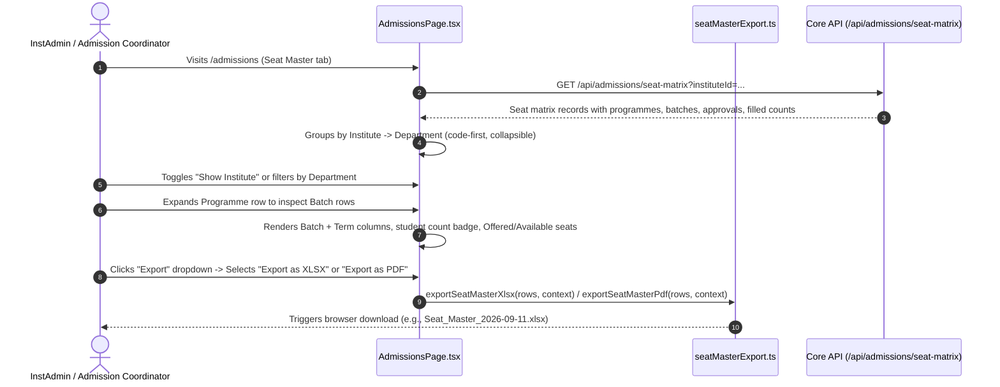
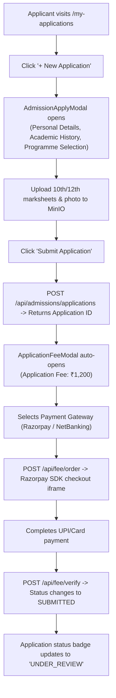

# Module 04: Admissions & Student Lifecycle — UI Click Flows

> **Scope**: Seat Master capacity management with XLSX/PDF exports, applicant submission, document uploads, application fee payment, merit list ranking and publication, seat offer acceptance, student onboarding, guarded onboarding rollback ("Remove a student"), and governed student profiles.

---

## Screen Inventory

| Route | Page Component | Primary Actors | Key Capabilities |
|:---|:---|:---|:---|
| `/admissions` | `AdmissionsPage.tsx` | InstAdmin, UnivAdmin, Admission Approver | Seat Master with collapsible Institute $\to$ Department hierarchy, code-first sorting, per-batch rows with student counts, single manage action, and XLSX/PDF export. |
| `/merit-list` | `MeritListPage.tsx` | Admission Approver, HOD | Merit formula configuration, entrance exam score imports, rank generation, tie-breaking, cutoff publishing, seat offers. |
| `/my-applications` | `StudentApplicationsPage.tsx` | Applicant | Active applications list, admission application form (`AdmissionApplyModal.tsx`), application fee payment (`ApplicationFeeModal.tsx`), offer letter download. |
| `/onboard-students` | `OnboardStudentsPage.tsx` | InstAdmin, UnivAdmin | Batch student enrollment, photo/document verification, enrollment ID generation, guarded "Remove a student" (undo onboarding per commit `f6baee56`). |
| `/profile` | `StudentProfilePage.tsx` | Enrolled Student | Governed profile viewer, profile change request submissions with field-level audit tracking. |

---

## Flow 1: Seat Master Management & Filtered Export (XLSX / PDF)

Per commits `eaffc7d5`, `a3c9dcf3`, `585dd703`, `5e32f7d2`, and `a779088d`, the Seat Master provides an interactive ledger with batch rows, collapsible tree hierarchy, and export actions.

### Granular Step-by-Step Table

| Step | Screen | User Interaction | Visual Changes & State | System Action / API Call | Redirection / Modal |
|:---|:---|:---|:---|:---|:---|
| 1.1 | `/admissions` | Opens Seat Master | Tree ledger renders: Institute $\to$ Department $\to$ Programme. Default view sorted by code. | `GET /api/admissions/seat-matrix` | Ledger renders |
| 1.2 | `/admissions` | Clicks chevron next to Department (`CSE`) | Expands list of Programmes under Computer Science. | None | Accordion expands |
| 1.3 | `/admissions` | Clicks chevron next to Programme (`BTECH-CSE`) | Shows per-batch child rows with Batch Name (`2026-2030`), Active Term (`Term 1`), Approved Intake, Current Size, Filled, Offered, Available. | None | Batch rows appear per `a3c9dcf3` |
| 1.4 | Batch Row | Clicks student count badge (e.g. `"42 Students"`) | Opens sliding drawer listing all 42 enrolled students with roll number and enrollment status. | `GET /api/admissions/batches/:id/students` | Drawer opens per `585dd703` |
| 1.5 | Batch Row | Clicks single **"Manage"** action button | Opens modal to edit statutory approval capacity, AICTE intake limit, or active status. | None | ApprovalModal opens per `a779088d` |
| 1.6 | Toolbar | Clicks **"Export as XLSX"** button | Button shows spinner; collects visible filtered rows (Code, Name, Batch, Term, Approved, Size, Filled, Offered, Available). | `exportSeatMasterXlsx()` in `seatMasterExport.ts` | Downloads `.xlsx` per `eaffc7d5` |
| 1.7 | Toolbar | Clicks **"Export as PDF"** button | Generates structured PDF report with institutional headers and column summaries. | `exportSeatMasterPdf()` in `seatMasterExport.ts` | Downloads `.pdf` per `eaffc7d5` |

---

## Flow 2: Applicant Application Submission & Fee Payment

### Granular Step-by-Step Table

| Step | Screen | User Interaction | Visual Changes & State | System Action / API Call | Redirection / Modal |
|:---|:---|:---|:---|:---|:---|
| 2.1 | `/my-applications` | Clicks **"+ New Application"** | `AdmissionApplyModal.tsx` opens with multi-tab wizard. | `GET /api/admissions/open-programmes` | Modal opens |
| 2.2 | Modal | Selects Programme, enters 10th & 12th marks | Real-time minimum percentage eligibility check (e.g. min 60% in PCM). | None | Eligibility badge |
| 2.3 | Modal | Uploads marksheets (PDF/JPG) | File uploads asynchronously to MinIO; progress bar shows percentage. | `POST /api/upload/admission-document` | File attached |
| 2.4 | Modal | Clicks **"Submit Application"** | Validates all mandatory fields; closes apply modal. | `POST /api/admissions/applications` | ApplicationFeeModal opens |
| 2.5 | Fee Modal | Reviews fee breakdown (`₹1,200`) & clicks **"Pay Now"** | Razorpay checkout popup mounts on top of portal. | `POST /api/fee/order` | Payment checkout |
| 2.6 | Razorpay | Completes payment via QR / Card | Checkout closes; webhook/signature verified. | `POST /api/fee/verify` | Success toast |
| 2.7 | `/my-applications` | Application card updates | Status badge displays emerald `SUBMITTED (PAID)`; receipt download button appears. | `GET /api/admissions/my` | Card reflects paid status |

---

## Flow 3: Merit List Generation, Cutoff & Seat Allocation

| Step | Screen | User Interaction | Visual Changes & State | System Action / API Call | Redirection / Modal |
|:---|:---|:---|:---|:---|:---|
| 3.1 | `/merit-list` | Selects Programme (`BTECH-CSE`) and Academic Year | Page displays Applicant pool and current ranking status. | `GET /api/admissions/merit-pool?programmeId=...` | Table loads |
| 3.2 | `/merit-list` | Configures formula weights (e.g., `12th PCM: 40%`, `Entrance Exam: 60%`) | Weightage total indicator displays `100%` (turns red if total != 100%). | None | Real-time validation |
| 3.3 | `/merit-list` | Clicks **"Run Merit Calculation"** | Ranked table updates showing Merit Rank 1...N, normalized composite score, reservation category (General, OBC, SC, ST). | `POST /api/admissions/merit-list/calculate` | Ranked table renders |
| 3.4 | `/merit-list` | Enters Cutoff Ranks per Category and clicks **"Publish Offers"** | Confirmation modal: "Publish seat offers to top 120 applicants?". | `POST /api/admissions/merit-list/publish` | ConfirmDialog |
| 3.5 | ConfirmDialog | Clicks **"Confirm & Notify"** | Status updates to `PUBLISHED`; queues SMS & Email notifications to shortlisted applicants. | None | Toast: "120 offers issued" |

---

## Flow 4: Student Onboarding & Guarded Onboarding Rollback ("Remove a student")

Per commit `f6baee56`, administrators can undo an onboarding operation if an applicant was enrolled by mistake, subject to strict audit guards.

| Step | Screen | User Interaction | Visual Changes & State | System Action / API Call | Redirection / Modal |
|:---|:---|:---|:---|:---|:---|
| 4.1 | `/onboard-students` | Selects Batch $\to$ Views Enrolled Roster | Table lists newly onboarded students with Enrollment Number, Roll Number, Date. | `GET /api/onboarding/students?batchId=...` | Table loads |
| 4.2 | Row Actions | Clicks row action menu $\to$ **"Remove a student (Undo Onboarding)"** | Destructive confirmation dialog opens per `f6baee56`. | None | ConfirmDialog opens |
| 4.3 | ConfirmDialog | Inspects warning: *"Reverting onboarding will delete the Student record, revoke ERP portal credentials, and restore the application to OFFER_ACCEPTED status."* | Admin is required to type the student's enrollment number to prevent accidental deletion. | `GET /api/onboarding/students/:id/check-dependencies` | Checks fee/marks dependencies |
| 4.4 | ConfirmDialog | Enters reason for removal and clicks **"Confirm Removal"** | If student has paid non-refundable semester fees or attended exams, removal is blocked with descriptive error. | None | Dependency check |
| 4.5 | ConfirmDialog | If clean: executes rollback transaction | Student record deleted; User role reverts to Applicant; enrollment restored to available pool. | `DELETE /api/onboarding/students/:id` | Toast: "Student onboarding reverted successfully" |
