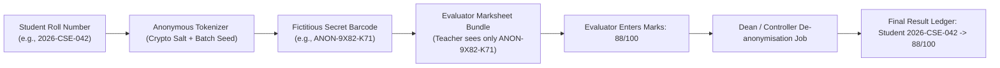

# Module 05: Examinations, Grading & CBE — End-to-End Action Processes

> **Enterprise Technical Specification**: Comprehensive examination administration, automated paper scheduling, answersheet serial custody tracking, anonymous candidate coding, admit card / hall ticket generation, fullscreen Computer-Based Exam (CBE) execution, real-time proctoring telemetry, psychometric item analysis, question challenge adjudication, and result publication.

---

## Complete Action & Endpoint Catalog

| Action # | Endpoint | HTTP Method | Primary Actor | Description & Security Scope |
|:---:|:---|:---:|:---|:---|
| **01** | `/api/examination/datesheet` | `POST` | Exam Controller | Schedules examination date sheet slots (Date, Time, Subject, Session: Morning/Afternoon). |
| **02** | `/api/examination/datesheet/reschedule` | `POST` | Exam Controller | Reschedules examination session; automatically notifies enrolled candidates and invigilators. |
| **03** | `/api/examination/release-admit-card` | `POST` | Exam Controller | Generates and releases digital Hall Tickets for students satisfying attendance ($\ge 75\%$) and fee clearance. |
| **04** | `/api/examination/hall-ticket` | `GET` | Enrolled Student | Retrieves official Hall Ticket PDF with exam timetable, seat number, venue, and QR security token. |
| **05** | `/api/examination/answersheet-serials` | `PUT` | Exam Superintendent | Logs physical barcode serials of distributed answer booklets per student in exam hall. |
| **06** | `/api/examination/answersheet-serials/lock` | `POST` | Exam Superintendent | Immutably locks answersheet serial register; prevents post-exam booklet tampering. |
| **07** | `/api/examination/exam-anonymise` | `PUT` | Exam Controller | Generates random anonymous barcodes (fictitious roll numbers) masking student identities before grading. |
| **08** | `/api/examination/invigilation/mine` | `GET` | Faculty Invigilator | Returns assigned invigilation duties, assigned room numbers, date, session, and student rosters. |
| **09** | `/api/examination/:id/assemble-questions` | `POST` | Paper Author | Assembles questions from Question Bank matching blueprint (Marks, Bloom's level, Topics). |
| **10** | `/api/examination/:paperId/start` | `POST` | Student | Enters fullscreen CBE exam environment; generates deterministic randomized question order. |
| **11** | `/api/examination/:paperId/respond` | `POST` | Student | Autosaves answer responses (MCQ, MSQ, Descriptive) with time-spent telemetry per question. |
| **12** | `/api/examination/:paperId/event` | `POST` | Browser SDK | Ingests proctoring violation events (Tab switch, window blurred, fullscreen exit, multiple faces). |
| **13** | `/api/examination/:paperId/snapshot` | `POST` | Browser SDK | Streams periodic webcam video frame snapshots to MinIO S3 storage for proctor review. |
| **14** | `/api/examination/:paperId/monitor` | `GET` | Proctor / Admin | Real-time candidate dashboard with active heartbeat status, violation counts, and live webcam feeds. |
| **15** | `/api/examination/attempts/:id/directive` | `POST` | Proctor | Dispatches real-time broadcast or private warning directives directly onto student's exam screen. |
| **16** | `/api/examination/:paperId/submit` | `POST` | Student | Finalizes and locks exam attempt; triggers instant automated MCQ grading pipeline. |
| **17** | `/api/examination/:paperId/grade/:responseId`| `PATCH` | Faculty Evaluator | Evaluates subjective long-answer responses against rubric; awards marks with evaluator remarks. |
| **18** | `/api/examination/:paperId/item-analysis` | `GET` | Psychometrician | Computes Facility Index ($P$), Discrimination Index ($D$), and Distractor Efficiency per question. |
| **19** | `/api/examination/:paperId/challenges` | `POST` | Student | Submits formal question error challenge (typo, ambiguous options, out-of-syllabus) during or after exam. |
| **20** | `/api/examination/challenges/:id/review`| `PATCH` | Subject Committee | Adjudicates question challenge; awards bonus marks or cancels question across all attempts. |
| **21** | `/api/examination/public-results-terms/:id` | `PUT` | Exam Controller | Publishes finalized semester results to public lookup portal (`/results`). |

---

## Action 1: Fullscreen CBE Exam Lifecycle (`POST /api/examination/:paperId/start` & `respond`)

```mermaid
sequenceDiagram
    autonumber
    actor Candidate as Student Candidate
    participant SDK as ExamTakePage.tsx (Fullscreen)
    participant Ctrl as ExaminationController
    participant Service as ExaminationService
    participant DB as PostgreSQL (Prisma)
    participant Monitor as ExamMonitorPage (Proctor)

    Candidate->>SDK: Clicks "Enter Exam & Fullscreen"
    SDK->>Ctrl: POST /api/examination/:paperId/start
    Ctrl->>Service: startAttempt(paperId, studentId)
    Service->>DB: Check exam window active & student eligible
    Service->>DB: examAttempt.upsert({ status: 'IN_PROGRESS' })
    Service-->>SDK: Sanitized questions array (answers stripped) + duration
    SDK->>SDK: Browser Fullscreen API locked; timer started

    loop Every 30 seconds
        SDK->>Ctrl: POST /api/examination/:paperId/event { type: 'HEARTBEAT' }
        SDK->>Ctrl: POST /api/examination/:paperId/snapshot (Webcam frame blob)
        Ctrl->>Monitor: Pushes telemetry (Focus: OK, Webcam: OK)
    end

    alt Candidate Alt-Tabs / Exits Fullscreen
        SDK->>SDK: Violation popup: "Warning 1/3: Focus lost"
        SDK->>Ctrl: POST /api/examination/:paperId/event { type: 'FOCUS_LOST', durationMs: 2400 }
        Ctrl->>DB: examProctorEvent.create({ severity: 'HIGH' })
        Ctrl->>Monitor: Candidate tile turns RED (Violation alert)
    end

    Candidate->>SDK: Answers Q1: Selects Option C -> Clicks "Save & Next"
    SDK->>Ctrl: POST /api/examination/:paperId/respond { questionId, selectedOptions: [2], timeSpent: 35 }
    Ctrl->>DB: examResponse.upsert({ questionId, selectedOptions: [2] })
    Ctrl-->>SDK: 200 OK (Saved)

    Candidate->>SDK: Clicks "Finish Exam" -> Confirms submission
    SDK->>Ctrl: POST /api/examination/:paperId/submit
    Ctrl->>DB: examAttempt.update({ status: 'SUBMITTED', submittedAt: now() })
    Ctrl->>Service: autoGradeMCQs(attemptId)
    Ctrl-->>SDK: 200 OK (Submission receipt token)
    SDK->>SDK: Exits fullscreen mode
```

### Protocol Specifications (`respond`)
- **HTTP Method & URL**: `POST /api/examination/:paperId/respond`
- **Request Body (DTO: `SubmitResponseDto`)**:
  ```json
  {
    "questionId": "q_net_302",
    "selectedOptions": [2],
    "textResponse": null,
    "timeSpentSeconds": 35
  }
  ```
- **Prisma Mutation**:
  ```prisma
  await prisma.examResponse.upsert({
    where: {
      examAttemptId_questionId: {
        examAttemptId: attempt.id,
        questionId: dto.questionId
      }
    },
    create: {
      examAttemptId: attempt.id,
      questionId: dto.questionId,
      selectedOptions: dto.selectedOptions,
      textResponse: dto.textResponse,
      timeSpentSeconds: dto.timeSpentSeconds
    },
    update: {
      selectedOptions: dto.selectedOptions,
      textResponse: dto.textResponse,
      timeSpentSeconds: { increment: dto.timeSpentSeconds }
    }
  });
  ```

---

## Action 2: Anonymous Coding Engine (`PUT /api/examination/exam-anonymise`)

To prevent institutional bias during grading, the examination cell replaces student identity numbers with cryptographic fictitious barcodes before physical or digital papers are routed to evaluators.



### Protocol Specifications
- **HTTP Method & URL**: `PUT /api/examination/exam-anonymise`
- **Guards**: `JwtAuthGuard`, `RolesGuard('ExaminationController')`
- **Request Body (DTO: `AnonymiseExamDto`)**:
  ```json
  {
    "batchTermId": "bterm_2026_cse_t4",
    "subjectId": "subj_operating_sys_01",
    "codePrefix": "ANON"
  }
  ```
- **Prisma Database Mutation**:
  ```prisma
  await prisma.$transaction(async (tx) => {
    const enrollments = await tx.studentSubjectEnrollment.findMany({
      where: { batchTermSubject: { batchTermId: dto.batchTermId, universitySubjectId: dto.subjectId } },
      include: { student: true }
    });

    for (const enr of enrollments) {
      const anonString = `${dto.codePrefix}-${crypto.randomBytes(3).toString("hex").toUpperCase()}`;
      await tx.examAnonCode.upsert({
        where: {
          studentId_batchTermSubjectId: {
            studentId: enr.studentId,
            batchTermSubjectId: enr.batchTermSubjectId
          }
        },
        create: {
          studentId: enr.studentId,
          batchTermSubjectId: enr.batchTermSubjectId,
          anonCode: anonString
        },
        update: { anonCode: anonString }
      });
    }
  });
  ```
- **Response (200 OK)**:
  ```json
  {
    "success": true,
    "anonymisedCount": 120,
    "batchTermId": "bterm_2026_cse_t4"
  }
  ```

---

## Action 3: Psychometric Item Analysis (`GET /api/examination/:paperId/item-analysis`)

- **HTTP Method & URL**: `GET /api/examination/:paperId/item-analysis`
- **Guards**: `JwtAuthGuard`, `RolesGuard('ExaminationController', 'HOD')`
- **Statistical Computation Pipeline**:
  1. Partitions candidates into Top 27% ($N_H$) and Bottom 27% ($N_L$) cohorts based on total paper score.
  2. For each question:
     - Facility Value $P = \frac{R_H + R_L}{N_H + N_L}$
     - Discrimination Index $D = \frac{R_H - R_L}{N_H}$
     - Distractor Analysis: Distribution percentage across options A, B, C, D.
  3. Identifies defective questions (Negative discrimination $D < 0$ or Non-functioning distractors $< 5\%$ selection).
- **Response (200 OK)**:
  ```json
  {
    "paperId": "paper_net_01",
    "totalCandidates": 148,
    "cronbachAlpha": 0.84,
    "questions": [
      {
        "questionId": "q_net_302",
        "questionText": "Which layer of OSI model does TCP operate on?",
        "facilityValue": 0.72,
        "facilityCategory": "OPTIMAL",
        "discriminationIndex": 0.48,
        "discriminationQuality": "EXCELLENT",
        "distractors": {
          "Transport (Correct)": { "highGroup": 92, "lowGroup": 44 },
          "Network": { "highGroup": 6, "lowGroup": 38 },
          "Data Link": { "highGroup": 2, "lowGroup": 12 },
          "Session": { "highGroup": 0, "lowGroup": 6 }
        }
      }
    ]
  }
  ```
