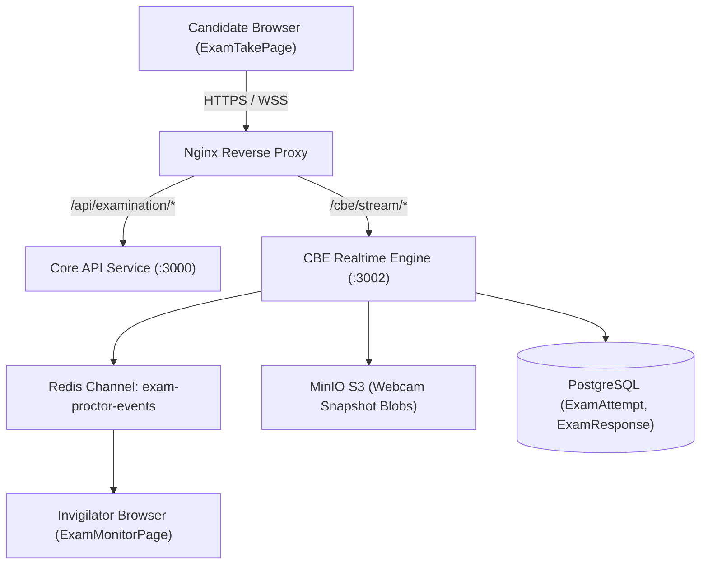
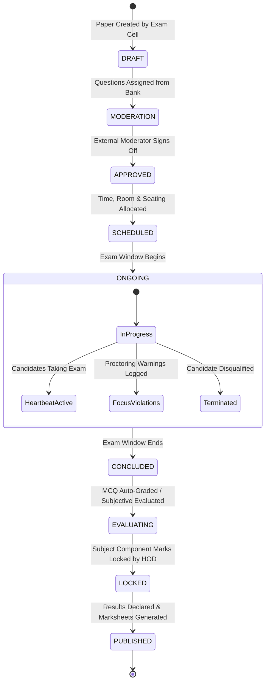

# Module 05: Examinations, Grading & CBE — Technical Architecture

> **Scope**: Examination Paper lifecycle, CBE engine microservice integration, proctoring stream architecture, grading lock hierarchy, and psychometric calculation algorithms.

---

## 1. CBE Engine Runtime Architecture

---

## 2. Examination Paper Lifecycle State Machine

---

## 3. Question Item Psychometric Calculations

The Item Analysis dashboard computes standard classical test theory (CTT) metrics:

### Facility Value (Difficulty Index $P$)
$$P = \frac{R}{T}$$
Where $R$ is the number of correct responses and $T$ is the total number of attempts.
- $P > 0.85$: Very Easy
- $0.30 \le P \le 0.85$: Acceptable Range
- $P < 0.30$: Very Difficult

### Discrimination Index ($D$)
$$D = \frac{R_H - R_L}{N}$$
Where $R_H$ is correct answers in the top 27% cohort, $R_L$ is correct answers in the bottom 27% cohort, and $N$ is the number of students in each cohort.
- $D \ge 0.40$: Excellent Discrimination
- $0.20 \le D < 0.40$: Marginal / Review Recommended
- $D < 0.20$: Flawed Question / Consider Bonus Invalidation
