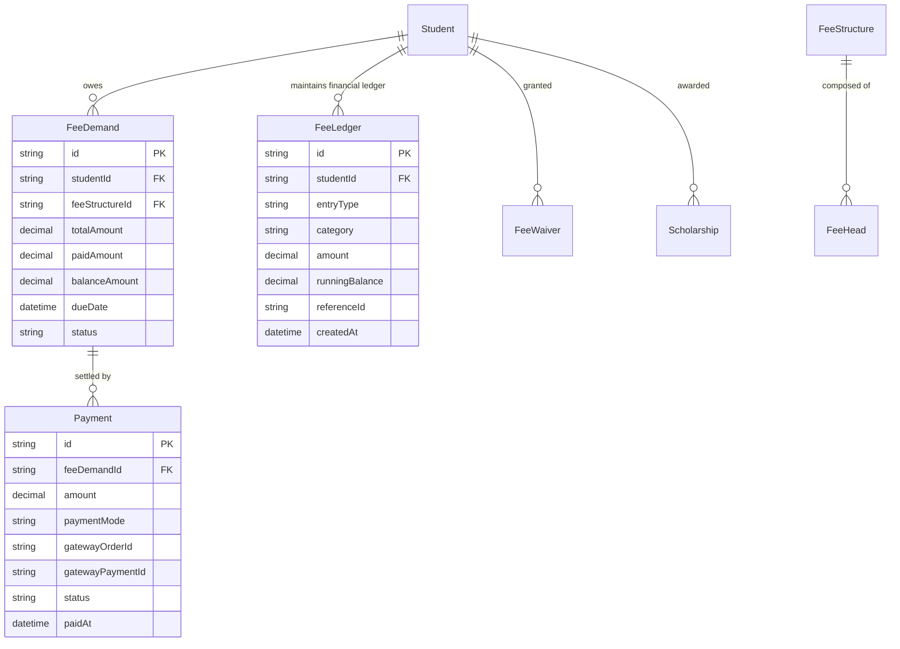
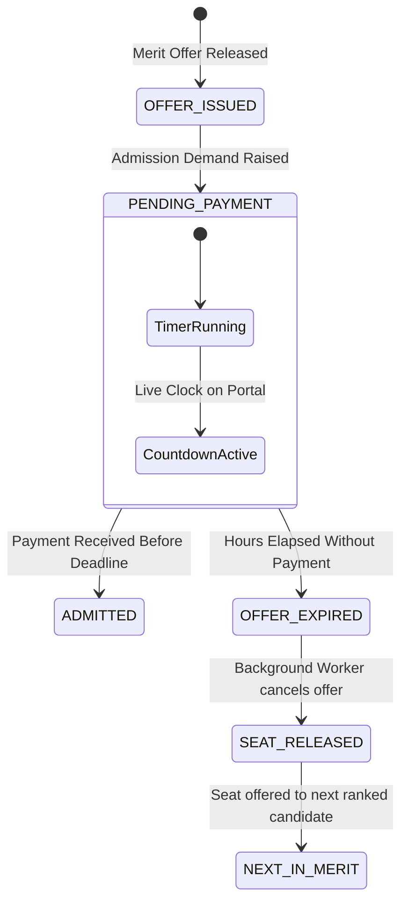

# Module 06: Fees, Finance & Payments — Technical Architecture

> **Scope**: Double-entry student ledger architecture, payment gateway idempotency and reconciliation models, fee demand generation scheduling, and payment window expiry logic.

---

## 1. Double-Entry Student Fee Ledger Architecture

Every financial debit (fee demand raised) and credit (payment received, scholarship applied, waiver granted) is recorded as an immutable ledger transaction in `FeeLedger`.

### Running Balance Formula
$$\text{Current Balance} = \sum (\text{DEBIT Amounts}) - \sum (\text{CREDIT Amounts})$$

---

## 2. Payment Expiry & Resource Hold Expiration Engine

When an applicant is offered a seat (or an approved hostel room/bus pass), a background job enforces the configured payment window (e.g. 48 hours per commit `6f060a59`).

