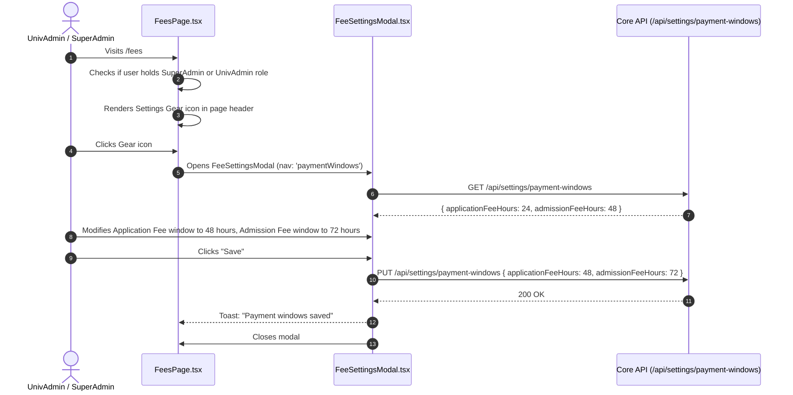
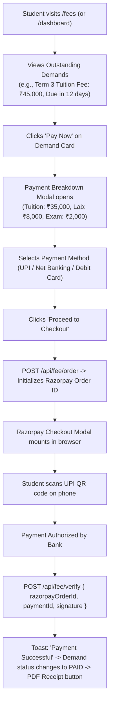

# Module 06: Fees, Finance & Payments — UI Click Flows

> **Scope**: Fee Structures, Program Fee Manager, Resource Fee Manager, Fee Demands, Student Ledger, Payment Gateways (Razorpay/Stripe/UPI), Offline Receipts, Fee Waivers & Scholarships, and Payment Windows Settings Gear (per commit `6f060a59`).

---

## Screen Inventory

| Route | Page Component | Primary Actors | Key Capabilities |
|:---|:---|:---|:---|
| `/fees` | `FeesPage.tsx` | UnivAdmin, InstAdmin, Accountant, Student | Comprehensive fee console: Fee Heads, Structures, Demands, Ledger, Offline Receipt issuing, Waivers approval, and Page Gear Settings. |
| Page Gear Modal | `FeeSettingsModal.tsx` | SuperAdmin, UnivAdmin | University-level payment windows configuration (Application fee expiry hours, Admission fee expiry hours per commit `6f060a59`). |
| Modal | `ChargeFeeModal.tsx` | Accountant, InstAdmin | Ad-hoc fee demands creation (Library fine, Laboratory breakage, Hostel fine, Exam re-assessment). |
| Tab / View | `ProgramFeeManager.tsx` | UnivAdmin, InstAdmin | Term-wise tuition, development, and lab fee component schedules per academic batch. |

---

## Flow 1: Payment Windows Configuration via Header Gear Modal

Per commit `6f060a59`, Payment Windows was moved from global settings directly to the gear icon on `/fees`.

### Granular Step-by-Step Table

| Step | Screen | User Interaction | Visual Changes & State | System Action / API Call | Redirection / Modal |
|:---|:---|:---|:---|:---|:---|
| 1.1 | `/fees` | Admin views page header | Gear icon button `<Settings>` visible next to page title for admins. | None | Page rendered |
| 1.2 | `/fees` | Clicks **Gear** icon | `FeeSettingsModal.tsx` opens with left navigation tab "Payment Windows". | `GET /api/settings/payment-windows` | Modal opens |
| 1.3 | Modal | Inspects "Application fee — pay within" | Input shows current hours (`24`). Helper text explains: *"How long an applicant has to pay before application is cancelled and held resources released."* | None | Input active |
| 1.4 | Modal | Types new value: `48` | Input validates between 1 and 720 hours (30 days). "Save" button enables. | None | Draft state |
| 1.5 | Modal | Clicks **"Save"** | Button displays "Saving...", inputs disabled. | `PUT /api/settings/payment-windows` | Toast: "Payment windows saved" $\to$ Modal closes |

---

## Flow 2: Student Fee Payment Journey (Online Razorpay Checkout)

### Granular Step-by-Step Table

| Step | Screen | User Interaction | Visual Changes & State | System Action / API Call | Redirection / Modal |
|:---|:---|:---|:---|:---|:---|
| 2.1 | `/fees` | Enrolled student opens page | Top summary cards render: Total Billed, Total Paid, Outstanding Balance (`₹45,000`). | `GET /api/fee/my-ledger` | Cards render |
| 2.2 | Demands Table | Clicks **"Pay Now"** on active demand | Payment breakdown modal opens with head-by-head breakdown. | `GET /api/fee/demands/:id` | Modal opens |
| 2.3 | Modal | Clicks **"Proceed to Payment"** | Loading spinner runs; initializes gateway session. | `POST /api/fee/order` | Razorpay popup mounts |
| 2.4 | Gateway Popup | Scans QR code with Google Pay / PhonePe | Gateway detects authorization. | Gateway internal polling | Webhook fires |
| 2.5 | `/fees` | Signature verified | Popup closes; green success checkmark animation displays. | `POST /api/fee/verify` | Success state |
| 2.6 | `/fees` | Clicks **"Download Receipt (PDF)"** | Downloads official tax receipt with university seal, transaction ID, and GSTIN. | `GET /api/fee/payments/:id/receipt` | PDF downloaded |

---

## Flow 3: Manual Offline Fee Entry & Cash/Cheque Collection

| Step | Screen | User Interaction | Visual Changes & State | System Action / API Call | Redirection / Modal |
|:---|:---|:---|:---|:---|:---|
| 3.1 | `/fees` | Accountant navigates to "Offline Collection" tab | Search bar: "Search student by Roll No or Name". | `GET /api/fee/students/search` | Search active |
| 3.2 | Search Bar | Types student roll number `2026-CSE-012` | Student details card renders with pending dues breakdown. | `GET /api/fee/student/:id/dues` | Dues shown |
| 3.3 | Collection Form | Selects Payment Mode (`CASH` / `DEMAND_DRAFT` / `NEFT_RTGS`), enters Bank Name & Instrument/UTR No | Reference number input validates format. | None | Form inputs |
| 3.4 | Collection Form | Enters amount received (`₹45,000`) and clicks **"Collect & Print Receipt"** | Validates against pending demand amount; records collection. | `POST /api/fee/offline-collect` | Prints thermal / A4 receipt |
