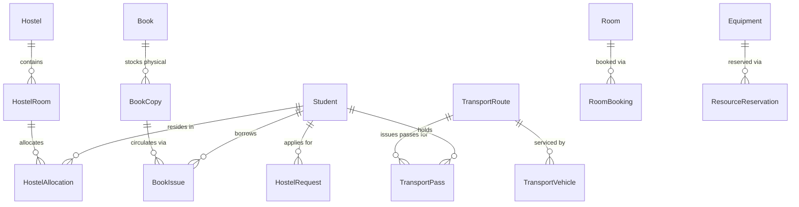
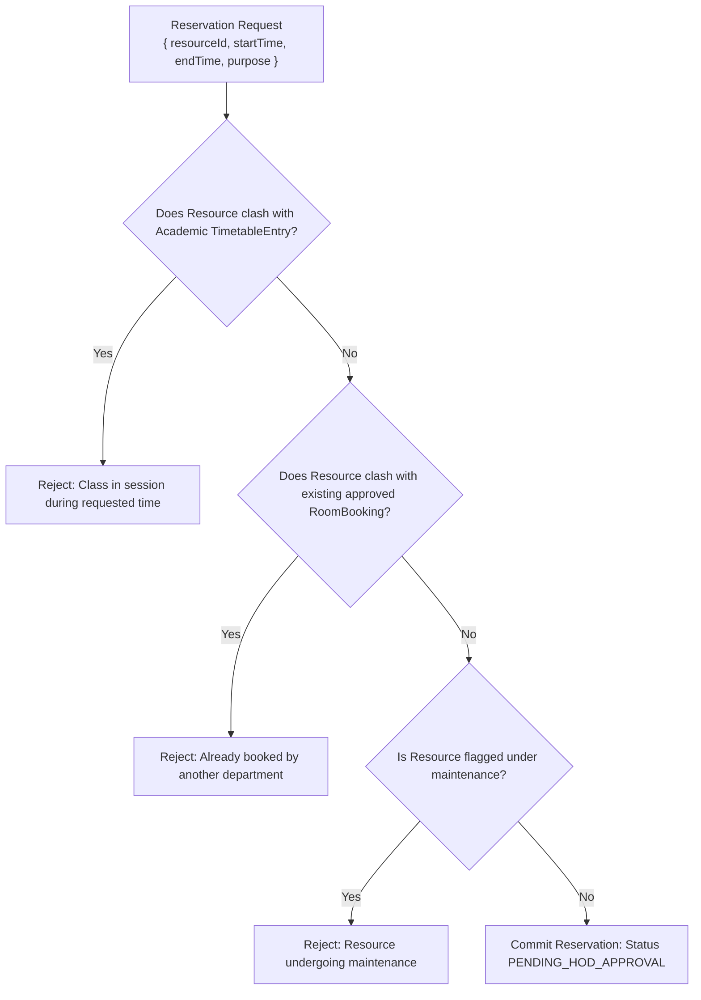

# Module 07: Campus Facilities & Logistics — Technical Architecture

> **Scope**: Resource reservation conflict engine, hostel occupancy state machines, transport fleet route capacity algorithms, and library circulation models.

---

## 1. Campus Facilities Entity Relationships

---

## 2. Resource Reservation Conflict Engine

When an auditorium, seminar hall, laboratory, or bus is reserved, the reservation engine checks against both scheduled class timetables and ad-hoc event bookings.

