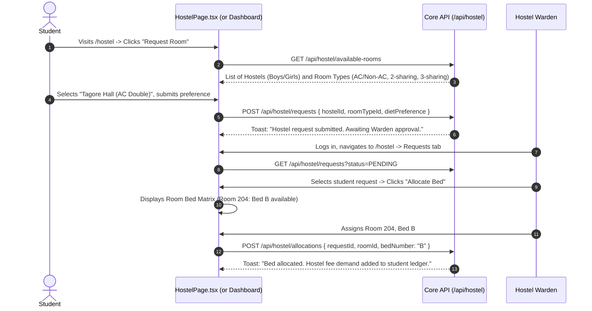

# Module 07: Campus Facilities & Logistics — UI Click Flows

> **Scope**: Hostel blocks, room configurations, bed allocation, hostel requests, fee refunds, transport routes, bus stops, vehicle management, digital bus passes, library catalog, circulation desk, and campus resource reservations.

---

## Screen Inventory

| Route | Page Component | Primary Actors | Key Capabilities |
|:---|:---|:---|:---|
| `/hostel` & `/hostel/:instituteId` | `HostelPage.tsx` | HostelWarden, InstAdmin, Student | Hostel building overview, floor maps, room occupancy matrices, bed allocations, student hostel applications, vacating requests, refund processing. |
| `/transport` & `/transport/:instituteId` | `TransportPage.tsx` | TransportManager, InstAdmin, Student | Route planning, stop scheduling, vehicle fleet & driver assignment, student transport pass generation, route capacity tracking. |
| `/library` | `LibraryPage.tsx` | Librarian, Students, Faculty | Book catalog searching (ISBN, Title, Author), barcode issue/return desk, reservation queues, overdue fine calculation. |

---

## Flow 1: Student Hostel Room Request & Allocation

### Granular Step-by-Step Table

| Step | Screen | User Interaction | Visual Changes & State | System Action / API Call | Redirection / Modal |
|:---|:---|:---|:---|:---|:---|
| 1.1 | `/hostel` | Enrolled student visits page | Summary view: "Not currently allocated to hostel". "Apply for Hostel" button. | `GET /api/hostel/my-allocation` | Button displayed |
| 1.2 | `/hostel` | Clicks **"Apply for Hostel"** | Modal opens: selects gender-appropriate hostel block, room type preference (Single/Double/Triple), mess plan (Veg/Non-Veg). | `GET /api/hostel/config` | Modal opens |
| 1.3 | Modal | Clicks **"Submit Application"** | Spinner runs; status updates to `PENDING_WARDEN_REVIEW`. | `POST /api/hostel/requests` | Toast notification |
| 1.4 | `/hostel` (Warden) | Warden views "Pending Allocations" | Table lists applicant queue sorted by distance from university and merit rank. | `GET /api/hostel/requests/pending` | Warden roster |
| 1.5 | Warden Roster | Clicks **"Allocate Bed"** | Visual grid of rooms in selected hostel opens. Green = Available Bed, Red = Occupied Bed. | None | Room grid drawer |
| 1.6 | Room Drawer | Clicks Bed `R-102-A` | Selected bed highlights with yellow border. Fee demand preview shows (`₹35,000/term`). | None | Bed selected |
| 1.7 | Room Drawer | Clicks **"Confirm Allocation"** | Bed status updates to `OCCUPIED`. Triggers hostel fee demand on student profile. | `POST /api/hostel/allocations` | Toast: "Bed R-102-A allocated" |

---

## Flow 2: Transport Route Management & Digital Pass Generation

| Step | Screen | User Interaction | Visual Changes & State | System Action / API Call | Redirection / Modal |
|:---|:---|:---|:---|:---|:---|
| 2.1 | `/transport` | Transport Manager visits page | Overview cards: Active Routes, Total Fleet, Active Passes, Route Occupancy %. | `GET /api/transport/dashboard` | Dashboard cards |
| 2.2 | Routes Tab | Clicks **"+ Create Route"** | Modal prompts: Route Number (`R-12`), Source, Destination, Stops with scheduled pickup times. | None | Modal opens |
| 2.3 | Modal | Adds Stops: Stop 1: `City Center (07:15 AM)`, Stop 2: `Metro Station (07:30 AM)` | Stop list reorders dynamically; estimated travel time calculates. | None | Stops listed |
| 2.4 | Modal | Assigns Vehicle (`Bus #14 - DL 1P 9021`) & Driver | Checks vehicle seating capacity (`52 seats`). | `POST /api/transport/routes` | Route created |
| 2.5 | `/transport` (Student)| Student selects Route R-12 & Stop "Metro Station" $\to$ Clicks **"Apply for Bus Pass"** | Calculates term fare based on stop distance (`₹8,500`). | `POST /api/transport/passes/apply` | Pass pending |
| 2.6 | `/transport` (Student)| Pays bus pass fee online | Pass issued with high-contrast QR code, photo, validity date, route and stop. | `GET /api/transport/my-pass` | Digital bus pass |

---

## Flow 3: Library Book Circulation Desk (Issue & Return)

| Step | Screen | User Interaction | Visual Changes & State | System Action / API Call | Redirection / Modal |
|:---|:---|:---|:---|:---|:---|
| 3.1 | `/library` | Librarian visits "Circulation Desk" tab | Barcode input field with scanner autofocus: "Scan Student ID or Book Barcode". | None | Focus on scanner |
| 3.2 | Circulation Desk| Scans student barcode `STD-2026-081` | Student profile card renders: Current checked out books (`2/4`), active fines (`₹0`), eligibility status (`CLEAR`). | `GET /api/library/students/:barcode` | Card renders |
| 3.3 | Circulation Desk| Scans book copy barcode `BK-99124-02` | Book details card appears: "Clean Code by Robert C. Martin", Due date set to 14 days ahead. | `GET /api/library/books/barcode/:code` | Book preview |
| 3.4 | Circulation Desk| Clicks **"Issue Book"** (or hits Enter) | Audio chime plays; book added to student's active loans list; copy status updates to `ISSUED`. | `POST /api/library/issue` | Toast: "Book issued. Due: 25 Sep" |
| 3.5 | Circulation Desk| Later: Scans book barcode for return | System detects active loan; calculates overdue fine if returned after due date (`₹5/day`). | `POST /api/library/return` | Fine toast if overdue |
