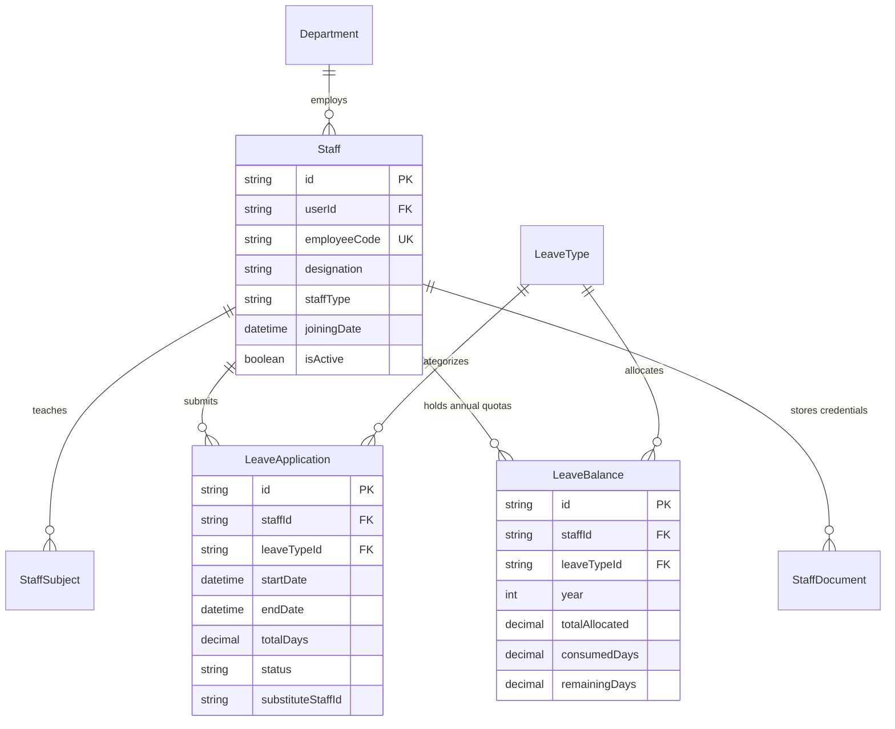
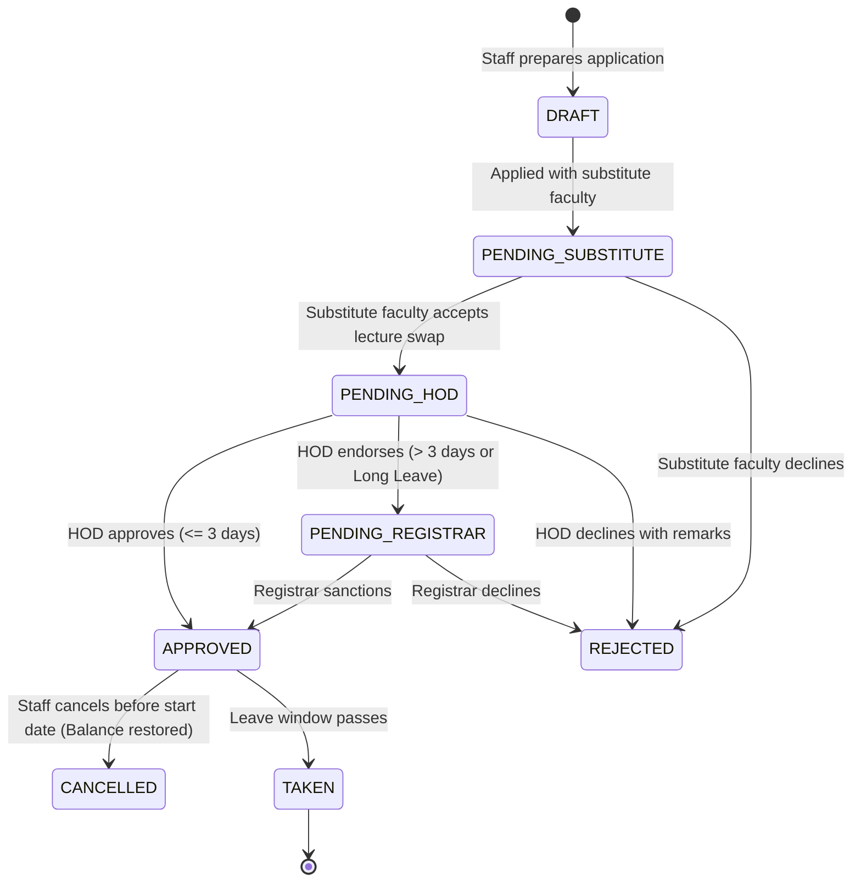

# Module 08: Human Resources & Leaves — Technical Architecture

> **Scope**: Leave balance accounting algorithms, substitute faculty scheduling integration, multi-level approval workflows, and staff entity relationships.

---

## 1. HR & Staff Entity Relationships

---

## 2. Leave Approval State Machine

