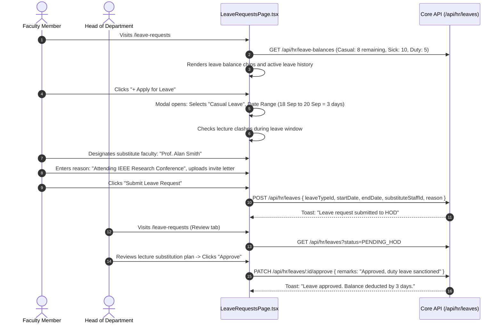

# Module 08: Human Resources & Leaves — UI Click Flows

> **Scope**: Faculty and Staff profiles, Employment types, Designations, Leave Types configuration, Leave balance accruals, Leave application and multi-stage HOD/Registrar approvals (`/leave-requests`), Holiday calendars, and Staff Directory (`/directory`).

---

## Screen Inventory

| Route | Page Component | Primary Actors | Key Capabilities |
|:---|:---|:---|:---|
| `/hr` | `HRPage.tsx` | HR Manager, InstAdmin, UnivAdmin | Staff directory, employment contracts, designation assignment, document repository (Degrees, Police clearances, IDs), Holiday calendar setup. |
| `/leave-requests` | `LeaveRequestsPage.tsx` | All Staff, Students, HODs, Reviewers | Universal self-service leave portal: apply for leave, view balance counters, calendar heatmaps, HOD approval action buttons with remarks. |
| `/directory` | `DirectoryPage.tsx` | All Staff, Enrolled Students | Searchable institutional directory: contact cards, department listings, office room numbers, extensions. |

---

## Flow 1: Faculty Self-Service Leave Application & HOD Approval

### Granular Step-by-Step Table

| Step | Screen | User Interaction | Visual Changes & State | System Action / API Call | Redirection / Modal |
|:---|:---|:---|:---|:---|:---|
| 1.1 | `/leave-requests` | Visits page | Top counters: Casual Leave (`8/12`), Medical (`10/10`), Duty (`4/5`). | `GET /api/hr/leave-balances` | Counters render |
| 1.2 | `/leave-requests` | Clicks **"+ Apply for Leave"** | Application modal opens. | `GET /api/hr/leave-types` | Modal opens |
| 1.3 | Modal | Selects Leave Type (`Casual`), picks Start and End dates | Automatically calculates total days (excluding weekends & holidays). | None | Days computed |
| 1.4 | Modal | Selects lecture replacement faculty from dropdown | Displays colleague availability during requested lecture slots. | `GET /api/hr/staff?departmentId=...` | Replacement set |
| 1.5 | Modal | Clicks **"Submit Request"** | Spinner runs; status updates to `SUBMITTED`. | `POST /api/hr/leaves` | Toast notification |
| 1.6 | `/leave-requests` (HOD)| HOD switches to "Approvals" tab | Pending queue displays applicant card, reason, replacement faculty acceptance badge. | `GET /api/hr/leaves/pending` | Approvals tab |
| 1.7 | Approvals Tab | Clicks **"Approve"** button | Enters optional review comment; confirms dialog. | `PATCH /api/hr/leaves/:id/approve` | Balance deducted |

---

## Flow 2: Staff Profile Creation & Document Management

| Step | Screen | User Interaction | Visual Changes & State | System Action / API Call | Redirection / Modal |
|:---|:---|:---|:---|:---|:---|
| 2.1 | `/hr` | HR Officer visits Staff tab $\to$ Clicks **"+ Add Staff Member"** | Staff onboarding modal opens: Personal, Academic, Employment tabs. | None | Modal opens |
| 2.2 | Modal | Enters Employee Code (`EMP-2026-091`), Name, Designation, Department | Designates Staff Type: `TEACHING` or `NON_TEACHING`. | None | Form inputs |
| 2.3 | Modal | Sets initial leave balance quota (Casual=12, Sick=10) | Initializes `LeaveBalance` records for current calendar year. | `POST /api/hr/staff` | Staff created |
| 2.4 | Staff Profile | Clicks **"Upload Document"** in Documents tab | Selects Document Category: "PhD Degree Certificate", uploads PDF. | `POST /api/hr/staff/:id/documents` | File attached |
